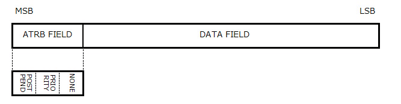
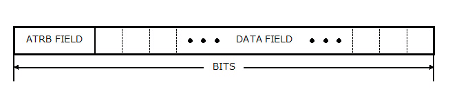
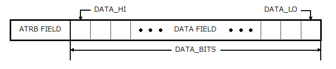
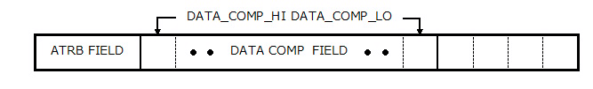
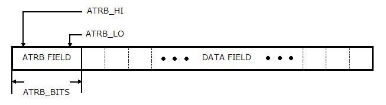
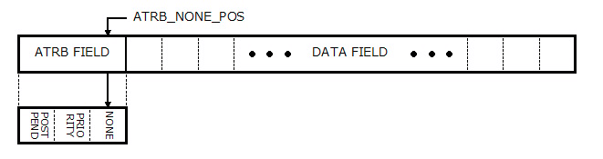
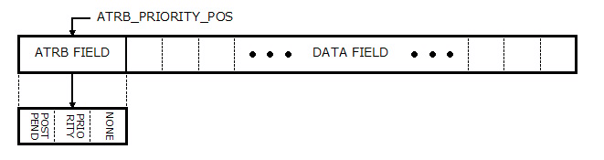
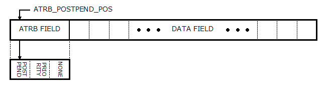

# VHDL で書くマージソーター(ワードの定義)


## はじめに


別記事 [「はじめに」] を参照してください。

この記事では、マージソーター内部で使用する「ワード」の定義について説明します。


## ワードとは


ここで説明するワードとは、マージソーター内部で使用するデータの内部形式を意味します。

ワードはビットの配列で示されます。配列の大きさは可変長です。VHDL では std_logic_vector で表現されます。


ワードにはマージソーター外部で定義されるデータ部と、マージソーター内部でのみ使用する属性部で構成されます。属性には、NONE、PRIORITY、POSTPEND があります。属性にかんしては後述します。データ部には、マージソーターがデータを比較するフィールドを含みます。




Fig.1 ワードの構成

<br />


## ワードパラメータの定義


  マージソーターでは、ワードの構成をWord.Param_Type という record タイプで保持します。これらの定義は Word パッケージで定義しています。


```VHDL:src/main/vhdl/core/word.vhd
library ieee;
use     ieee.std_logic_1164.all;
use     ieee.numeric_std.all;
package Word is
    -------------------------------------------------------------------------------
    --
    -------------------------------------------------------------------------------
    constant  ATRB_NONE_POS         :  integer := 0;
    constant  ATRB_PRIORITY_POS     :  integer := 1;
    constant  ATRB_POSTPEND_POS     :  integer := 2;
    constant  ATRB_BITS             :  integer := 3;
    -------------------------------------------------------------------------------
    --
    -------------------------------------------------------------------------------
    type      Param_Type       is record
                  BITS              :  integer;
                  DATA_BITS         :  integer;
                  DATA_LO           :  integer;
                  DATA_HI           :  integer;
                  DATA_COMPARE_LO   :  integer;
                  DATA_COMPARE_HI   :  integer;
                  DATA_COMPARE_SIGN :  boolean;
                  ATRB_BITS         :  integer;
                  ATRB_LO           :  integer;
                  ATRB_HI           :  integer;
                  ATRB_NONE_POS     :  integer;
                  ATRB_PRIORITY_POS :  integer;
                  ATRB_POSTPEND_POS :  integer;
    end record;
		-- (中略) --
end Word;
```


### BITS


BITS はワードの全ビット長を示します。




Fig.2 BITS Field

<br />


### DATA_BITS  DATA_LO  DATA_HI


DATA_BITS はデータ部のビット数、DATA_LO はワード内のデータ部の最下位ビット位置、DATA_HI は最上位ビット位置を示します。




Fig.3 DATA_BITS DATA_LO DATA_HI Field

<br />


### DATA_COMP_LO DATA_COMP_HI DATA_COMP_SIGN


データ部には、マージソーターがワードどうしを比較する際に使用する部分を含みます。DATA_COMP_LO および DATA_COMP_HI はその比較する部分を示します。また DATA_COMP_SIGN は、比較する際にDATA 比較フィールドを符号付きとして扱うか符号無しとして扱うかを示します。




Fig.4 DATA_COMP_HI DATA_COMP_LO Field

<br />


### ATRB_BITS  ATRB_LO  ATRB_HI


ATRB_BITS は属性部のビット数、ATRB_LO はワード内の属性部の最下位ビット位置、ATRB_HI は最上位ビット位置を示します。




Fig.5 ATRB_BITS ATRB_LO ATRB_HI Field

<br />


### ATRB_NONE_POS


ATRB_NONE_POS は属性ビットのうちの NONE 属性の位置を示します。NONE 属性は、マージソーター内部で便宜上追加したワードに付加されます。最終的にはこの NONE 属性が付加されたワードは出力されずに捨てられます。NONE 属性は後述するPRIORITY 属性または POSTPEND 属性とともに付加されます。

NONE 属性の用途に関しては[「端数ワード処理」]を参照してください。




Fig.6 ATRB_NONE_POS Field

<br />


### ATRB_PRIORITY_POS


ATRB_PRIORITY_POS は属性ビットのうちの PRIORITY 属性の位置を示します。PRIORITY は「優先」を意味します。この属性が付加されたワードは、他のワードとの比較の際に、優先的に選択されます。例えば、AワードとBワードを比較した際に、もし Aワードにこの属性が付加されていた場合は Bワードがどんな値であってもAワードが選択されます。

PRIORITY 属性の用途に関しては[「マルチワード マージソート ノード」]を参照してください。




Fig.7 ATRB_PRIORITY_POS Field

<br />


### ATRB_POSTPEND_POS


ATRB_POSTPEND_POS は属性ビットのうちの POSTPEND 属性の位置を示します。POSTPEND は「後回し」を意味します。この属性が付加されたワードは、他のワードとの比較の際に後回しにされて、もう一方のワードが選択されます。例えば、AワードとBワードを比較した際に、もしBワードにこの属性が付加されていた場合はAワードがどんな値であってもAワードが選択されます。

POSTPEND 属性の用途に関しては[「マルチワード マージソート ノード」]および[「端数ワード処理」]を参照してください。




Fig.8 ATRB_POSTPEND_POS Field

<br />


## ワードパラメータの生成


### New_Param 関数


ワードパラメータの各々のフィールドをすべて一つ一つ設定するのは面倒なので、フィールドの幾つかの値を指定すると自動的にすべてのフィールドを設定する関数を Word パッケージに用意しています。


```VHDL:src/main/vhdl/core/word.vhd
library ieee;
use     ieee.std_logic_1164.all;
use     ieee.numeric_std.all;
package Word is
		-- (前略) --
    function  New_Param(
                  DATA_BITS         :  integer;
                  COMP_LO           :  integer;
                  COMP_HI           :  integer;
                  SIGN              :  boolean
              )   return               Param_Type;
    function  New_Param(
                  DATA_BITS         :  integer;
                  COMP_LO           :  integer;
                  COMP_HI           :  integer
              )   return               Param_Type;
    function  New_Param(
                  DATA_BITS         :  integer;
                  SIGN              :  boolean
              )   return               Param_Type;
    function  New_Param(
                  DATA_BITS         :  integer
              )   return               Param_Type;
		-- (中略) --
end Word;
```


```VHDL:src/main/vhdl/core/word.vhd
library ieee;
use     ieee.std_logic_1164.all;
use     ieee.numeric_std.all;
package body Word is
    function  New_Param(
                  DATA_BITS         :  integer;
                  COMP_LO           :  integer;
                  COMP_HI           :  integer;
                  SIGN              :  boolean
              )   return               Param_Type
    is
        variable  pos               :  integer;
        variable  param             :  Param_Type;
    begin
        pos := 0;
        param.DATA_BITS             := DATA_BITS;
        param.DATA_LO               := pos;
        param.DATA_HI               := pos + DATA_BITS-1;
        param.DATA_COMPARE_LO       := COMP_LO;
        param.DATA_COMPARE_HI       := COMP_HI;
        param.DATA_COMPARE_SIGN     := SIGN;
        pos := pos + DATA_BITS;
        
        param.ATRB_BITS             := ATRB_BITS;
        param.ATRB_LO               := pos;
        param.ATRB_HI               := pos + ATRB_BITS-1;
        param.ATRB_NONE_POS         := pos + ATRB_NONE_POS;
        param.ATRB_PRIORITY_POS     := pos + ATRB_PRIORITY_POS;
        param.ATRB_POSTPEND_POS     := pos + ATRB_POSTPEND_POS;
        pos := pos + ATRB_BITS;
        param.BITS := pos;
        return param;
    end New_Param;

```


```VHDL:src/main/vhdl/core/word.vhd
    function  New_Param(
                  DATA_BITS         :  integer;
                  COMP_LO           :  integer;
                  COMP_HI           :  integer
              )   return               Param_Type
    is
    begin
        return New_Param(
                  DATA_BITS         => DATA_BITS  ,
                  COMP_LO           => COMP_LO    ,
                  COMP_HI           => COMP_HI    ,
                  SIGN              => FALSE
               );
    end New_Param;
 
```


```VHDL:src/main/vhdl/core/word.vhd
    function  New_Param(
                  DATA_BITS         :  integer;
                  SIGN              :  boolean
              )   return               Param_Type
    is
    begin
        return New_Param(
                  DATA_BITS         => DATA_BITS  ,
                  COMP_LO           => 0          ,
                  COMP_HI           => DATA_BITS-1,
                  SIGN              => SIGN
               );
    end New_Param; 
```


```VHDL:src/main/vhdl/core/word.vhd
    function  New_Param(
                  DATA_BITS         :  integer
              )   return               Param_Type
    is
    begin
        return New_Param(
                  DATA_BITS         => DATA_BITS  ,
                  COMP_LO           => 0          ,
                  COMP_HI           => DATA_BITS-1,
                  SIGN              => FALSE
               );
    end New_Param;
 		-- (中略) --
end Word;
```


## ワードの生成


### New_Word 関数


データからワードを生成するための New_Word 関数を Word パッケージに用意しています。


```VHDL:src/main/vhdl/core/word.vhd
library ieee;
use     ieee.std_logic_1164.all;
use     ieee.numeric_std.all;
package Word is
		-- (前略) --
    function  New_Word(
                  PARAM            :  Param_Type;
                  DATA             :  std_logic_vector;
                  PRIORITY         :  std_logic;
                  POSTPEND         :  std_logic;
                  NONE             :  std_logic
              )   return              std_logic_vector;
    function  New_Word(
                  PARAM            :  Param_Type;
                  DATA             :  std_logic_vector
              )   return              std_logic_vector;
		-- (中略) --
end Word;
```


```VHDL:src/main/vhdl/core/word.vhd
library ieee;
use     ieee.std_logic_1164.all;
use     ieee.numeric_std.all;
package body Word is
		-- (前略) --
    function  resize(I: std_logic_vector;LEN: integer) return std_logic_vector
    is
    begin
        return std_logic_vector(resize(unsigned(I), LEN));
    end function;
    function  New_Word(
                  PARAM            :  Param_Type;
                  DATA             :  std_logic_vector;
                  PRIORITY         :  std_logic;
                  POSTPEND         :  std_logic;
                  NONE             :  std_logic
              )   return              std_logic_vector
    is
        variable  a_word           :  std_logic_vector(PARAM.BITS-1 downto 0);
    begin
        a_word := (others => '0');
        a_word(PARAM.DATA_HI downto PARAM.DATA_LO) := DATA;
        a_word(PARAM.ATRB_NONE_POS    ) := NONE;
        a_word(PARAM.ATRB_PRIORITY_POS) := PRIORITY;
        a_word(PARAM.ATRB_POSTPEND_POS) := POSTPEND;
        return a_word;
    end function;
    function  New_Word(
                  PARAM            :  Param_Type;
                  DATA             :  std_logic_vector
              )   return              std_logic_vector
    is
    begin
        return New_Word(PARAM    => PARAM,
                        DATA     => DATA ,
                        PRIORITY => '0'  ,
                        POSTPEND => '0'  ,
                        NONE     => '0'
               );
    end function;
		-- (中略) --
end Word;
```


### New_Priority_Word 関数


PRIORITY 属性を持つワードを生成する New_Priority_Word 関数を Word パッケージに用意しています。


```VHDL:src/main/vhdl/core/word.vhd
library ieee;
use     ieee.std_logic_1164.all;
use     ieee.numeric_std.all;
package Word is
		-- (前略) --
    function  New_Priority_Word(
                  PARAM            :  Param_Type;
                  DATA             :  std_logic_vector := "0";
                  NONE             :  std_logic        := '1'
              )   return              std_logic_vector;
		-- (中略) --
end Word;
```


```VHDL:src/main/vhdl/core/word.vhd
library ieee;
use     ieee.std_logic_1164.all;
use     ieee.numeric_std.all;
package body Word is
		-- (前略) --
    function  New_Priority_Word(
                  PARAM            :  Param_Type;
                  DATA             :  std_logic_vector := "0";
                  NONE             :  std_logic        := '1'
              )   return              std_logic_vector
    is
    begin
        return New_Word(PARAM    => PARAM                       ,
                        DATA     => resize(DATA,PARAM.DATA_BITS),
                        PRIORITY => '1'                         ,
                        POSTPEND => '0'                         ,
                        NONE     => NONE
               );
    end function;
		-- (中略) --
end Word;
```


### New_Postpend_Word 関数


POSTPEND 属性を持つワードを生成する New_Postpend_Word 関数を Word パッケージに用意しています。


```VHDL:src/main/vhdl/core/word.vhd
library ieee;
use     ieee.std_logic_1164.all;
use     ieee.numeric_std.all;
package Word is
		-- (前略) --
    function  New_Postpend_Word(
                  PARAM            :  Param_Type;
                  DATA             :  std_logic_vector := "0";
                  NONE             :  std_logic        := '1'
              )   return              std_logic_vector;
		-- (中略) --
end Word;
```


```VHDL:src/main/vhdl/core/word.vhd
library ieee;
use     ieee.std_logic_1164.all;
use     ieee.numeric_std.all;
package body Word is
		-- (前略) --
    function  New_Postpend_Word(
                  PARAM            :  Param_Type;
                  DATA             :  std_logic_vector := "0";
                  NONE             :  std_logic        := '1'
              )   return              std_logic_vector
    is
    begin
        return New_Word(PARAM    => PARAM                       ,
                        DATA     => resize(DATA,PARAM.DATA_BITS),
                        PRIORITY => '0'                         ,
                        POSTPEND => '1'                         ,
                        NONE     => NONE
               );
    end function;
		-- (中略) --
end Word;
```


## 参照


* 目次: [「はじめに」]
* 次回: [「ワード比較器」]
* ソースコード:　 https://github.com/ikwzm/Merge_Sorter/blob/0.9.1/src/main/vhdl/core/word.vhd


[「はじめに」]: ./01_introduction.md "「VHDL で書くマージソーター(はじめに)」"
[「ワードの定義」]: ./02_word_package.md "「VHDL で書くマージソーター(ワードの定義)」"
[「ワード比較器」]: ./03_word_compare.md "「VHDL で書くマージソーター(ワード比較器)」"
[「ソーティングネットワーク」]: ./04_sorting_network.md "「VHDL で書くマージソーター(ソーティングネットワーク)」"
[「バイトニックマージソート」]: ./05_bitonic_sorter.md "「VHDL で書くマージソーター(バイトニックマージソート)」"
[「バッチャー奇偶マージソート」]: ./06_oddeven_sorter.md "「VHDL で書くマージソーター(バッチャー奇偶マージソート)」"
[「シングルワード マージソート ノード」]: ./07_merge_sort_node_single.md "「VHDL で書くマージソーター(シングルワード マージソート ノード)」"
[「マルチワード マージソート ノード」]: ./08_merge_sort_node_multi.md "「VHDL で書くマージソーター(マルチワード マージソート ノード)」"
[「マージソート ツリー」]: ./09_merge_sort_tree.md "「VHDL で書くマージソーター(マージソート ツリー)」"
[「端数ワード処理」]: ./10_merge_sort_core_1.md "「VHDL で書くマージソーター(端数ワード処理)」"
[「ストリーム入力」]: ./11_merge_sort_core_2.md "「VHDL で書くマージソーター(ストリーム入力)」"
[「ストリームフィードバック」]: ./12_merge_sort_core_3.md "「VHDL で書くマージソーター(ストリームフィードバック)」"
