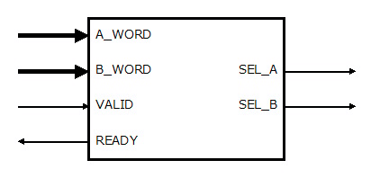

# VHDL で書くマージソーター(ワード比較器)


## はじめに


別記事 [「はじめに」] を参照してください。

この記事では、マージソーター内部で使用するワード比較器(Word_Compare)について説明します。


## ワード比較器とは


ワード比較器(Word_Compare)は、二つのワード([「ワードの定義」]参照)を比較して、どちらかを選択します。二つのワード(AワードとBワード）のうち、選択した方の選択信号(SEL_A または SEL_B) がアサートされます。また、AワードとBワードが同一条件だった時は常にAワードが選択されます。




Fig.1 Word Compare

<br />


## ワード比較器の VHDL 記述


### Entity


ワード比較器(Word_Compare) の Entity 宣言は次のようになっています。ジェネリック変数の WORD_PARAM でワードの定義を指定します。SORT_ORDER で昇順か降順を指定します。

A_WORD および B_WORD はビット配列(std_logic_vector) で入力されます。ビット配列の長さは WORD_PARAM の BITS フィールドの値で指定されます。


```VHDL:src/main/vhdl/core/word_compare.vhd
library ieee;
use     ieee.std_logic_1164.all;
library Merge_Sorter;
use     Merge_Sorter.Word;
entity  Word_Compare is
    generic (
        WORD_PARAM  :  Word.Param_Type := Word.Default_Param;
        SORT_ORDER  :  integer :=  0
    );
    port (
        CLK         :  in  std_logic;
        RST         :  in  std_logic;
        CLR         :  in  std_logic;
        A_WORD      :  in  std_logic_vector(WORD_PARAM.BITS-1 downto 0);
        B_WORD      :  in  std_logic_vector(WORD_PARAM.BITS-1 downto 0);
        VALID       :  in  std_logic;
        READY       :  out std_logic;
        SEL_A       :  out std_logic;
        SEL_B       :  out std_logic
    );
end Word_Compare;

```


### Functions


ワードを中の DATA_COMP_HI および DATA_COMP_LO で指定されたフィールドを取り出して比較する関数は次のように定義しています。データが符号付きか符号無しかによって別々の関数を定義しています。


```VHDL:src/main/vhdl/core/word_compare.vhd
library ieee;
use     ieee.std_logic_1164.all;
use     ieee.numeric_std.all;
architecture RTL of Word_Compare is
    function select_a_unsigned(A_WORD, B_WORD: std_logic_vector;ORDER: integer) return boolean is
        variable a_comp  :  unsigned(WORD_PARAM.DATA_COMPARE_HI - WORD_PARAM.DATA_COMPARE_LO downto 0);
        variable b_comp  :  unsigned(WORD_PARAM.DATA_COMPARE_HI - WORD_PARAM.DATA_COMPARE_LO downto 0);
    begin
        a_comp := to_01(unsigned(A_WORD(WORD_PARAM.DATA_COMPARE_HI downto WORD_PARAM.DATA_COMPARE_LO)));
        b_comp := to_01(unsigned(B_WORD(WORD_PARAM.DATA_COMPARE_HI downto WORD_PARAM.DATA_COMPARE_LO)));
        if (ORDER = 0) then
            return (a_comp <= b_comp);
        else
            return (a_comp >= b_comp);
        end if;
    end function;
    function select_a_signed(A_WORD, B_WORD: std_logic_vector;ORDER: integer) return boolean is
        variable a_comp  :    signed(WORD_PARAM.DATA_COMPARE_HI - WORD_PARAM.DATA_COMPARE_LO downto 0);
        variable b_comp  :    signed(WORD_PARAM.DATA_COMPARE_HI - WORD_PARAM.DATA_COMPARE_LO downto 0);
    begin
        a_comp := to_01(  signed(A_WORD(WORD_PARAM.DATA_COMPARE_HI downto WORD_PARAM.DATA_COMPARE_LO)));
        b_comp := to_01(  signed(B_WORD(WORD_PARAM.DATA_COMPARE_HI downto WORD_PARAM.DATA_COMPARE_LO)));
        if (ORDER = 0) then
            return (a_comp <= b_comp);
        else
            return (a_comp >= b_comp);
        end if;
    end function;

```


### Body


VALID 信号が '1' の時、A_WORD と B_WORD を比較して結果を出力します。

A_WORD に PRIORITY 属性がついているか B_WORD に POSTPEND 属性がついている場合は A_WORD を選択するために SEL_A 信号がアサートされます。

上記以外で、B_WORD にPRIORITY 属性がついているか A_WORD に POSTPEND 属性がついている場合は B_WORD を選択するために SEL_B 信号がアサートされます。

さらに上記以外では前述の比較関数の結果を出力します。


```VHDL:src/main/vhdl/core/word_compare.vhd
begin
    process(VALID, A_WORD, B_WORD) 
        variable select_a :  boolean;
    begin
        if (VALID = '1') then
            if (WORD_PARAM.DATA_COMPARE_SIGN) then
                select_a := select_a_signed  (A_WORD, B_WORD, SORT_ORDER);
            else
                select_a := select_a_unsigned(A_WORD, B_WORD, SORT_ORDER);
            end if;
            if    (A_WORD(WORD_PARAM.ATRB_PRIORITY_POS) = '1') or
                  (B_WORD(WORD_PARAM.ATRB_POSTPEND_POS) = '1') then
                SEL_A <= '1';
                SEL_B <= '0';
            elsif (B_WORD(WORD_PARAM.ATRB_PRIORITY_POS) = '1') or
                  (A_WORD(WORD_PARAM.ATRB_POSTPEND_POS) = '1') then
                SEL_A <= '0';
                SEL_B <= '1';
            elsif (select_a = TRUE) then
                SEL_A <= '1';
                SEL_B <= '0';
            else
                SEL_A <= '0';
                SEL_B <= '1';
            end if;
                READY <= '1';
        else
                READY <= '0';
                SEL_A <= '0';
                SEL_B <= '0';
        end if;
    end process;
end RTL;

```


## 参照

* 目次: [「はじめに」]
* 次回: [「ソーティングネットワーク(コアパッケージ)」]
* 前回: [「ワードの定義」]
* ソースコード: https://github.com/ikwzm/Merge_Sorter/blob/1.4.1/src/main/vhdl/core/word_compare.vhd


[「はじめに」]: ./01_introduction.md "「VHDL で書くマージソーター(はじめに)」"
[「ワードの定義」]: ./02_word_package.md "「VHDL で書くマージソーター(ワードの定義)」"
[「ワード比較器」]: ./03_word_compare.md "「VHDL で書くマージソーター(ワード比較器)」"
[「ソーティングネットワーク(コアパッケージ)」]: ./04_sorting_network.md "「VHDL で書くソーティングネットワーク(コアパッケージ)」"
[「ソーティングネットワーク(バイトニックマージソート)」]: ./05_bitonic_sorter.md "「VHDL で書くソーティングネットワーク(バイトニックマージソート)」"
[「ソーティングネットワーク(バッチャー奇偶マージソート)」]: ./06_oddeven_sorter.md "「VHDL で書くソーティングネットワーク(バッチャー奇偶マージソート)」"
[「シングルワード マージソート ノード」]: ./07_merge_sort_node_single.md "「VHDL で書くマージソーター(シングルワード マージソート ノード)」"
[「マルチワード マージソート ノード」]: ./08_merge_sort_node_multi.md "「VHDL で書くマージソーター(マルチワード マージソート ノード)」"
[「マージソート ツリー」]: ./09_merge_sort_tree.md "「VHDL で書くマージソーター(マージソート ツリー)」"
[「端数ワード処理」]: ./10_merge_sort_core_1.md "「VHDL で書くマージソーター(端数ワード処理)」"
[「ストリーム入力」]: ./11_merge_sort_core_2.md "「VHDL で書くマージソーター(ストリーム入力)」"
[「ストリームフィードバック」]: ./12_merge_sort_core_3.md "「VHDL で書くマージソーター(ストリームフィードバック)」"
[「ArgSort IP」]: ./13_argsort.md "「VHDL で書くマージソーター(ArgSort IP)」"
[「ArgSort-Ultra96」]: https://github.com/ikwzm/ArgSort-Ultra96/blob/1.2.1/doc/ja/argsort-ultra96.md "「VHDL で書くマージソーター(ArgSort-Ultra96)」"
[「ArgSort-Kv260」]: https://github.com/ikwzm/ArgSort-Kv260/blob/1.2.1/doc/ja/argsort-Kv260.md "「VHDL で書くマージソーター(ArgSort-Kv260)」"
