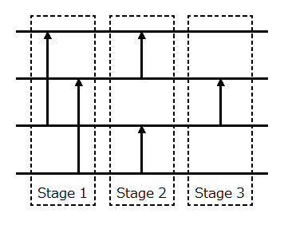
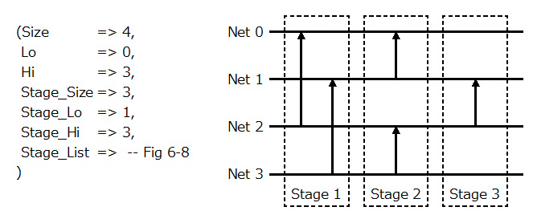

# VHDL で書くマージソーター(ソーティングネットワーク)


## はじめに


別記事 [「はじめに」] を参照してください。

この記事では、マージソーター内部で使用するソーティングネットワーク(Sorting_Network) について説明します。


## ソーティングネットワークとは


ソーティングネットワークとは、ワイヤとコンパレータで構成されます。ワイヤは値を伝えます。コンパレーターは入出力に二本のワイヤをとり、二つの値が入力されると、指定された属性に従って出力をスルーしたりスワップしたりします。

コンパレーターには Up/Down という方向が設定されています。下図では矢印で示しています。

ソーティングネットワークの場合は、昇順と降順があります。昇順は値を小さい方から大きい方にソートするため、コンパレーターは値の小さい方を矢印の方に出力します。


")

Fig.1 コンパレーター (昇順)

<br />


逆に降順は値を大きい方から小さい方にソートするため、コンパレーターは値の大きい方を矢印の方に出力します。


")

Fig.2 コンパレーター (降順)

<br />


以下に、単純な昇順のソーティングネットワークの動作を示します。


")

Fig.3 ソーティングネットワークの動作例 (4入力昇順)

<br />


## ソーティングネットワークの VHDL 記述


### ソーティングネットワークのステージ


ソーティングネットワークを VHDL で記述するにあたり、ステージという概念を導入します。ステージとは、ソーティングネットワークを並列処理可能な単位で分割したものです。前述の４入力昇順ソーティングネットワークの場合は、次のように３ステージに分割することが出来ます。




Fig.4 ソーティングネットワークのステージ

<br />


ステージを分割することによって、ステージ間にレジスタを挿入することでパイプライン処理が可能になります。


### ソーティングネットワーク構成の VHDL 記述


#### Param_Type


ソーティングネットワークを VHDL で記述するにあたり、まずはソーティングネットワークの構成を Sorting_Network.Param_Type という record タイプで定義します。これらの定義は Sorting_Network パッケージで定義しています。


Param_Type は、ネットワークのサイズ(入力ワード数)を保持する Size、ステージのサイズを保持する Stage_Size、ステージごとの各種情報を保持する Stage_Listで構成されています。


```VHDL:src/main/vhdl/core/sorting_network.vhd
library ieee;
use     ieee.std_logic_1164.all;
use     ieee.numeric_std.all;
library Merge_Sorter;
use     Merge_Sorter.Word;
package Sorting_Network is
    constant  Max_Network_Size      :  integer := 256;
    constant  Max_Stage_Size        :  integer := 256;
    -- (中略) --
    type      Param_Type            is record
                  Stage_List        :  Stage_Vector( 1 to Max_Stage_Size);
                  Stage_Size        :  integer range 0 to Max_Stage_Size;
                  Stage_Lo          :  integer range 0 to Max_Stage_Size;
                  Stage_Hi          :  integer range 0 to Max_Stage_Size;
                  Stage_Ctrl_Lo     :  integer range 0 to Max_Stage_Size*Stage_Queue_Ctrl_Bits;
                  Stage_Ctrl_Hi     :  integer range 0 to Max_Stage_Size*Stage_Queue_Ctrl_Bits;
                  Sort_Order        :  integer;
                  Size              :  integer range 0 to Max_Network_Size;
                  Lo                :  integer range 0 to Max_Network_Size-1;
                  Hi                :  integer range 0 to Max_Network_Size-1;
    end record;
    -- (後略) --
end Sorting_Network;
```


#### Stage_Type


Stage_Type およびその配列型である Stage_Vector は Sorting_Network パッケージにて次のように定義されています。

Stage_Type はネットワーク毎のコンパレーターの情報を保持する Comparator_List とパイプラインレジスタのキューのサイズを保持する Queue_Sizeで構成されています。


```VHDL:src/main/vhdl/core/sorting_network.vhd
library ieee;
use     ieee.std_logic_1164.all;
use     ieee.numeric_std.all;
library Merge_Sorter;
use     Merge_Sorter.Word;
package Sorting_Network is
     -- (前略) --
    constant  Max_Stage_Queue_Size  :  integer := 2;
    type      Stage_Type            is record
                  Comparator_List   :  Comparator_Vector(0 to Max_Network_Size-1);
                  Queue_Size        :  integer range 0 to Max_Stage_Queue_Size;
    end record;
    constant  Stage_Null            :  Stage_Type := (
                  Comparator_List   => (others => Comparator_Null),
                  Queue_Size        => 0
              );
    type      Stage_Vector          is array (integer range <>) of Stage_Type;
    -- (後略) --
end Sorting_Network;
```


#### Comparator_Type


Comparator_Type およびその配列型である Comparator_Vector は Sorting_Network パッケージにて次のように定義されています。

Comparator_Type は、コンパレーターを接続するネットワークの相対位置を示す SPEP およびコンパレーターの Up/Down を保持する UP で構成されています。


```VHDL:src/main/vhdl/core/sorting_network.vhd
library ieee;
use     ieee.std_logic_1164.all;
use     ieee.numeric_std.all;
library Merge_Sorter;
use     Merge_Sorter.Word;
package Sorting_Network is
     -- (前略) --
    type      Comparator_Type       is record
                  STEP              :  integer;
                  UP                :  boolean;
    end record;
    constant  Comparator_Null       :  Comparator_Type := (
                  STEP              => 0,
                  UP                => TRUE
              );
    type      Comparator_Vector     is array (integer range <>) of Comparator_Type;
    -- (後略) --
end Sorting_Network;
```


#### 構成例


以下に４入力昇順ソーティングネットワーク(Fig.4参照)の構成を VHDL で記述した例を示します。




Fig.5 ソーティングネットワーク構成の VHDL 記述例

<br />


")

Fig.6 ソーティングネットワーク構成の VHDL 記述例 (Stage 1)

<br />


")

Fig.7 ソーティングネットワーク構成の VHDL 記述例 (Stage 2)

<br />


")

Fig.8 ソーティングネットワーク構成の VHDL 記述例 (Stage 3)

<br />


### ソーティングネットワークコアの VHDL 記述


#### 構造


ソーティングネットワークコアは、前節で定義したソーティングネットワーク構成(Sorting_Network.Param_Type) に基づき、ソーティングネットワークを構築します。

ソーティングネットワークコアの構造は次のようになっています。


Fig.9 ソーティングネットワークコアの構成

<br />


#### Entity 


ジェネリック変数の NETWORK_PARAM でソーティングネットワークの構成を指定します。WORD_PARAM で[「ワードの定義」]を指定します。INFO_BITS はソーティングネットワークを通すその他の情報のビット数を指定します。

I_WORD はソーティングネットワークに入力するネットワーク毎のワードで、O_WORD はソートされたネットワーク毎のワードです。I_WORD および O_WORD はネットワーク毎のワードを一次元のビット配列(std_logic_vector)にしたものです。

I_INFO はその他の情報を入力し、O_INFO から内部のパイプライン分だけ遅延されて出力されます。


```VHDL:src/main/vhdl/core/sorting_network_core.vhd
library ieee;
use     ieee.std_logic_1164.all;
library Merge_Sorter;
use     Merge_Sorter.Word;
use     Merge_Sorter.Sorting_Network;
entity  Sorting_Network_Core is
    generic (
        NETWORK_PARAM   :  Sorting_Network.Param_Type := Sorting_Network.Param_Null;
        WORD_PARAM      :  Word.Param_Type            := Word.Default_Param;
        INFO_BITS       :  integer :=  3
    );
    port (
        CLK             :  in  std_logic;
        RST             :  in  std_logic;
        CLR             :  in  std_logic;
        I_WORD          :  in  std_logic_vector(NETWORK_PARAM.Size*WORD_PARAM.BITS-1 downto 0);
        I_INFO          :  in  std_logic_vector(INFO_BITS-1 downto 0) := (others => '0');
        I_VALID         :  in  std_logic;
        I_READY         :  out std_logic;
        O_WORD          :  out std_logic_vector(NETWORK_PARAM.Size*WORD_PARAM.BITS-1 downto 0);
        O_INFO          :  out std_logic_vector(INFO_BITS-1 downto 0);
        O_VALID         :  out std_logic;
        O_READY         :  in  std_logic;
        BUSY            :  out std_logic
    );
end Sorting_Network_Core;

```


#### Architecture


まずは Sorting_Network_Core 内部で使用するタイプおよびステージ毎の各種信号を定義します。


```VHDL:src/main/vhdl/core/sorting_network_core.vhd
library ieee;
use     ieee.std_logic_1164.all;
use     ieee.numeric_std.all;
library Merge_Sorter;
use     Merge_Sorter.Word;
use     Merge_Sorter.Sorting_Network;
use     Merge_Sorter.Core_Components.Word_Compare;
use     Merge_Sorter.Core_Components.Word_Pipeline_Register;
architecture RTL of Sorting_Network_Core is
    constant  STAGE_OPENER      :  integer := NETWORK_PARAM.Stage_Lo - 1;
    constant  STAGE_FIRST       :  integer := NETWORK_PARAM.Stage_Lo;
    constant  STAGE_LAST        :  integer := NETWORK_PARAM.Stage_Hi;
    subtype   WORD_TYPE         is std_logic_vector (WORD_PARAM.BITS-1 downto 0);
    type      STAGE_WORD_TYPE   is array (NETWORK_PARAM.Lo to NETWORK_PARAM.Hi) of WORD_TYPE;
    type      STAGE_WORD_VECTOR is array (integer range <>) of STAGE_WORD_TYPE;
    signal    stage_word        :  STAGE_WORD_VECTOR(STAGE_OPENER to STAGE_LAST);
    subtype   STAGE_INFO_TYPE   is std_logic_vector (INFO_BITS-1 downto 0);
    type      STAGE_INFO_VECTOR is array (integer range <>) of STAGE_INFO_TYPE;
    signal    stage_info        :  STAGE_INFO_VECTOR(STAGE_OPENER to STAGE_LAST);
    signal    stage_valid       :  std_logic_vector (STAGE_OPENER to STAGE_LAST);
    signal    stage_ready       :  std_logic_vector (STAGE_OPENER to STAGE_LAST);
    signal    stage_busy        :  std_logic_vector (STAGE_OPENER to STAGE_LAST);
    constant  STAGE_BUSY_ALL0   :  std_logic_vector (STAGE_OPENER to STAGE_LAST) := (others => '0');
begin
```


 I_WORD はソーティングネットワークに入力するネットワーク毎のワードで、ネットワーク毎のワードを一次元のビット配列(std_logic_vector)にしたものです。OPENER ブロックでは I_WORD を内部の信号に変換します。


```VHDL:src/main/vhdl/core/sorting_network_core.vhd
    OPENER: block
    begin
        NET: for i in 0 to NETWORK_PARAM.Size-1 generate
            stage_word(STAGE_OPENER)(NETWORK_PARAM.Lo+i) <= I_WORD((i+1)*WORD_PARAM.BITS-1 downto i*WORD_PARAM.BITS);
        end generate;
        stage_info (STAGE_OPENER) <= I_INFO;
        stage_valid(STAGE_OPENER) <= I_VALID;
        stage_busy (STAGE_OPENER) <= '0';
        I_READY <= stage_ready(STAGE_OPENER);
    end block;

```


ステージ毎に generate 分を使って記述します。


```VHDL:src/main/vhdl/core/sorting_network_core.vhd
    MAIN: for stage in STAGE_FIRST to STAGE_LAST generate
        constant  Stage_Param   :  Sorting_Network.Stage_Type := NETWORK_PARAM.Stage_List(stage);
        signal    sorted_word   :  STAGE_WORD_TYPE;
    begin
          
```


ステージ内のさらにネットワーク毎にコンパレーターを記述します。

STEPが正の値の時は対となるネットワークが自ネットワーク番号＋STEPに存在します。この場合は対となるネットワークとの間にコンパレーターを接続して、その結果に応じて入力ワードを交換します。

STEP が0の時はコンパレーターを使わずに入力ワードをそのまま出力します。

STEP が負の値の時は、すでに対となるネットワーク(STEPの値が正のネットワーク)にてコンパレーターが接続されているので何もしません。


```VHDL:src/main/vhdl/core/sorting_network_core.vhd
        NET: for i in NETWORK_PARAM.Lo to NETWORK_PARAM.Hi generate
            constant  STEP           :  integer := Stage_Param.Comparator_List(i).STEP;
            constant  UP             :  boolean := Stage_Param.Comparator_List(i).UP;
        begin
            XCHG: if STEP > 0 generate
                signal    comp_sel_a     :  std_logic;
                signal    comp_sel_b     :  std_logic;
                signal    swap           :  boolean;
            begin
                COMP: Word_Compare                                    --
                    generic map(                                      --
                        WORD_PARAM  => WORD_PARAM                   , -- 
                        SORT_ORDER  => NETWORK_PARAM.Sort_Order       -- 
                    )                                                 -- 
                    port map (                                        --
                        CLK         => CLK                          , -- In  :
                        RST         => RST                          , -- In  :
                        CLR         => CLR                          , -- In  :
                        A_WORD      => stage_word(stage-1)(i     )  , -- In  :
                        B_WORD      => stage_word(stage-1)(i+STEP)  , -- In  :
                        VALID       => '1'                          , -- In  :
                        READY       => open                         , -- Out :
                        SEL_A       => comp_sel_a                   , -- Out :
                        SEL_B       => comp_sel_b                     -- Out :
                    );                                                --
                swap <= (comp_sel_b = '1' and UP = TRUE ) or
                        (comp_sel_a = '1' and UP = FALSE);
                sorted_word(i     ) <= stage_word(stage-1)(i+STEP) when (swap) else
                                       stage_word(stage-1)(i     );
                sorted_word(i+STEP) <= stage_word(stage-1)(i     ) when (swap) else
                                       stage_word(stage-1)(i+STEP);
            end generate;
            PASS: if STEP = 0 generate
                sorted_word(i     ) <= stage_word(stage-1)(i     );
            end generate;
        end generate;
  
```


ステージ毎にパイプラインレジスタを挿入します。


```VHDL:src/main/vhdl/core/sorting_network_core.vhd
        REGS: block
            signal    d_word    :  std_logic_vector(NETWORK_PARAM.Size*WORD_PARAM.BITS-1 downto 0);
            signal    q_word    :  std_logic_vector(NETWORK_PARAM.Size*WORD_PARAM.BITS-1 downto 0);
        begin
            NET_I: for i in 0 to NETWORK_PARAM.Size-1 generate
                d_word((i+1)*WORD_PARAM.BITS-1 downto i*WORD_PARAM.BITS)
                    <= sorted_word(i+NETWORK_PARAM.Lo);
            end generate;
            Q: Word_Pipeline_Register
                generic map(                                      --
                    WORD_PARAM  => WORD_PARAM                   , --
                    WORDS       => NETWORK_PARAM.Size           , --
                    INFO_BITS   => INFO_BITS                    , --
                    QUEUE_SIZE  => Stage_Param.QUEUE_SIZE         --
                )                                                 -- 
                port map (                                        --
                    CLK         => CLK                          , -- In  :
                    RST         => RST                          , -- In  :
                    CLR         => CLR                          , -- In  :
                    I_WORD      => d_word                       , -- In  :
                    I_INFO      => stage_info (stage-1)         , -- In  :
                    I_VALID     => stage_valid(stage-1)         , -- In  :
                    I_READY     => stage_ready(stage-1)         , -- Out :
                    O_WORD      => q_word                       , -- Out :
                    O_INFO      => stage_info (stage  )         , -- Out :
                    O_VALID     => stage_valid(stage  )         , -- Out :
                    O_READY     => stage_ready(stage  )         , -- In  :
                    BUSY        => stage_busy (stage  )           -- 
                );
            NET_O: for i in 0 to NETWORK_PARAM.Size-1 generate
                stage_word(stage)(i+NETWORK_PARAM.Lo)
                    <= q_word((i+1)*WORD_PARAM.BITS-1 downto i*WORD_PARAM.BITS);
            end generate;
        end block;
    end generate;
  
```


 O_WORD はネットワーク毎のソート済みのワードを一次元のビット配列(std_logic_vector)にしたものです。OUTLET ブロックではソート済みの各ネットワークの出力ワードを O_WORD に変換します。


```VHDL:src/main/vhdl/core/sorting_network_core.vhd
    OUTLET: block
    begin
        NET: for i in 0 to NETWORK_PARAM.Size-1 generate
            O_WORD((i+1)*WORD_PARAM.BITS-1 downto i*WORD_PARAM.BITS)
                <= stage_word(STAGE_LAST)(i+NETWORK_PARAM.Lo);
        end generate;
        O_INFO  <= stage_info (STAGE_LAST);
        O_VALID <= stage_valid(STAGE_LAST);
        stage_ready(STAGE_LAST) <= O_READY;
    end block;
    BUSY <= '1' when (stage_busy /= STAGE_BUSY_ALL0) else '0';
end RTL;
  
```


## 参照


* 目次: [「はじめに」]
* 次回: [「バイトニックマージソート」]
* 前回: [「ワード比較器」]
* ソースコード: https://github.com/ikwzm/Merge_Sorter/blob/0.9.1/src/main/vhdl/core/sorting_network.vhd   
https://github.com/ikwzm/Merge_Sorter/blob/0.9.1/src/main/vhdl/core/sorting_network_core.vhd


[「はじめに」]: ./01_introduction.md "「VHDL で書くマージソーター(はじめに)」"
[「ワードの定義」]: ./02_word_package.md "「VHDL で書くマージソーター(ワードの定義)」"
[「ワード比較器」]: ./03_word_compare.md "「VHDL で書くマージソーター(ワード比較器)」"
[「ソーティングネットワーク」]: ./04_sorting_network.md "「VHDL で書くマージソーター(ソーティングネットワーク)」"
[「バイトニックマージソート」]: ./05_bitonic_sorter.md "「VHDL で書くマージソーター(バイトニックマージソート)」"
[「バッチャー奇偶マージソート」]: ./06_oddeven_sorter.md "「VHDL で書くマージソーター(バッチャー奇偶マージソート)」"
[「シングルワード マージソート ノード」]: ./07_merge_sort_node_single.md "「VHDL で書くマージソーター(シングルワード マージソート ノード)」"
[「マルチワード マージソート ノード」]: ./08_merge_sort_node_multi.md "「VHDL で書くマージソーター(マルチワード マージソート ノード)」"
[「マージソート ツリー」]: ./09_merge_sort_tree.md "「VHDL で書くマージソーター(マージソート ツリー)」"
