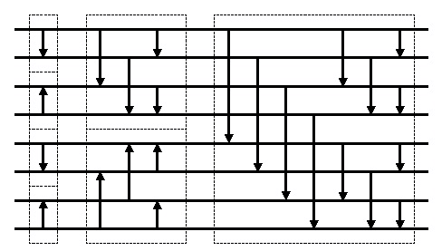

# VHDL で書くマージソーター(バイトニックマージソート)


## はじめに


別記事 [「はじめに」] を参照してください。

この記事では、前回説明した[「ソーティングネットワーク」]を使ってバイトニックマージソート回路を構成する方法を紹介します。


## バイトニックマージソートとは


バイトニックマージソート(Bitonic megesort) または単にバイトニックソート(Bitonic sort) とは、ソートの並列アルゴリズムの一つで、ソーティングネットワークの構築法としても知られています(出典:[Wikipedia/Bitonic_sorter])。

次図に８入力のバイトニックソートのソーティングネットワークの例を示します。




Fig.1 バイトニックソートのソーティングネットワーク例

<br />


以下に再帰呼び出しを使って Python で記述したバイトニックソートの実装例を示します(出典:[Wikipedia/Bitonic_sorter])。


```Python:bitonic_sort.py
def bitonic_sort(up: bool, x: Sequence[int]) -> List[int]:
    if len(x) <= 1:
        return x
    else: 
        first = bitonic_sort(True, x[:len(x) // 2])
        second = bitonic_sort(False, x[len(x) // 2:])
        return bitonic_merge(up, first + second)
def bitonic_merge(up: bool, x) -> List[int]: 
    if len(x) == 1:
        return x
    else:
        bitonic_compare(up, x)
        first = bitonic_merge(up, x[:len(x) // 2])
        second = bitonic_merge(up, x[len(x) // 2:])
        return first + second
def bitonic_compare(up: bool, x) -> None:
    dist = len(x) // 2
    for i in range(dist):
        if (x[i] > x[i + dist]) == up:
            x[i], x[i + dist] = x[i + dist], x[i] 
```


## バイトニックマージソートの VHDL 記述


### ソーティングネットワークの VHDL 記述


#### New_Bitonic_Sorter_Network 関数


New_Bitonic_Sorter_Network 関数は、バイトニックマージソートのソーティングネットワークに対応した Sorting_Network.Param_Type([「ソーティングネットワーク」]参照)を生成します。 New_Bitonic_Sorter_Network 関数は Sorting_Network パッケージにて定義しています。


```VHDL:src/main/vhdl/core/sorting_network.vhd
library ieee;
use     ieee.std_logic_1164.all;
use     ieee.numeric_std.all;
library Merge_Sorter;
use     Merge_Sorter.Word;
package Sorting_Network is
    -- (前略) --
    function   New_Bitonic_Sorter_Network(LO,HI,ORDER,QUEUE:integer) return Param_Type;
    -- (後略) --
end Sorting_Network;
```


```VHDL:src/main/vhdl/core/sorting_network.vhd
library ieee;
use     ieee.std_logic_1164.all;
use     ieee.numeric_std.all;
package body Sorting_Network is
    -- (前略) --
    function   New_Bitonic_Sorter_Network(LO,HI,ORDER,QUEUE:integer) return Param_Type
    is
        variable  network  :  Param_Type;
    begin
        network            := Param_Null;
        network.Size       := HI - LO + 1;
        network.Lo         := LO;
        network.Hi         := HI;
        network.Sort_Order := ORDER;
        network.Stage_Lo   := 1;
        network.Stage_Hi   := 0;
        bitonic_sort(network, network.Stage_Lo, network.Lo, network.Hi, TRUE);
        Add_Queue_Params(network, QUEUE);
        return network;
    end function;
    -- (後略) --
end Sorting_Network;
```


#### New_Bitonic_Merger_Network 関数


New_Bitonic_Merger_Network 関数は、バイトニックマージソートネットワークのうちのマージの部分だけを取り出した Sorting_Network.Param_Type([「ソーティングネットワーク」]参照)を生成します。 New_Bitonic_Merger_Network 関数は Sorting_Network パッケージにて定義しています。


```VHDL:src/main/vhdl/core/sorting_network.vhd
library ieee;
use     ieee.std_logic_1164.all;
use     ieee.numeric_std.all;
library Merge_Sorter;
use     Merge_Sorter.Word;
package Sorting_Network is
    -- (前略) --
    function   New_Bitonic_Merger_Network(LO,HI,ORDER,QUEUE:integer) return Param_Type;
    -- (後略) --
end Sorting_Network;
```


```VHDL:src/main/vhdl/core/sorting_network.vhd
library ieee;
use     ieee.std_logic_1164.all;
use     ieee.numeric_std.all;
package body Sorting_Network is
    -- (前略) --
    function   New_Bitonic_Merger_Network(LO,HI,ORDER,QUEUE:integer) return Param_Type
    is
        variable  network  :  Param_Type;
    begin
        network            := Param_Null;
        network.Size       := HI - LO + 1;
        network.Lo         := LO;
        network.Hi         := HI;
        network.Sort_Order := ORDER;
        network.Stage_Lo   := 1;
        network.Stage_Hi   := 0;
        bitonic_merge(network, network.Stage_Lo, network.Lo, network.Hi, TRUE);
        Add_Queue_Params(network, QUEUE);
        return network;
    end function;
    -- (後略) --
end Sorting_Network;
```


#### bitonic_sort 関数


Sorting_Netowork パッケージボディに定義されたbitonic_sort 関数は、前述の Python による実装でしめした bitonic_sort に対応します。bitonic_sort 関数を再帰的に呼び出しています。


```VHDL:src/main/vhdl/core/sorting_network.vhd
library ieee;
use     ieee.std_logic_1164.all;
use     ieee.numeric_std.all;
package body Sorting_Network is
    -- (前略) --
    procedure bitonic_sort(
        variable  NETWORK     :  inout Param_Type;
                  START_STAGE :  in    integer;
                  LO          :  in    integer;
                  HI          :  in    integer;
                  UP          :  in    boolean
    ) is
        variable  dist        :        integer;
        variable  first       :        Param_Type;
        variable  second      :        Param_Type;
        variable  next_stage  :        integer;
    begin
        if (HI - LO > 0) then
            dist := (HI-LO+1)/2;
            first  := NETWORK;
            second := NETWORK;
            bitonic_sort (first  , START_STAGE, LO        , LO + dist-1, TRUE );
            bitonic_sort (second , START_STAGE, LO + dist , HI         , FALSE);
            merge_network_stage_list(NETWORK, first , START_STAGE);
            merge_network_stage_list(NETWORK, second, START_STAGE);
            next_stage := NETWORK.Stage_Hi + 1;
            bitonic_merge(NETWORK, next_stage , LO        , HI         , UP   );
        end if;
    end procedure;
    -- (後略) --
end Sorting_Network;
```


#### bitonic_merge 関数


Sorting_Netowork パッケージボディに定義されたbitonic_merge 関数は、前述の Python による実装でしめした bitonic_merge に対応します。bitonic_merge 関数を再帰的に呼び出しています。

また、Python のよる実装では bitonic_compare を呼び出して実際に値を比較して交換していますが、この Sorting_Network パッケージではソーティングネットワークを構築するのが目的なので、ソーティングネットワークにコンパレーターを挿入するための Add_Comparator 関数を呼び出します。


```VHDL:src/main/vhdl/core/sorting_network.vhd
library ieee;
use     ieee.std_logic_1164.all;
use     ieee.numeric_std.all;
package body Sorting_Network is
    -- (前略) --
    procedure bitonic_merge(
        variable  NETWORK     :  inout Param_Type;
                  START_STAGE :  in    integer;
                  LO          :  in    integer;
                  HI          :  in    integer;
                  UP          :  in    boolean
    ) is
        variable  dist        :        integer;
        variable  index       :        integer;
    begin
        if (HI - LO > 0) then
            dist   := (HI-LO+1)/2;
            index  := LO;
            while (index+dist <= HI) loop
                Add_Comparator(NETWORK, START_STAGE, index, index+dist, UP);
                index := index + 1;
            end loop;
            if (START_STAGE > NETWORK.Stage_Hi) then
                NETWORK.Stage_Hi   := START_STAGE;
                NETWORK.Stage_Size := NETWORK.Stage_Hi - NETWORK.Stage_Lo + 1;
            end if;
            bitonic_merge(NETWORK, START_STAGE + 1, LO     , LO+dist-1, UP);
            bitonic_merge(NETWORK, START_STAGE + 1, LO+dist, HI       , UP);
        end if;
    end procedure;
    -- (後略) --
end Sorting_Network;
```


#### Add_Comparator 関数


Add_Comparator 関数はソーティングネットワークにコンパレーターを追加します。STAGE でコンパレーターを追加するステージを指定します。LO と HI でコンパレーターを挿入する対となるネットワークを指定します。UP でソーティングネットワークの Up/Down の方向を指定します。


```VHDL:src/main/vhdl/core/sorting_network.vhd
library ieee;
use     ieee.std_logic_1164.all;
use     ieee.numeric_std.all;
library Merge_Sorter;
use     Merge_Sorter.Word;
package Sorting_Network is
    -- (前略) --
    procedure  Add_Comparator(
        variable  NETWORK     :  inout Param_Type;
                  STAGE       :  in    integer;
                  LO          :  in    integer;
                  HI          :  in    integer;
                  UP          :  in    boolean
    );
    -- (後略) --
end Sorting_Network;
```


```VHDL:src/main/vhdl/core/sorting_network.vhd
library ieee;
use     ieee.std_logic_1164.all;
use     ieee.numeric_std.all;
package body Sorting_Network is
    -- (前略) --
    procedure Add_Comparator(
        variable  NETWORK     :  inout Param_Type;
                  STAGE       :  in    integer;
                  LO          :  in    integer;
                  HI          :  in    integer;
                  UP          :  in    boolean
    ) is
    begin
        assert (HI - LO > 0)
            report "Add_Comparator error" severity ERROR;
        assert ((NETWORK.Stage_List(STAGE).Comparator_List(LO).STEP = 0) or
                ((NETWORK.Stage_List(STAGE).Comparator_List(LO).STEP = HI-LO) and
                 (NETWORK.Stage_List(STAGE).Comparator_List(LO).UP   = UP   )))
            report "Add_Comparator error" severity ERROR;
        assert ((NETWORK.Stage_List(STAGE).Comparator_List(HI).STEP = 0) or
                ((NETWORK.Stage_List(STAGE).Comparator_List(HI).STEP = LO-HI) and
                 (NETWORK.Stage_List(STAGE).Comparator_List(HI).UP   = UP   )))
            report "Add_Comparator error" severity ERROR;
        NETWORK.Stage_List(STAGE).Comparator_List(LO).STEP  := HI-LO;
        NETWORK.Stage_List(STAGE).Comparator_List(LO).UP    := UP;
        NETWORK.Stage_List(STAGE).Comparator_List(HI).STEP  := LO-HI;
        NETWORK.Stage_List(STAGE).Comparator_List(HI).UP    := UP;
    end procedure;
    -- (後略) --
end Sorting_Network;
```


### バイトニックマージソートの VHDL 記述例


前回の[「ソーティングネットワーク」]で説明した Sorting_Network_Core に、前述で説明した New_Bitonic_Sorter_Network関数で生成したソーティングネットワーク構成を示す定数を渡してバイトニックソートマージ回路を構成した例を示します。


#### Entity 


```VHDL:src/main/vhdl/examples/bitonic_sorter/bitonic_sorter.vhd
library ieee;
use     ieee.std_logic_1164.all;
entity  Bitonic_Sorter is
    generic (
        WORDS           :  integer :=  4;
        DATA_BITS       :  integer := 32;
        COMP_HIGH       :  integer := 32;
        COMP_LOW        :  integer :=  0;
        COMP_SIGN       :  boolean := FALSE;
        SORT_ORDER      :  integer :=  0;
        ATRB_BITS       :  integer :=  4;
        INFO_BITS       :  integer :=  1;
        QUEUE_SIZE      :  integer :=  0
    );
    port (
        CLK             :  in  std_logic;
        RST             :  in  std_logic;
        CLR             :  in  std_logic;
        I_DATA          :  in  std_logic_vector(WORDS*DATA_BITS-1 downto 0);
        I_ATRB          :  in  std_logic_vector(WORDS*ATRB_BITS-1 downto 0) := (others => '0');
        I_INFO          :  in  std_logic_vector(      INFO_BITS-1 downto 0) := (others => '0');
        I_VALID         :  in  std_logic;
        I_READY         :  out std_logic;
        O_DATA          :  out std_logic_vector(WORDS*DATA_BITS-1 downto 0);
        O_ATRB          :  out std_logic_vector(WORDS*ATRB_BITS-1 downto 0);
        O_INFO          :  out std_logic_vector(      INFO_BITS-1 downto 0);
        O_VALID         :  out std_logic;
        O_READY         :  in  std_logic;
        BUSY            :  out std_logic
    );
end Bitonic_Sorter;

```


#### Architecture


[「ワードの定義」]で説明したパラメータを WORD_PARAM 定数に設定します。


```VHDL:src/main/vhdl/examples/bitonic_sorter/bitonic_sorter.vhd
library ieee;
use     ieee.std_logic_1164.all;
library Merge_Sorter;
use     Merge_Sorter.Word;
use     Merge_Sorter.Sorting_Network;
use     Merge_Sorter.Core_Components.Sorting_Network_Core;
architecture RTL of Bitonic_Sorter is
    constant  WORD_PARAM    :  Word.Param_Type := Word.New_Param(DATA_BITS, COMP_LOW, COMP_HIGH, COMP_SIGN);
    signal    i_word        :  std_logic_vector(WORDS*WORD_PARAM.BITS-1 downto 0);
    signal    o_word        :  std_logic_vector(WORDS*WORD_PARAM.BITS-1 downto 0);
begin

```


入力された I_DATA と I_ATRB を[「ワードの定義」]で指定されたワード形式に変換します。


```VHDL:src/main/vhdl/examples/bitonic_sorter/bitonic_sorter.vhd
    process (I_DATA, I_ATRB)
        variable   data     :  std_logic_vector(DATA_BITS-1 downto 0);
        variable   atrb     :  std_logic_vector(ATRB_BITS-1 downto 0);
        variable   word     :  std_logic_vector(WORD_PARAM.BITS-1 downto 0);
    begin
        for i in 0 to WORDS-1 loop
            data := I_DATA((i+1)*DATA_BITS-1 downto i*DATA_BITS);
            atrb := I_ATRB((i+1)*ATRB_BITS-1 downto i*ATRB_BITS);
            word(WORD_PARAM.DATA_HI downto WORD_PARAM.DATA_LO) := data;
            word(WORD_PARAM.ATRB_NONE_POS    ) := atrb(0);
            word(WORD_PARAM.ATRB_PRIORITY_POS) := atrb(1);
            word(WORD_PARAM.ATRB_POSTPEND_POS) := atrb(2);
            i_word((i+1)*WORD_PARAM.BITS-1 downto i*WORD_PARAM.BITS) <= word;
        end loop;
    end process;

```


前節で説明した New_Bitonic_Sorter_Network 関数を使ってバイトニックマージソートのソーティングネットワークを構築して[「ソーティングネットワーク」]で説明した Sorting_Network_Core に渡します。これにでバイトニックマージソートを行うソーティングネットワークが出来ます。


```VHDL:src/main/vhdl/examples/bitonic_sorter/bitonic_sorter.vhd
    CORE: Sorting_Network_Core
        generic map (
            NETWORK_PARAM   => Sorting_Network.New_Bitonic_Sorter_Network(
                                   LO    => 0,
                                   HI    => WORDS-1,
                                   ORDER => SORT_ORDER,
                                   QUEUE => QUEUE_SIZE
                               ),
            WORD_PARAM      => WORD_PARAM      , -- 
            INFO_BITS       => INFO_BITS         -- 
        )                                        -- 
        port map (                               -- 
            CLK             => CLK             , -- In  :
            RST             => RST             , -- In  :
            CLR             => CLR             , -- In  :
            I_WORD          => i_word          , -- In  :
            I_INFO          => I_INFO          , -- In  :
            I_VALID         => I_VALID         , -- In  :
            I_READY         => I_READY         , -- Out :
            O_WORD          => o_word          , -- Out :
            O_INFO          => O_INFO          , -- Out :
            O_VALID         => O_VALID         , -- Out :
            O_READY         => O_READY         , -- In  :
            BUSY            => BUSY              -- Out :
        );

```


最後にソート結果を O_WORD と O_ATRB に変換して出力します。


```VHDL:src/main/vhdl/examples/bitonic_sorter/bitonic_sorter.vhd
    process (o_word)
        variable   data     :  std_logic_vector(DATA_BITS-1 downto 0);
        variable   atrb     :  std_logic_vector(ATRB_BITS-1 downto 0);
        variable   word     :  std_logic_vector(WORD_PARAM.BITS-1 downto 0);
    begin
        for i in 0 to WORDS-1 loop
            word := o_word((i+1)*WORD_PARAM.BITS-1 downto i*WORD_PARAM.BITS);
            data := word(WORD_PARAM.DATA_HI downto WORD_PARAM.DATA_LO);
            atrb    := (others => '0');
            atrb(0) := word(WORD_PARAM.ATRB_NONE_POS    );
            atrb(1) := word(WORD_PARAM.ATRB_PRIORITY_POS);
            atrb(2) := word(WORD_PARAM.ATRB_POSTPEND_POS);
            O_DATA((i+1)*DATA_BITS-1 downto i*DATA_BITS) <= data;
            O_ATRB((i+1)*ATRB_BITS-1 downto i*ATRB_BITS) <= atrb;
        end loop;
    end process;
end RTL;

```


## 参照


* 目次: [「はじめに」]
* 次回: [「バッチャー奇偶マージソート」]
* 前回: [「ソーティングネットワーク」]
* ソースコード: https://github.com/ikwzm/Merge_Sorter/blob/0.9.1/src/main/vhdl/core/sorting_network.vhd   
https://github.com/ikwzm/Merge_Sorter/blob/0.9.1/src/main/vhdl/examples/bitonic_sorter/bitonic_sorter.vhd
* 出典: https://en.wikipedia.org/wiki/Bitonic_sorter


[「はじめに」]: ./01_introduction.md "「VHDL で書くマージソーター(はじめに)」"
[「ワードの定義」]: ./02_word_package.md "「VHDL で書くマージソーター(ワードの定義)」"
[「ワード比較器」]: ./03_word_compare.md "「VHDL で書くマージソーター(ワード比較器)」"
[「ソーティングネットワーク」]: ./04_sorting_network.md "「VHDL で書くマージソーター(ソーティングネットワーク)」"
[「バイトニックマージソート」]: ./05_bitonic_sorter.md "「VHDL で書くマージソーター(バイトニックマージソート)」"
[「バッチャー奇偶マージソート」]: ./06_oddeven_sorter.md "「VHDL で書くマージソーター(バッチャー奇偶マージソート)」"
[「シングルワード マージソート ノード」]: ./07_merge_sort_node_single.md "「VHDL で書くマージソーター(シングルワード マージソート ノード)」"
[「マルチワード マージソート ノード」]: ./08_merge_sort_node_multi.md "「VHDL で書くマージソーター(マルチワード マージソート ノード)」"
[「マージソート ツリー」]: ./09_merge_sort_tree.md "「VHDL で書くマージソーター(マージソート ツリー)」"
[Wikipedia/Bitonic_sorter]: https://ja.wikipedia.org/wiki/%E3%83%90%E3%82%A4%E3%83%88%E3%83%8B%E3%83%83%E3%82%AF%E3%82%BD%E3%83%BC%E3%83%88 "Wikipedia/Bitonic_sorter"
