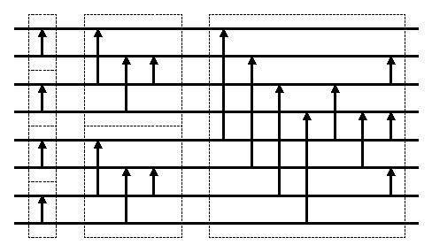

# VHDL で書くマージソーター(バッチャー奇偶マージソート)


## はじめに


別記事 [「はじめに」] を参照してください。

この記事では、前々回説明した[「ソーティングネットワーク」]を使ってバッチャー奇偶マージソート回路を構成する方法を紹介します。


## バッチャー奇偶マージソートとは


バッチャー奇偶マージソート(Batcher's odd-even megesort) は Ken Batche(en: Ken Batcher) によって考案された、要素数ｎに対して、大きさO(n(log n)\*\*2) かつ深さO((log n)\*\*2)のソーティングネットワークです(出典:[Wikipedia/Batcher_odd-even_mergesort])。

次図に８入力のバッチャー奇偶マージソートのソーティングネットワークの例を示します。




Fig.1 バッチャー奇偶マージソートのソーティングネットワーク例

<br />


以下に再帰呼び出しを使って Python で記述したバッチャー奇偶マージソートの実装例を示します(出典:[Wikipedia/Batcher_odd-even_mergesort])。


```Python:oddeven_sort.py
def compare_and_swap(x, a, b):
    if x[a] > x[b]:
        x[a], x[b] = x[b], x[a]
 
def oddeven_merge(x, lo, hi, r):
    step = r * 2
    if step < hi - lo:
        oddeven_merge(x, lo, hi, step)
        oddeven_merge(x, lo + r, hi, step)
        for i in range(lo + r, hi - r, step):
            compare_and_swap(x, i, i + r)
    else:
        compare_and_swap(x, lo, lo + r)
 
def oddeven_merge_sort_range(x, lo, hi):
    if (hi - lo) >= 1:
        mid = lo + ((hi - lo) / 2)
        oddeven_merge_sort_range(x, lo, mid)
        oddeven_merge_sort_range(x, mid + 1, hi)
        oddeven_merge(x, lo, hi, 1)
 
def oddeven_merge_sort(x):
    oddeven_merge_sort_range(x, 0, len(x)-1)

```


## バッチャーズ奇偶マージソートの VHDL 記述


### ソーティングネットワークの VHDL 記述


#### New_OddEven_Sorter_Network 関数


New_OddEven_Sorter_Network 関数は、バッチャーズ奇偶マージソートのソーティングネットワークに対応した Sorting_Network.Param_Type([「ソーティングネットワーク」]参照)を生成します。 New_OddEven_Sorter_Network 関数は Sorting_Network パッケージにて定義しています。


```VHDL:src/main/vhdl/core/sorting_network.vhd
library ieee;
use     ieee.std_logic_1164.all;
use     ieee.numeric_std.all;
library Merge_Sorter;
use     Merge_Sorter.Word;
package Sorting_Network is
    -- (前略) --
    function   New_OddEven_Sorter_Network(LO,HI,ORDER,QUEUE:integer) return Param_Type;
    -- (後略) --
end Sorting_Network;
```


```VHDL:src/main/vhdl/core/sorting_network.vhd
library ieee;
use     ieee.std_logic_1164.all;
use     ieee.numeric_std.all;
package body Sorting_Network is
    -- (前略) --
    function   New_OddEven_Sorter_Network(LO,HI,ORDER,QUEUE:integer) return Param_Type
    is
        variable  network  :  Param_Type;
    begin
        network            := Param_Null;
        network.Size       := HI - LO + 1;
        network.Lo         := LO;
        network.Hi         := HI;
        network.Sort_Order := ORDER;
        network.Stage_Lo   := 1;
        network.Stage_Hi   := 0;
        oddeven_sort(network, network.Stage_Lo, network.Lo, network.Hi);
        reverse_network_stage_list(network);
        Add_Queue_Params(network, QUEUE);
        return network;
    end function;
    -- (後略) --
end Sorting_Network;
```


#### New_OddEven_Merger_Network 関数


New_OddEven_Merger_Network 関数は、バッチャーズ奇偶マージソートネットワークのうちのマージの部分だけを取り出した Sorting_Network.Param_Type([「ソーティングネットワーク」]参照)を生成します。 New_OddEven_Merger_Network 関数は Sorting_Network パッケージにて定義しています。


```VHDL:src/main/vhdl/core/sorting_network.vhd
library ieee;
use     ieee.std_logic_1164.all;
use     ieee.numeric_std.all;
library Merge_Sorter;
use     Merge_Sorter.Word;
package Sorting_Network is
    -- (前略) --
    function   New_OddEven_Merger_Network(LO,HI,ORDER,QUEUE:integer) return Param_Type;
    -- (後略) --
end Sorting_Network;
```


```VHDL:src/main/vhdl/core/sorting_network.vhd
library ieee;
use     ieee.std_logic_1164.all;
use     ieee.numeric_std.all;
package body Sorting_Network is
    -- (前略) --
    function   New_OddEven_Merger_Network(LO,HI,ORDER,QUEUE:integer) return Param_Type
    is
        variable  network  :  Param_Type;
    begin
        network            := Param_Null;
        network.Size       := HI - LO + 1;
        network.Lo         := LO;
        network.Hi         := HI;
        network.Sort_Order := ORDER;
        network.Stage_Lo   := 1;
        network.Stage_Hi   := 0;
        oddeven_merge(network, network.Stage_Lo, network.Lo, network.Hi, 1);
        reverse_network_stage_list(network);
        Add_Queue_Params(network, QUEUE);
        return network;
    end function;
    -- (後略) --
end Sorting_Network;
```


#### oddeven_sort 関数


Sorting_Netowork パッケージボディに定義されたoddeven_sort 関数は、前述の Python による実装でしめした oddeven_merge_sort_range に対応します。oddeven_sort 関数を再帰的に呼び出しています。


```VHDL:src/main/vhdl/core/sorting_network.vhd
library ieee;
use     ieee.std_logic_1164.all;
use     ieee.numeric_std.all;
package body Sorting_Network is
    -- (前略) --
    procedure oddeven_sort(
        variable  NETWORK     :  inout Param_Type;
                  START_STAGE :  in    integer;
                  LO          :  in    integer;
                  HI          :  in    integer
    ) is
        variable  mid         :        integer;
    begin
        if (HI - LO > 0) then
            mid := LO + ((HI - LO) / 2);
            oddeven_merge(NETWORK, START_STAGE         , LO   , HI , 1);
            oddeven_sort (NETWORK, NETWORK.Stage_HI + 1, LO   , mid   );
            oddeven_sort (NETWORK, NETWORK.Stage_HI + 1, mid+1, HI    );
        end if;
    end procedure;
    -- (後略) --
end Sorting_Network;
```


#### oddeven_merge 関数


Sorting_Netowork パッケージボディに定義されたoddeven_merge 関数は、前述の Python による実装でしめした oddeven_merge に対応します。oddeven_merge 関数を再帰的に呼び出しています。

また、Python のよる実装では compare_and_swap を呼び出して実際に値を比較して交換していますが、この Sorting_Network パッケージではソーティングネットワークを構築するのが目的なので、ソーティングネットワークにコンパレーターを挿入するための Add_Comparator 関数を呼び出します。


```VHDL:src/main/vhdl/core/sorting_network.vhd
library ieee;
use     ieee.std_logic_1164.all;
use     ieee.numeric_std.all;
package body Sorting_Network is
    -- (前略) --
    procedure oddeven_merge(
        variable  NETWORK     :  inout Param_Type;
                  START_STAGE :  in    integer;
                  LO          :  in    integer;
                  HI          :  in    integer;
                  R           :  in    integer
    ) is
        variable  step        :        integer;
        variable  index       :        integer;
    begin
        step := R * 2;
        if (HI - LO > step) then
            oddeven_merge(NETWORK, START_STAGE + 1, LO    , HI, step);
            oddeven_merge(NETWORK, START_STAGE + 1, LO + r, HI, step);
            index  := LO + R;
            while (index <= HI - R) loop
                Add_Comparator(NETWORK, START_STAGE, index, index + R, TRUE);
                index := index + step;
            end loop;
        else
            Add_Comparator(NETWORK, START_STAGE, LO, LO + R, TRUE);
        end if;
        if (START_STAGE > NETWORK.Stage_Hi) then
            NETWORK.Stage_Hi   := START_STAGE;
            NETWORK.Stage_Size := NETWORK.Stage_Hi - NETWORK.Stage_Lo + 1;
        end if;
    end procedure;
    -- (後略) --
end Sorting_Network;
```


#### Add_Comparator 関数


Add_Comparator 関数はソーティングネットワークにコンパレーターを追加します。STAGE でコンパレーターを追加するステージを指定します。LO と HI でコンパレーターを挿入する対となるネットワークを指定します。UP でソーティングネットワークの Up/Down の方向を指定します。


```VHDL:src/main/vhdl/core/sorting_network.vhd
library ieee;
use     ieee.std_logic_1164.all;
use     ieee.numeric_std.all;
library Merge_Sorter;
use     Merge_Sorter.Word;
package Sorting_Network is
    -- (前略) --
    procedure  Add_Comparator(
        variable  NETWORK     :  inout Param_Type;
                  STAGE       :  in    integer;
                  LO          :  in    integer;
                  HI          :  in    integer;
                  UP          :  in    boolean
    );
    -- (後略) --
end Sorting_Network;
```


```VHDL:src/main/vhdl/core/sorting_network.vhd
library ieee;
use     ieee.std_logic_1164.all;
use     ieee.numeric_std.all;
package body Sorting_Network is
    -- (前略) --
    procedure Add_Comparator(
        variable  NETWORK     :  inout Param_Type;
                  STAGE       :  in    integer;
                  LO          :  in    integer;
                  HI          :  in    integer;
                  UP          :  in    boolean
    ) is
    begin
        assert (HI - LO > 0)
            report "Add_Comparator error" severity ERROR;
        assert ((NETWORK.Stage_List(STAGE).Comparator_List(LO).STEP = 0) or
                ((NETWORK.Stage_List(STAGE).Comparator_List(LO).STEP = HI-LO) and
                 (NETWORK.Stage_List(STAGE).Comparator_List(LO).UP   = UP   )))
            report "Add_Comparator error" severity ERROR;
        assert ((NETWORK.Stage_List(STAGE).Comparator_List(HI).STEP = 0) or
                ((NETWORK.Stage_List(STAGE).Comparator_List(HI).STEP = LO-HI) and
                 (NETWORK.Stage_List(STAGE).Comparator_List(HI).UP   = UP   )))
            report "Add_Comparator error" severity ERROR;
        NETWORK.Stage_List(STAGE).Comparator_List(LO).STEP  := HI-LO;
        NETWORK.Stage_List(STAGE).Comparator_List(LO).UP    := UP;
        NETWORK.Stage_List(STAGE).Comparator_List(HI).STEP  := LO-HI;
        NETWORK.Stage_List(STAGE).Comparator_List(HI).UP    := UP;
    end procedure;
    -- (後略) --
end Sorting_Network;
```


### バッチャーズ奇偶マージソートの VHDL 記述例


前回の[「ソーティングネットワーク」]で説明した Sorting_Network_Core に、前述で説明した New_Oddeven_Sorter_Network関数で生成したソーティングネットワーク構成を示す定数を渡してバッチャーズ奇偶ソートマージ回路を構成した例を示します。


#### Entity 


```VHDL:src/main/vhdl/examples/oddeven_sorter/oddeven_sorter.vhd
library ieee;
use     ieee.std_logic_1164.all;
entity  OddEven_Sorter is
    generic (
        WORDS           :  integer :=  4;
        DATA_BITS       :  integer := 32;
        COMP_HIGH       :  integer := 32;
        COMP_LOW        :  integer :=  0;
        COMP_SIGN       :  boolean := FALSE;
        SORT_ORDER      :  integer :=  0;
        ATRB_BITS       :  integer :=  4;
        INFO_BITS       :  integer :=  1;
        QUEUE_SIZE      :  integer :=  0
    );
    port (
        CLK             :  in  std_logic;
        RST             :  in  std_logic;
        CLR             :  in  std_logic;
        I_DATA          :  in  std_logic_vector(WORDS*DATA_BITS-1 downto 0);
        I_ATRB          :  in  std_logic_vector(WORDS*ATRB_BITS-1 downto 0) := (others => '0');
        I_INFO          :  in  std_logic_vector(      INFO_BITS-1 downto 0) := (others => '0');
        I_VALID         :  in  std_logic;
        I_READY         :  out std_logic;
        O_DATA          :  out std_logic_vector(WORDS*DATA_BITS-1 downto 0);
        O_ATRB          :  out std_logic_vector(WORDS*ATRB_BITS-1 downto 0);
        O_INFO          :  out std_logic_vector(      INFO_BITS-1 downto 0);
        O_VALID         :  out std_logic;
        O_READY         :  in  std_logic;
        BUSY            :  out std_logic
    );
end OddEven_Sorter;

```


#### Architecture


[「ワードの定義」]で説明したパラメータを WORD_PARAM 定数に設定します。


```VHDL:src/main/vhdl/examples/oddeven_sorter/oddeven_sorter.vhd
library ieee;
use     ieee.std_logic_1164.all;
library Merge_Sorter;
use     Merge_Sorter.Word;
use     Merge_Sorter.Sorting_Network;
use     Merge_Sorter.Core_Components.Sorting_Network_Core;
architecture RTL of OddEven_Sorter is
    constant  WORD_PARAM    :  Word.Param_Type := Word.New_Param(DATA_BITS, COMP_LOW, COMP_HIGH, COMP_SIGN);
    signal    i_word        :  std_logic_vector(WORDS*WORD_PARAM.BITS-1 downto 0);
    signal    o_word        :  std_logic_vector(WORDS*WORD_PARAM.BITS-1 downto 0);
begin

```


入力された I_DATA と I_ATRB を[「ワードの定義」]で指定されたワード形式に変換します。


```VHDL:src/main/vhdl/examples/oddeven_sorter/oddeven_sorter.vhd
    process (I_DATA, I_ATRB)
        variable   data     :  std_logic_vector(DATA_BITS-1 downto 0);
        variable   atrb     :  std_logic_vector(ATRB_BITS-1 downto 0);
        variable   word     :  std_logic_vector(WORD_PARAM.BITS-1 downto 0);
    begin
        for i in 0 to WORDS-1 loop
            data := I_DATA((i+1)*DATA_BITS-1 downto i*DATA_BITS);
            atrb := I_ATRB((i+1)*ATRB_BITS-1 downto i*ATRB_BITS);
            word(WORD_PARAM.DATA_HI downto WORD_PARAM.DATA_LO) := data;
            word(WORD_PARAM.ATRB_NONE_POS    ) := atrb(0);
            word(WORD_PARAM.ATRB_PRIORITY_POS) := atrb(1);
            word(WORD_PARAM.ATRB_POSTPEND_POS) := atrb(2);
            i_word((i+1)*WORD_PARAM.BITS-1 downto i*WORD_PARAM.BITS) <= word;
        end loop;
    end process;

```


前節で説明した New_Bitonic_Sorter_Network 関数を使ってバッチャーズ奇偶マージソートのソーティングネットワークを構築して[「ソーティングネットワーク」]で説明した Sorting_Network_Core に渡します。これにでバッチャーズ奇偶マージソートを行うソーティングネットワークが出来ます。


```VHDL:src/main/vhdl/examples/oddeven_sorter/oddeven_sorter.vhd
    CORE: Sorting_Network_Core
        generic map (
            NETWORK_PARAM   => Sorting_Network.New_OddEven_Sorter_Network(
                                   LO    => 0,
                                   HI    => WORDS-1,
                                   ORDER => SORT_ORDER,
                                   QUEUE => QUEUE_SIZE
                               ),
            WORD_PARAM      => WORD_PARAM      , -- 
            INFO_BITS       => INFO_BITS         -- 
        )                                        -- 
        port map (                               -- 
            CLK             => CLK             , -- In  :
            RST             => RST             , -- In  :
            CLR             => CLR             , -- In  :
            I_WORD          => i_word          , -- In  :
            I_INFO          => I_INFO          , -- In  :
            I_VALID         => I_VALID         , -- In  :
            I_READY         => I_READY         , -- Out :
            O_WORD          => o_word          , -- Out :
            O_INFO          => O_INFO          , -- Out :
            O_VALID         => O_VALID         , -- Out :
            O_READY         => O_READY         , -- In  :
            BUSY            => BUSY              -- Out :
        );

```


最後にソート結果を O_WORD と O_ATRB に変換して出力します。


```VHDL:src/main/vhdl/examples/oddeven_sorter/oddeven_sorter.vhd
    process (o_word)
        variable   data     :  std_logic_vector(DATA_BITS-1 downto 0);
        variable   atrb     :  std_logic_vector(ATRB_BITS-1 downto 0);
        variable   word     :  std_logic_vector(WORD_PARAM.BITS-1 downto 0);
    begin
        for i in 0 to WORDS-1 loop
            word := o_word((i+1)*WORD_PARAM.BITS-1 downto i*WORD_PARAM.BITS);
            data := word(WORD_PARAM.DATA_HI downto WORD_PARAM.DATA_LO);
            atrb    := (others => '0');
            atrb(0) := word(WORD_PARAM.ATRB_NONE_POS    );
            atrb(1) := word(WORD_PARAM.ATRB_PRIORITY_POS);
            atrb(2) := word(WORD_PARAM.ATRB_POSTPEND_POS);
            O_DATA((i+1)*DATA_BITS-1 downto i*DATA_BITS) <= data;
            O_ATRB((i+1)*ATRB_BITS-1 downto i*ATRB_BITS) <= atrb;
        end loop;
    end process;
end RTL;

```


## 参照

* 目次: [「はじめに」]
* 次回: [「シングルワード マージソート ノード」]
* 前回: [「バイトニックマージソート」]
* ソースコード:   
https://github.com/ikwzm/Merge_Sorter/blob/0.9.1/src/main/vhdl/core/sorting_network.vhd   
https://github.com/ikwzm/Merge_Sorter/blob/0.9.1/src/main/vhdl/examples/oddeven_sorter/oddeven_sorter.vhd
* 出典: [Wikipedia/Batcher_odd-even_mergesort]


[「はじめに」]: ./01_introduction.md "「VHDL で書くマージソーター(はじめに)」"
[「ワードの定義」]: ./02_word_package.md "「VHDL で書くマージソーター(ワードの定義)」"
[「ワード比較器」]: ./03_word_compare.md "「VHDL で書くマージソーター(ワード比較器)」"
[「ソーティングネットワーク」]: ./04_sorting_network.md "「VHDL で書くマージソーター(ソーティングネットワーク)」"
[「バイトニックマージソート」]: ./05_bitonic_sorter.md "「VHDL で書くマージソーター(バイトニックマージソート)」"
[「バッチャー奇偶マージソート」]: ./06_oddeven_sorter.md "「VHDL で書くマージソーター(バッチャー奇偶マージソート)」"
[「シングルワード マージソート ノード」]: ./07_merge_sort_node_single.md "「VHDL で書くマージソーター(シングルワード マージソート ノード)」"
[「マルチワード マージソート ノード」]: ./08_merge_sort_node_multi.md "「VHDL で書くマージソーター(マルチワード マージソート ノード)」"
[「マージソート ツリー」]: ./09_merge_sort_tree.md "「VHDL で書くマージソーター(マージソート ツリー)」"
[「端数ワード処理」]: ./10_merge_sort_core_1.md "「VHDL で書くマージソーター(端数ワード処理)」"
[「ストリーム入力」]: ./11_merge_sort_core_2.md "「VHDL で書くマージソーター(ストリーム入力)」"
[「ストリームフィードバック」]: ./12_merge_sort_core_3.md "「VHDL で書くマージソーター(ストリームフィードバック)」"
[「ArgSort IP」]: ./13_argsort.md "「VHDL で書くマージソーター(ArgSort IP)」"
[「ArgSort-Ultra96」]: https://github.com/ikwzm/ArgSort-Ultra96/blob/1.2.1/doc/ja/argsort-ultra96.md "「VHDL で書くマージソーター(ArgSort-Ultra96)」"
[「ArgSort-Kv260」]: https://github.com/ikwzm/ArgSort-Kv260/blob/1.2.1/doc/ja/argsort-Kv260.md "「VHDL で書くマージソーター(ArgSort-Kv260)」"
[Wikipedia/Batcher_odd-even_mergesort]: https://ja.wikipedia.org/wiki/%E3%83%90%E3%83%83%E3%83%81%E3%83%A3%E3%83%BC%E5%A5%87%E5%81%B6%E3%83%9E%E3%83%BC%E3%82%B8%E3%82%BD%E3%83%BC%E3%83%88 "Wikipedia/Batcher_odd-even_mergesort"
