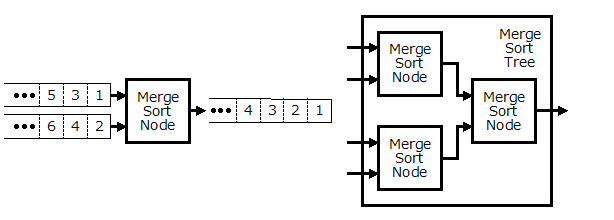
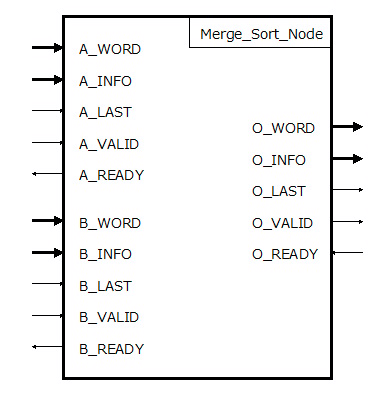

# VHDL で書くマージソーター(シングルワード マージソート ノード)


## はじめに


別記事 [「はじめに」] を参照してください。

この記事では、マージソートツリーの１要素のマージソートノードについて説明します。なお、この記事で説明するマージソートノードは、シングルワード版です。より高速なマルチワード版は次回([「マルチワード マージソート ノード」])で説明します。


## マージソートノードとは


マージソートノードは２ワードの入力を受け付けて、[「ワード比較器」] の比較結果をもとにどちらかのワードを出力します。[「FPGAを使って基本的なアルゴリズムのソーティングを劇的に高速化(1)」] ではマージロジック回路として紹介されていますが、これと同じものです。

複数のマージソートノードを用いてマージソートツリーを構成します。例えば下図のように4-way マージソートツリーは３つのマージソートノードで構成されます。




Fig.1 マージソートノードと 4-way マージソートツリー

<br />


## マージソートノードのアーキテクチャ


### 入出力


マージソートノードは次図のような入出力ポートを持っています。




Fig.2 マージソートノードの入出力

<br />

A_WORD、B_WORD、O_WORD は[ワードの定義]で指定されたワードのビット数×ジェネリック変数 WORDS で指定されるワード数のビット配列です。

A_INFO、B_INFO、O_INFO はワードではないその他の情報です。マージソートノード内で使用されることはありません。


データの入出力は AXI4-Stream と同じ [「VALID-then-READY」] プロトコルで行います。[「VALID-then-READY」]プロトコルは、VALID 信号と READY 信号によるハンドシェイクでデータの転送を行います。マージソートツリーおよびマージソートノードでは[「VALID-then-READY」] により複数のワードをパイプライン的に処理します。


A_LAST、B_LAST、O_LAST は一連のワード列の最後のワードであることを示します。


### 状態遷移


マージソートノードは、内部で次のような状態を持ちます。
  * COMP_STATE はAとBからの入力ワードを比較する状態
  * A_SEL_STATEは A を選択している状態
  * B_SEL_STATEは B を選択している状態
  * A_FLUSH_STATEはB入力が終了してA入力のみ受け付ける状態
  * B_FLUSH_STATEはA入力が終了してB入力のみ受け付ける状態


COMP_STATE で Word_Compare によりA が選択されると一時的に A_SEL_STATE に遷移します。後段の準備が出来ていなかった場合は、A_SEL_STATE の状態を維持します。後段の準備が出来ていた場合でA_LAST='0' の時は、すぐにCOMP_STATE に戻ります。

COMP_STATE で Word_Compare によりB が選択されると一時的に B_SEL_STATE に遷移します。後段の準備が出来ていなかった場合は、B_SEL_STATE の状態を維持します。後段の準備が出来ていた場合でB_LAST='0'の時は、すぐにCOMP_STATE に戻ります。


")

Fig.3 マージソートノードの状態遷移(1)

<br />

A_SEL_STATE で A を選択している状態時、後段の準備が出来ていた場合でA_LAST='1' の時は B_FLUSH_STATE に遷移します。

B_FLUSH_STATE は B_LAST='1' が入力されるまで B からの入力を後段に出力し続けます。B_LAST='1' が入力されてBからの最後のワードが後段に出力されると COMP_STATE に戻ります。


")

Fig.4 マージソートノードの状態遷移(2)

<br />


B_SEL_STATE で B を選択している状態時、後段の準備が出来ていた場合でB_LAST='1' の時は A_FLUSH_STATE に遷移します。

A_FLUSH_STATE は A_LAST='1' が入力されるまで A からの入力を後段に出力し続けます。A_LAST='1' が入力されてAからの最後のワードが後段に出力されると COMP_STATE に戻ります。


")

Fig.5 マージソートノードの状態遷移(3)

<br />


## マージソートノードの VHDL 記述


### Entity 


[「ワードの定義」]で説明したパラメータを ジェネリック変数 WORD_PARAM に設定します。

同時に処理するワード数を ジェネリック変数WORDS に設定します。この記事ではシングルワード版のみの説明なので、WORDS=1 の場合のみ紹介します。

ジェネリック変数 SORT_ORDER は昇順か降順かを指定します。


```VHDL:src/main/vhdl/core/merge_sorter_node.vhd
library ieee;
use     ieee.std_logic_1164.all;
library Merge_Sorter;
use     Merge_Sorter.Word;
entity  Merge_Sorter_Node is
    generic (
        WORD_PARAM  :  Word.Param_Type := Word.Default_Param;
        WORDS       :  integer :=  1;
        INFO_BITS   :  integer :=  1;
        SORT_ORDER  :  integer :=  0
    );
    port (
        CLK         :  in  std_logic;
        RST         :  in  std_logic;
        CLR         :  in  std_logic;
        A_WORD      :  in  std_logic_vector(WORDS*WORD_PARAM.BITS-1 downto 0);
        A_INFO      :  in  std_logic_vector(            INFO_BITS-1 downto 0) := (others => '0');
        A_LAST      :  in  std_logic;
        A_VALID     :  in  std_logic;
        A_READY     :  out std_logic;
        B_WORD      :  in  std_logic_vector(WORDS*WORD_PARAM.BITS-1 downto 0);
        B_INFO      :  in  std_logic_vector(            INFO_BITS-1 downto 0) := (others => '0');
        B_LAST      :  in  std_logic;
        B_VALID     :  in  std_logic;
        B_READY     :  out std_logic;
        O_WORD      :  out std_logic_vector(WORDS*WORD_PARAM.BITS-1 downto 0);
        O_INFO      :  out std_logic_vector(            INFO_BITS-1 downto 0);
        O_LAST      :  out std_logic;
        O_VALID     :  out std_logic;
        O_READY     :  in  std_logic
    );
end Merge_Sorter_Node;

```


### Architecture


マージソートノードでは以下のライブラリパッケージを使用します。


```VHDL:src/main/vhdl/core/merge_sorter_node.vhd
library ieee;
use     ieee.std_logic_1164.all;
library Merge_Sorter;
use     Merge_Sorter.Word;
use     Merge_Sorter.Sorting_Network;
use     Merge_Sorter.OddEven_MergeSort_Network;
use     Merge_Sorter.Core_Components.Word_Compare;
use     Merge_Sorter.Core_Components.Word_Queue;
use     Merge_Sorter.Core_Components.Sorting_Network_Core;
library PipeWork;
use     PipeWork.Components.REDUCER;

```


内部で使用する信号とステートマシンの定義です。


```VHDL:src/main/vhdl/core/merge_sorter_node.vhd
architecture RTL of Merge_Sorter_Node is
    signal    i_word            :  std_logic_vector(WORDS*WORD_PARAM.BITS-1 downto 0);
    signal    i_info            :  std_logic_vector(            INFO_BITS-1 downto 0);
    signal    i_sel_a           :  std_logic;
    signal    i_last            :  std_logic;
    signal    i_valid           :  std_logic;
    signal    i_ready           :  std_logic;
    type      STATE_TYPE        is (IDLE_STATE , COMP_STATE   ,
                                    A_SEL_STATE, A_FLUSH_STATE, 
                                    B_SEL_STATE, B_FLUSH_STATE
                                );
    signal    curr_state        :  STATE_TYPE;
    signal    next_state        :  STATE_TYPE;
    signal    temp_state        :  STATE_TYPE;
    signal    comp_valid        :  std_logic;
    signal    comp_ready        :  std_logic;
    signal    comp_sel_a        :  std_logic;
    signal    comp_sel_b        :  std_logic;
begin
```


A_WORD と B_WORD の比較を Word_Comapre([「ワード比較器」])で行います。Word_Compare への有効信号(comp_valid信号)は現在のステートが COMP_STATE かつ、A入力側のVALID信号(A_VALID信号) が '1' かつ B入力側のVALID信号(B_VALID信号) が '1' の時にアサートします。


```VHDL:src/main/vhdl/core/merge_sorter_node.vhd
    COMP: Word_Compare                                         --
        generic map(                                           --
            WORD_PARAM  => WORD_PARAM                        , -- 
            SORT_ORDER  => SORT_ORDER                          -- 
        )                                                      -- 
        port map (                                             --
            CLK         => CLK                               , -- In  :
            RST         => RST                               , -- In  :
            CLR         => CLR                               , -- In  :
            A_WORD      => A_WORD(WORD_PARAM.BITS-1 downto 0), -- In  :
            B_WORD      => B_WORD(WORD_PARAM.BITS-1 downto 0), -- In  :
            VALID       => comp_valid                        , -- In  :
            READY       => comp_ready                        , -- Out :
            SEL_A       => comp_sel_a                        , -- Out :
            SEL_B       => comp_sel_b                          -- Out :
        );                                                     -- 
    comp_valid <= '1' when (curr_state = COMP_STATE and A_VALID = '1' and B_VALID = '1') else '0';

```


現在の状態(curr_state 信号) が COMP_STATE の時のみ、Word_Compare の結果を一時的な状態(temp_state) に反映します。現在の状態(curr_state 信号) が COMP_STATE 以外の時は一時的な状態(temp_state) は現在の状態(curr_state信号) を反映します。


```VHDL:src/main/vhdl/core/merge_sorter_node.vhd
    process (curr_state, comp_ready, comp_sel_b) begin
        case curr_state is
            when COMP_STATE =>
                if   (comp_ready = '1') then
                    if (comp_sel_b = '1') then
                        temp_state <= B_SEL_STATE;
                    else
                        temp_state <= A_SEL_STATE;
                    end if;
                else
                        temp_state <= COMP_STATE;
                end if;
            when others =>
                        temp_state <= curr_state;
        end case;
    end process;

```


一時的な状態(temp_state) から次に遷移する状態(next_state) を決めます。後段の準備が出来ていない時(i_ready='0'の時)は、次に遷移する状態(next_state)は一時的な状態(temp_state)から変わりません。

後段の準備が出来ている時(i_ready='1'の時)は、A_LAST信号またはB_LAST信号の状態によって次に遷移する状態(next_state)が変わります。


```VHDL:src/main/vhdl/core/merge_sorter_node.vhd
    process (temp_state, A_VALID, A_LAST, B_VALID, B_LAST, i_ready) begin
        case temp_state is
            when A_SEL_STATE =>
                if    (i_ready = '1' and A_VALID = '1' and A_LAST = '1') then
                    next_state <= B_FLUSH_STATE;
                elsif (i_ready = '1' and A_VALID = '1' and A_LAST = '0') then
                    next_state <= COMP_STATE;
                else
                    next_state <= A_SEL_STATE;
                end if;
            when B_SEL_STATE =>
                if    (i_ready = '1' and B_VALID = '1' and B_LAST = '1') then
                    next_state <= A_FLUSH_STATE;
                elsif (i_ready = '1' and B_VALID = '1' and B_LAST = '0') then
                    next_state <= COMP_STATE;
                else
                    next_state <= B_SEL_STATE;
                end if;
            when A_FLUSH_STATE =>
                if    (i_ready = '1' and A_VALID = '1' and A_LAST = '1') then
                    next_state <= COMP_STATE;
                else
                    next_state <= A_FLUSH_STATE;
                end if;
            when B_FLUSH_STATE =>
                if    (i_ready = '1' and B_VALID = '1' and B_LAST = '1') then
                    next_state <= COMP_STATE;
                else
                    next_state <= B_FLUSH_STATE;
                end if;
            when COMP_STATE  =>
                    next_state <= COMP_STATE;
            when others =>
                    next_state <= COMP_STATE;
        end case;
    end process;

```


クロックで次に遷移する状態(next_state)を現在の状態(curr_state)に反映します。


```VHDL:src/main/vhdl/core/merge_sorter_node.vhd
    process (CLK, RST) begin
        if (RST = '1') then
                curr_state <= IDLE_STATE;
        elsif (CLK'event and CLK = '1') then
            if (CLR = '1') then
                curr_state <= IDLE_STATE;
            else
                curr_state <= next_state;
            end if;
        end if;
    end process;

```


A入力側への応答(A_READY信号)は、 temp_state が A_SEL_STATE(比較結果がSEL_Aの時) または A_FLUSH_STATE(B入力が終了してA入力のみ受け付ける状態) に後段からのREADY信号(i_ready信号) の値を反映します。

同様にB入力側への応答(B_READY信号)は、 temp_state が B_SEL_STATE(比較結果がSEL_Bの時) または B_FLUSH_STATE(A入力が終了してB入力のみ受け付ける状態) に後段からのREADY信号(i_ready信号) の値を反映します。


```VHDL:src/main/vhdl/core/merge_sorter_node.vhd
    A_READY <= '1' when (temp_state = A_SEL_STATE   and i_ready = '1') or
                        (temp_state = A_FLUSH_STATE and i_ready = '1') else '0';
    B_READY <= '1' when (temp_state = B_SEL_STATE   and i_ready = '1') or
                        (temp_state = B_FLUSH_STATE and i_ready = '1') else '0';

```


後段への VALID 信号(i_valid 信号) は temp_state が A_SEL_STATE(比較結果がSEL_Aの時)  または A_FLUSH_STATE(B入力が終了してA入力のみ受け付ける状態) の時は、A入力側からのVALID信号(A_VALID信号) の値を反映します。

または、temp_state が B_SEL_STATE(比較結果がSEL_Bの時)  または B_FLUSH_STATE(A入力が終了してB入力のみ受け付ける状態) の時は、B入力側からのVALID信号(B_VALID信号) の値を反映します。


```VHDL:src/main/vhdl/core/merge_sorter_node.vhd
    i_valid <= '1' when (temp_state = A_SEL_STATE   and A_VALID = '1') or
                        (temp_state = A_FLUSH_STATE and A_VALID = '1') or
                        (temp_state = B_SEL_STATE   and B_VALID = '1') or
                        (temp_state = B_FLUSH_STATE and B_VALID = '1') else '0';

```


後段へのLAST信号(i_last信号) は、temp_state が A_FLUSH_STATE(B入力が終了してA入力のみ受け付ける状態)の時に A入力側のLAST信号(A_LAST信号) がアサートされた時、またはtemp_state が B_FLUSH_STATE(A入力が終了してB入力のみ受け付ける状態)の時に B入力側のLAST信号(B_LAST信号) がアサートされた時にアサートします。


```VHDL:src/main/vhdl/core/merge_sorter_node.vhd
    i_last  <= '1' when (temp_state = A_FLUSH_STATE and A_LAST  = '1') or
                        (temp_state = B_FLUSH_STATE and B_LAST  = '1') else '0';

```


後段への選択信号(i_sel_a信号)、ワード(i_word信号)、その他の情報(i_info) は次のように出力します。


```VHDL:src/main/vhdl/core/merge_sorter_node.vhd
    i_sel_a <= '1' when (temp_state = A_SEL_STATE  ) or
                        (temp_state = A_FLUSH_STATE) else '0';
    i_word  <= B_WORD when (temp_state = B_SEL_STATE  ) or
                           (temp_state = B_FLUSH_STATE) else A_WORD;
    i_info  <= B_INFO when (temp_state = B_SEL_STATE  ) or
                           (temp_state = B_FLUSH_STATE) else A_INFO;

```


シングルワード(WORDS=1)の場合は、後段への出力(i_word信号、i_info信号、i_last信号、i_valid信号) はそのままマージソートノードの後段への出力(O_WORD信号、O_INFO信号、O_LAST信号、O_VALID信号) となります。


```VHDL:src/main/vhdl/core/merge_sorter_node.vhd
    SINGLE_WORD: if (WORDS = 1) generate
        O_WORD  <= i_word;
        O_INFO  <= i_info;
        O_LAST  <= i_last;
        O_VALID <= i_valid;
        i_ready <= O_READY;
    end generate;

```


マルチワード(WORDS>1)の場合は、次回のマルチワード マージソート ノードで説明します。


```VHDL:src/main/vhdl/core/merge_sorter_node.vhd
    MULTI_WORD: if (WORDS > 1) generate
		-- 次回説明 --
    end generate;
end RTL;

```


## 参照

* 目次: [「はじめに」]
* 次回: [「マルチワード マージソート ノード」]
* 前回: [「バッチャー奇偶マージソート」]
* ソースコード:   
https://github.com/ikwzm/Merge_Sorter/blob/1.4.1/src/main/vhdl/core/merge_sorter_node.vhd
* [「FPGAを使って基本的なアルゴリズムのソーティングを劇的に高速化(1)」]
* [「VALID 信号と READY 信号によるハンドシェイクの注意点」 @Qiita][「VALID-then-READY」] 


[「はじめに」]: ./01_introduction.md "「VHDL で書くマージソーター(はじめに)」"
[「ワードの定義」]: ./02_word_package.md "「VHDL で書くマージソーター(ワードの定義)」"
[「ワード比較器」]: ./03_word_compare.md "「VHDL で書くマージソーター(ワード比較器)」"
[「ソーティングネットワーク」]: ./04_sorting_network.md "「VHDL で書くマージソーター(ソーティングネットワーク)」"
[「バイトニックマージソート」]: ./05_bitonic_sorter.md "「VHDL で書くマージソーター(バイトニックマージソート)」"
[「バッチャー奇偶マージソート」]: ./06_oddeven_sorter.md "「VHDL で書くマージソーター(バッチャー奇偶マージソート)」"
[「シングルワード マージソート ノード」]: ./07_merge_sort_node_single.md "「VHDL で書くマージソーター(シングルワード マージソート ノード)」"
[「マルチワード マージソート ノード」]: ./08_merge_sort_node_multi.md "「VHDL で書くマージソーター(マルチワード マージソート ノード)」"
[「マージソート ツリー」]: ./09_merge_sort_tree.md "「VHDL で書くマージソーター(マージソート ツリー)」"
[「端数ワード処理」]: ./10_merge_sort_core_1.md "「VHDL で書くマージソーター(端数ワード処理)」"
[「ストリーム入力」]: ./11_merge_sort_core_2.md "「VHDL で書くマージソーター(ストリーム入力)」"
[「ストリームフィードバック」]: ./12_merge_sort_core_3.md "「VHDL で書くマージソーター(ストリームフィードバック)」"
[「ArgSort IP」]: ./13_argsort.md "「VHDL で書くマージソーター(ArgSort IP)」"
[「ArgSort-Ultra96」]: https://github.com/ikwzm/ArgSort-Ultra96/blob/1.2.1/doc/ja/argsort-ultra96.md "「VHDL で書くマージソーター(ArgSort-Ultra96)」"
[「ArgSort-Kv260」]: https://github.com/ikwzm/ArgSort-Kv260/blob/1.2.1/doc/ja/argsort-Kv260.md "「VHDL で書くマージソーター(ArgSort-Kv260)」"
[「FPGAを使って基本的なアルゴリズムのソーティングを劇的に高速化(1)」]: https://www.acri.c.titech.ac.jp/wordpress/archives/132 "「FPGAを使って基本的なアルゴリズムのソーティングを劇的に高速化(1)」"
[「VALID-then-READY」]: https://qiita.com/ikwzm/items/9736b5547cb15309af5c "「VALID 信号と READY 信号によるハンドシェイクの注意点」"
