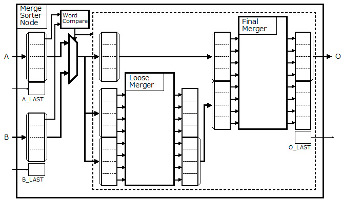

# VHDL で書くマージソーター(マルチワード マージソート ノード)


## はじめに


別記事 [「はじめに」] を参照してください。

この記事は、前回の[「シングルワード マージソート ノード」]の続きで、マルチワードに対応したマージソートノードの説明をします。


## マルチワードマージソートノードとは


前回の記事で説明した[「シングルワード マージソート ノード」]は、同時に１ワードずつの出力しか出来ませんでした。つまりマージソートツリーのノードを増やしてどんなに way 数を増やしても、最終的に出て行くワードは単位時間あたり１ワードしかありません。

マルチワードソートノードは、同時に処理するワードを複数ワードにすることで、単位時間あたりに出力するワード数を増やします。その結果、マージソートをワード数倍に高速化することが出来ます。

マルチワードノードソートは、[「はじめに」]で紹介した以下の ACRi の記事がとても詳しいです。私はその記事に刺激を受けて VHDL で実装してみたに過ぎません。詳しい内容はそちらを参照してください。
*  [「FPGAを使って基本的なアルゴリズムのソーティングを劇的に高速化(1)」] 
*  [「FPGAを使って基本的なアルゴリズムのソーティングを劇的に高速化(2)」] 
*  [「FPGAを使って基本的なアルゴリズムのソーティングを劇的に高速化(3)」] 
*  [「FPGAを使って基本的なアルゴリズムのソーティングを劇的に高速化(4)」] 
*  [「FPGAを使って基本的なアルゴリズムのソーティングを劇的に高速化(5)」] 


## マルチワードマージソートノードのアーキテクチャ


### 構成


今回実装したマルチワードソートノードは、[「FPGAを使って基本的なアルゴリズムのソーティングを劇的に高速化(5)」] で紹介されている MMS(フィードバックデータパスのない HMS) をもとにしています。




Fig.1 マルチワードマージソートのアーキテクチャ

<br />

マルチワードマージソートノードの入力側は[「シングルワード マージソート ノード」]とほとんど変わりありません。上の図の点線で囲まれた部分がマルチワードに拡張した部分になります。

今回実装したマルチワードソートノードは、[「バッチャー奇偶マージソート」]のマージ部分を使っています。


### 動作例


以下にマルチワードマージソートノードの動作例を示します。


まず最初のワード群が A および B から入力されたとします。Aのワード群の最初のワードと、Bのワード群の最初のワードを[「ワード比較器」]で比較します。その際、Aが選択された場合は、レジスタにAのワード群が設定され、もう一つのレジスタには PRIORITY  属性のワードが設定されます。


")

Fig.2 マルチワードマージソートの動作例(1)

<br />


次にAからは次のワード群が入力されます(その際、最後のワード群であることを示すA_LASTが'1'だったとします）。そして今度はBのワード群が選択されたとします。

前段のバッチャーズ奇偶マージャー(Loose Merger) は前回選択されたAワード群と最初に設定されていた PRIRITY属性を持つワード群をソートします。PRIORITY 属性を持つワードは最優先でソートされるので、その結果、前回選択されたAワード群がソートの下位に出力されます。

後段のバッチャーズ奇偶マージャー(Final Merger)は、今回選択された B ワード群と前段のバッチャーズ奇偶マージャー(Loose Merger)がソートした下位のワード群(結果として前回選択されたAワード群)とをソートして上位のワード群を出力します。


")

Fig.3 マルチワードマージソートの動作例(2)

<br />

次にBからは次のワード群が入力されます(その際、最後のワード群であることを示すA_LASTが'1'だったとします）。そして今度はAのワード群が選択されたとします。

前段のバッチャーズ奇偶マージャー(Loose Merger) は前回選択されたBワード群と前々回選択された A ワード群をソートします。


  __実は前段のバッチャーズ奇偶マージャー(Loose Merger)のソートの結果の下位ワード群は、前の図(Fig.3 マルチワードマージソートの動作例(2))の後段のバッチャーズ奇偶マージャー(Final Merger)の下位ワード群と同じであることに注目してください。これがこのアルゴリズムの秀逸なところです（これみつけた人はすごい）。__  


つまり前段のバッチャーズ奇偶マージャー(Loose Merger)の下位のワード群は前回のソート結果の負けたほう(出力されなかったほう)を後段のバッチャーズ奇偶マージャー(Final Merger)に入力するためのものです。このようにフィードバックパスを無くしてパイプライン処理を可能にすることで高い周波数で動作する回路にすることができます。


")

Fig.4 マルチワードマージソートの動作例(3)

<br />


前回Aから入力されたワード群には A_LAST='1' だったのでこれ以上Aからは入力されません。そのため今回はBから入力されたワード群が選択されます。

ここでも、前の図(Fig.4 マルチワードマージソートの動作例(3))の後段のバッチャーズ奇偶マージャー(Final Merger)のソート結果で負けたほう(出力されなかったほう)のワード群が、前段のバッチャーズ奇偶マージャー(Loose Merger)の下位のワード群から出力されています。


")

Fig.5 マルチワードマージソートの動作例(4)

<br />


前回Bから入力されたワード群には B_LAST='1' だったのでこれ以上AからもBからも入力されません。したがってこれが最後のフェーズになります。後段のバッチャーズ奇偶マージャー(Final Merger)の上位ワード群には POSTPEND 属性を付加したワードを入力します。POSTPEND 属性をもつワードはソートの際に常に他のワードよりも後回しにされるので、その結果、レジスタ内に残された最後のワード群が出力されます(と同時にO_LAST='1'を出力します)。


")

Fig.6 マルチワードマージソートの動作例(5)

<br />


## マルチワードマージソートノードの VHDL 記述


### Architecture


入力側の[ワード比較器]まわりは前回の[「シングルワード マージソート ノード」]と同じです。この記事ではマルチワード時(WORDS > 1) の場合のみ説明します。


前段のバッチャーズ奇偶マージャー(Loose Merger) と後段のバッチャーズ奇偶マージャー(Final Merger)を [「ソーティングネットワーク」]で構築するために [「バッチャー奇偶マージソート」]で説明した関数(Sorting_Network.New_OddEven_Merge_Network)を用いてパラメータを生成します。


```VHDL:src/main/vhdl/core/merge_sorter_node.vhd
    MULTI_WORD: if (WORDS > 1) generate
        type      PARAM_TYPE        is record
                  INTAKE_QUEUE_SIZE :  integer;
                  LOSER_MERGE       :  Sorting_Network.Param_Type;
                  FINAL_MERGE       :  Sorting_Network.Param_Type;
        end record;
        function  GEN_PARAM return PARAM_TYPE is
            variable param          :  PARAM_TYPE;
        begin
            param.INTAKE_QUEUE_SIZE := 2;
            param.LOSER_MERGE       := OddEven_MergeSort_Network.New_Merge_Network(
                                           LO     => 0         ,
                                           HI     => 2*WORDS-1 ,
                                           ORDER  => SORT_ORDER
                                       );
            param.FINAL_MERGE       := OddEven_MergeSort_Network.New_Merge_Network(
                                           LO     => 0         ,
                                           HI     => 2*WORDS-1 ,
                                           ORDER  => SORT_ORDER
                                       );
            Sorting_Network.Set_Queue_Param(param.LOSER_MERGE,
                                            Sorting_Network.Constant_Queue_Size(1,1,1));
            Sorting_Network.Set_Queue_Param(param.FINAL_MERGE,
                                            Sorting_Network.Constant_Queue_Size(1,1,0));
            return param;
        end function;
        constant  PARAM             :  PARAM_TYPE := GEN_PARAM;

```


ワード群を示すタイプを定義します。ここではワード群は TEAM という名前にしています。


```VHDL:src/main/vhdl/core/merge_sorter_node.vhd
        constant  WORD_BITS         :  integer := WORD_PARAM.BITS;
        constant  TEAM_BITS         :  integer := WORDS*WORD_BITS;
        subtype   WORD_TYPE         is std_logic_vector(WORD_BITS-1 downto 0);
        type      TEAM_TYPE         is array(WORDS-1 downto 0) of WORD_TYPE;
        function  TO_STD_LOGIC_VECTOR(TEAM: TEAM_TYPE) return std_logic_vector is
            variable   value        :  std_logic_vector(TEAM_BITS-1 downto 0);
        begin
            for i in 0 to WORDS-1 loop
                value((i+1)*WORD_BITS-1 downto i*WORD_BITS) := TEAM(i);
            end loop;
            return value;
        end function;
        function  TO_TEAM(SV: std_logic_vector) return TEAM_TYPE is
            alias      value        :  std_logic_vector(SV'length-1 downto 0) is SV;
            variable   team         :  TEAM_TYPE;
        begin
            for i in 0 to WORDS-1 loop
                team(i) := value((i+1)*WORD_BITS-1 downto i*WORD_BITS);
            end loop;
            return team;
        end function;

```


マルチワードマージソートノード内部で使用する定数と信号を定義します。


```VHDL:src/main/vhdl/core/merge_sorter_node.vhd
        constant  PRIORITY_WORD     :  WORD_TYPE := Word.New_Priority_Word(WORD_PARAM);
        constant  POSTPEND_WORD     :  WORD_TYPE := Word.New_Postpend_Word(WORD_PARAM);
        constant  PRIORITY_TEAM     :  TEAM_TYPE := (others => PRIORITY_WORD);
        constant  POSTPEND_TEAM     :  TEAM_TYPE := (others => POSTPEND_WORD);
        signal    intake_team       :  TEAM_TYPE;
        signal    intake_info       :  std_logic_vector(INFO_BITS-1 downto 0);
        signal    intake_sel_a      :  std_logic;
        signal    intake_last       :  std_logic;
        signal    intake_valid      :  std_logic;
        signal    intake_ready      :  std_logic;
        signal    seeded_team       :  TEAM_TYPE;
        signal    last_a_team       :  TEAM_TYPE;
        signal    last_b_team       :  TEAM_TYPE;
        signal    merge_info        :  std_logic_vector(INFO_BITS-1 downto 0);
        signal    merge_last        :  std_logic;
        signal    merge_valid       :  std_logic;
        signal    merge_ready       :  std_logic;
        signal    last_winner_team  :  TEAM_TYPE;
        signal    last_loser_team   :  TEAM_TYPE;
        signal    challenger_team   :  TEAM_TYPE;
        signal    challenger_info   :  std_logic_vector(INFO_BITS-1 downto 0);
        signal    challenger_last   :  std_logic;
        signal    challenger_valid  :  std_logic;
        signal    challenger_ready  :  std_logic;
        signal    final_winner_team :  TEAM_TYPE;
        signal    final_loser_team  :  TEAM_TYPE;
    begin

```


前段の[「ワード比較器」]によって選択されたワード群(i_word 信号)はどちらから選択されたかを示す信号(i_sel_a信号)とその他の情報(i_info信号)とともに一旦キューに格納します。キューの出力は intake_xxx という信号名で後段に渡します。


```VHDL:src/main/vhdl/core/merge_sorter_node.vhd
        INTAKE: block
            constant  INFO_INFO_LO      :  integer := 0;
            constant  INFO_INFO_HI      :  integer := INFO_INFO_LO + INFO_BITS - 1;
            constant  INFO_SEL_POS      :  integer := INFO_INFO_HI + 1;
            constant  THIS_INFO_BITS    :  integer := INFO_SEL_POS - INFO_INFO_LO + 1;
            signal    ii_info           :  std_logic_vector(THIS_INFO_BITS-1 downto 0);
            signal    oo_info           :  std_logic_vector(THIS_INFO_BITS-1 downto 0);
            signal    oo_word           :  std_logic_vector(TEAM_BITS     -1 downto 0);
        begin
            ii_info(INFO_INFO_HI downto INFO_INFO_LO) <= i_info;
            ii_info(INFO_SEL_POS                    ) <= i_sel_a;
            QUEUE: Word_Queue                                           -- 
                generic map (                                           -- 
                    WORD_PARAM  => WORD_PARAM                         , -- 
                    WORDS       => WORDS                              , --
                    INFO_BITS   => THIS_INFO_BITS                     , -- 
                    QUEUE_SIZE  => PARAM.INTAKE_QUEUE_SIZE              -- 
                )                                                       -- 
                port map (                                              -- 
                    CLK         => CLK                                , -- In  :
                    RST         => RST                                , -- In  :
                    CLR         => CLR                                , -- In  :
                    I_WORD      => i_word                             , -- In  :
                    I_INFO      => ii_info                            , -- In  :
                    I_LAST      => i_last                             , -- In  :
                    I_VALID     => i_valid                            , -- In  :
                    I_READY     => i_ready                            , -- Out :
                    O_WORD      => oo_word                            , -- Out :
                    O_INFO      => oo_info                            , -- Out :
                    O_LAST      => intake_last                        , -- Out :
                    O_VALID     => intake_valid                       , -- Out :
                    O_READY     => intake_ready                         -- In  :
                );                                                       --
            intake_team  <= TO_TEAM(oo_word);
            intake_info  <= oo_info(INFO_INFO_HI downto INFO_INFO_LO);
            intake_sel_a <= oo_info(INFO_SEL_POS                    );
        end block;

```


前回入力したワード群を保持するレジスタと状態遷移を行います。


```VHDL:src/main/vhdl/core/merge_sorter_node.vhd
        PREPARE_TERM : block
            type      STATE_TYPE        is (IDLE_STATE, XFER_STATE, LAST_STATE);
            signal    curr_state        :  STATE_TYPE;
            signal    last_info         :  std_logic_vector(INFO_BITS-1 downto 0);
        begin
            process (CLK, RST) begin
                if (RST = '1') then
                        curr_state  <= IDLE_STATE;
                        last_a_team <= PRIORITY_TEAM;
                        last_b_team <= PRIORITY_TEAM;
                        last_info   <= (others => '0');
                elsif (CLK'event and CLK = '1') then
                    if (CLR = '1') then
                        curr_state  <= IDLE_STATE;
                        last_a_team <= PRIORITY_TEAM;
                        last_b_team <= PRIORITY_TEAM;
                        last_info   <= (others => '0');
                    else
                        case curr_state is
                            when IDLE_STATE =>
                                if (intake_valid = '1' and intake_ready = '1') then
                                    if (intake_last = '1') then
                                        curr_state <= LAST_STATE;
                                    else
                                        curr_state <= XFER_STATE;
                                    end if;
                                    if (intake_sel_a = '1') then
                                        last_a_team <= intake_team;
                                        last_b_team <= PRIORITY_TEAM;
                                    else
                                        last_a_team <= PRIORITY_TEAM;
                                        last_b_team <= intake_team;
                                    end if;
                                    last_info  <= intake_info;
                                else
                                    curr_state <= IDLE_STATE;
                                end if;
                            when XFER_STATE =>
                                if (intake_valid = '1' and intake_ready = '1') then
                                    if (intake_last = '1') then
                                        curr_state <= LAST_STATE;
                                    else
                                        curr_state <= XFER_STATE;
                                    end if;
                                    if (intake_sel_a = '1') then
                                        last_a_team <= intake_team;
                                    else
                                        last_b_team <= intake_team;
                                    end if;
                                    last_info  <= intake_info;
                                else
                                    curr_state <= XFER_STATE;
                                end if;
                            when LAST_STATE =>
                                if (merge_ready = '1') then
                                    curr_state <= IDLE_STATE;
                                else
                                    curr_state <= LAST_STATE;
                                end if;
                            when others =>
                                    curr_state <= IDLE_STATE;
                        end case;
                    end if;
                end if;
            end process;
            merge_info   <= last_info     when (curr_state = LAST_STATE) else intake_info;
            seeded_team  <= POSTPEND_TEAM when (curr_state = LAST_STATE) else intake_team;
            merge_valid  <= '1' when (curr_state = XFER_STATE and intake_valid = '1') or
                                     (curr_state = LAST_STATE                       ) else '0';
            merge_last   <= '1' when (curr_state = LAST_STATE                       ) else '0';
            intake_ready <= '1' when (curr_state = IDLE_STATE                       ) or
                                     (curr_state = XFER_STATE and merge_ready  = '1') else '0';
        end block;

```


前段のバッチャーズ奇偶マージャー(Loose Merger)を定義します。


```VHDL:src/main/vhdl/core/merge_sorter_node.vhd
        LOSER_MERGE: block
            constant  WORD_TEAM0_LO     :  integer := 0;
            constant  WORD_TEAM0_HI     :  integer := WORD_TEAM0_LO + TEAM_BITS - 1;
            constant  WORD_TEAM1_LO     :  integer := WORD_TEAM0_HI + 1;
            constant  WORD_TEAM1_HI     :  integer := WORD_TEAM1_LO + TEAM_BITS - 1;
            constant  THIS_WORD_BITS    :  integer := WORD_TEAM1_HI - WORD_TEAM0_LO + 1;
            constant  INFO_TEAM_LO      :  integer := 0;
            constant  INFO_TEAM_HI      :  integer := INFO_TEAM_LO  + TEAM_BITS - 1;
            constant  INFO_INFO_LO      :  integer := INFO_TEAM_HI  + 1;
            constant  INFO_INFO_HI      :  integer := INFO_INFO_LO  + INFO_BITS - 1;
            constant  INFO_LAST_POS     :  integer := INFO_INFO_HI  + 1;
            constant  THIS_INFO_BITS    :  integer := INFO_LAST_POS - INFO_TEAM_LO  + 1;
            signal    ii_word           :  std_logic_vector(THIS_WORD_BITS-1 downto 0);
            signal    ii_info           :  std_logic_vector(THIS_INFO_BITS-1 downto 0);
            signal    oo_word           :  std_logic_vector(THIS_WORD_BITS-1 downto 0);
            signal    oo_info           :  std_logic_vector(THIS_INFO_BITS-1 downto 0);
        begin
            ii_word(WORD_TEAM0_HI downto WORD_TEAM0_LO) <= TO_STD_LOGIC_VECTOR(last_a_team);
            ii_word(WORD_TEAM1_HI downto WORD_TEAM1_LO) <= TO_STD_LOGIC_VECTOR(last_b_team);
            ii_info(INFO_TEAM_HI  downto INFO_TEAM_LO ) <= TO_STD_LOGIC_VECTOR(seeded_team);
            ii_info(INFO_INFO_HI  downto INFO_INFO_LO ) <= merge_info;
            ii_info(INFO_LAST_POS                     ) <= merge_last;
            CORE: Sorting_Network_Core                         -- 
                generic map (                                  -- 
                    NETWORK_PARAM       => PARAM.LOSER_MERGE , --
                    WORD_PARAM          => WORD_PARAM        , -- 
                    INFO_BITS           => THIS_INFO_BITS      -- 
                )                                              -- 
                port map (                                     -- 
                    CLK                 => CLK               , -- In  :
                    RST                 => RST               , -- In  :
                    CLR                 => CLR               , -- In  :
                    I_WORD              => ii_word           , -- In  :
                    I_INFO              => ii_info           , -- In  :
                    I_VALID             => merge_valid       , -- In  :
                    I_READY             => merge_ready       , -- Out :
                    O_WORD              => oo_word           , -- Out :
                    O_INFO              => oo_info           , -- Out :
                    O_VALID             => challenger_valid  , -- Out :
                    O_READY             => challenger_ready  , -- In  :
                    BUSY                => open                -- Out :
                );
            last_winner_team <= TO_TEAM(oo_word(WORD_TEAM0_HI downto WORD_TEAM0_LO));
            last_loser_team  <= TO_TEAM(oo_word(WORD_TEAM1_HI downto WORD_TEAM1_LO));
            challenger_team  <= TO_TEAM(oo_info(INFO_TEAM_HI  downto INFO_TEAM_LO ));
            challenger_info  <=         oo_info(INFO_INFO_HI  downto INFO_INFO_LO ) ;
            challenger_last  <=         oo_info(INFO_LAST_POS                     ) ;
        end block;

```


後段のバッチャーズ奇偶マージャー(Final Merger)を定義します。


```VHDL:src/main/vhdl/core/merge_sorter_node.vhd
        FINAL_MERGE: block
            constant  WORD_TEAM0_LO     :  integer := 0;
            constant  WORD_TEAM0_HI     :  integer := WORD_TEAM0_LO + TEAM_BITS - 1;
            constant  WORD_TEAM1_LO     :  integer := WORD_TEAM0_HI + 1;
            constant  WORD_TEAM1_HI     :  integer := WORD_TEAM1_LO + TEAM_BITS - 1;
            constant  THIS_WORD_BITS    :  integer := WORD_TEAM1_HI - WORD_TEAM0_LO + 1;
            constant  INFO_INFO_LO      :  integer := 0;
            constant  INFO_INFO_HI      :  integer := INFO_INFO_LO  + INFO_BITS - 1;
            constant  INFO_LAST_POS     :  integer := INFO_INFO_HI  + 1;
            constant  THIS_INFO_BITS    :  integer := INFO_LAST_POS - INFO_INFO_LO + 1;
            signal    ii_word           :  std_logic_vector(THIS_WORD_BITS-1 downto 0);
            signal    ii_info           :  std_logic_vector(THIS_INFO_BITS-1 downto 0);
            signal    oo_word           :  std_logic_vector(THIS_WORD_BITS-1 downto 0);
            signal    oo_info           :  std_logic_vector(THIS_INFO_BITS-1 downto 0);
        begin
            ii_word(WORD_TEAM0_HI downto WORD_TEAM0_LO) <= TO_STD_LOGIC_VECTOR(challenger_team);
            ii_word(WORD_TEAM1_HI downto WORD_TEAM1_LO) <= TO_STD_LOGIC_VECTOR(last_loser_team);
            ii_info(INFO_INFO_HI  downto INFO_INFO_LO ) <= challenger_info;
            ii_info(INFO_LAST_POS                     ) <= challenger_last;
            CORE: Sorting_Network_Core                         -- 
                generic map (                                  -- 
                    NETWORK_PARAM       => PARAM.FINAL_MERGE , --
                    WORD_PARAM          => WORD_PARAM        , -- 
                    INFO_BITS           => THIS_INFO_BITS      -- 
                )                                              -- 
                port map (                                     -- 
                    CLK                 => CLK               , -- In  :
                    RST                 => RST               , -- In  :
                    CLR                 => CLR               , -- In  :
                    I_WORD              => ii_word           , -- In  :
                    I_INFO              => ii_info           , -- In  :
                    I_VALID             => challenger_valid  , -- In  :
                    I_READY             => challenger_ready  , -- Out :
                    O_WORD              => oo_word           , -- Out :
                    O_INFO              => oo_info           , -- Out :
                    O_VALID             => O_VALID           , -- Out :
                    O_READY             => O_READY           , -- In  :
                    BUSY                => open                -- Out :
                );
            final_winner_team <= TO_TEAM(oo_word(WORD_TEAM0_HI downto WORD_TEAM0_LO));
            final_loser_team  <= TO_TEAM(oo_word(WORD_TEAM1_HI downto WORD_TEAM1_LO));
            O_WORD <= oo_word(WORD_TEAM0_HI downto WORD_TEAM0_LO);
            O_INFO <= oo_info(INFO_INFO_HI  downto INFO_INFO_LO );
            O_LAST <= oo_info(INFO_LAST_POS);
        end block;
    end generate;
end RTL;

```


## 参照

* 目次: [「はじめに」]
* 次回: [「マージソート ツリー」]
* 前回: [「シングルワード マージソート ノード」]
* ソースコード:   
https://github.com/ikwzm/Merge_Sorter/blob/1.4.1/src/main/vhdl/core/merge_sorter_node.vhd
* [「FPGAを使って基本的なアルゴリズムのソーティングを劇的に高速化(5)」]


[「はじめに」]: ./01_introduction.md "「VHDL で書くマージソーター(はじめに)」"
[「ワードの定義」]: ./02_word_package.md "「VHDL で書くマージソーター(ワードの定義)」"
[「ワード比較器」]: ./03_word_compare.md "「VHDL で書くマージソーター(ワード比較器)」"
[「ソーティングネットワーク」]: ./04_sorting_network.md "「VHDL で書くマージソーター(ソーティングネットワーク)」"
[「バイトニックマージソート」]: ./05_bitonic_sorter.md "「VHDL で書くマージソーター(バイトニックマージソート)」"
[「バッチャー奇偶マージソート」]: ./06_oddeven_sorter.md "「VHDL で書くマージソーター(バッチャー奇偶マージソート)」"
[「シングルワード マージソート ノード」]: ./07_merge_sort_node_single.md "「VHDL で書くマージソーター(シングルワード マージソート ノード)」"
[「マルチワード マージソート ノード」]: ./08_merge_sort_node_multi.md "「VHDL で書くマージソーター(マルチワード マージソート ノード)」"
[「マージソート ツリー」]: ./09_merge_sort_tree.md "「VHDL で書くマージソーター(マージソート ツリー)」"
[「端数ワード処理」]: ./10_merge_sort_core_1.md "「VHDL で書くマージソーター(端数ワード処理)」"
[「ストリーム入力」]: ./11_merge_sort_core_2.md "「VHDL で書くマージソーター(ストリーム入力)」"
[「ストリームフィードバック」]: ./12_merge_sort_core_3.md "「VHDL で書くマージソーター(ストリームフィードバック)」"
[「ArgSort IP」]: ./13_argsort.md "「VHDL で書くマージソーター(ArgSort IP)」"
[「ArgSort-Ultra96」]: https://github.com/ikwzm/ArgSort-Ultra96/blob/1.2.1/doc/ja/argsort-ultra96.md "「VHDL で書くマージソーター(ArgSort-Ultra96)」"
[「ArgSort-Kv260」]: https://github.com/ikwzm/ArgSort-Kv260/blob/1.2.1/doc/ja/argsort-Kv260.md "「VHDL で書くマージソーター(ArgSort-Kv260)」"
[ACRi]: https://www.acri.c.titech.ac.jp/wp "アダプティブコンピューティング研究推進体(ACRi)"
[アダプティブコンピューティング研究推進体(ACRi)]: https://www.acri.c.titech.ac.jp/wp "アダプティブコンピューティング研究推進体(ACRi)"
[「FPGAを使って基本的なアルゴリズムのソーティングを劇的に高速化(1)」]: https://www.acri.c.titech.ac.jp/wordpress/archives/132 "「FPGAを使って基本的なアルゴリズムのソーティングを劇的に高速化(1)」"
[「FPGAを使って基本的なアルゴリズムのソーティングを劇的に高速化(2)」]: https://www.acri.c.titech.ac.jp/wordpress/archives/501 "「FPGAを使って基本的なアルゴリズムのソーティングを劇的に高速化(2)」"
[「FPGAを使って基本的なアルゴリズムのソーティングを劇的に高速化(3)」]: https://www.acri.c.titech.ac.jp/wordpress/archives/2393 "「FPGAを使って基本的なアルゴリズムのソーティングを劇的に高速化(3)」"
[「FPGAを使って基本的なアルゴリズムのソーティングを劇的に高速化(4)」]: https://www.acri.c.titech.ac.jp/wordpress/archives/3888 "「FPGAを使って基本的なアルゴリズムのソーティングを劇的に高速化(4)」"
[「FPGAを使って基本的なアルゴリズムのソーティングを劇的に高速化(5)」]: https://www.acri.c.titech.ac.jp/wordpress/archives/4713 "「FPGAを使って基本的なアルゴリズムのソーティングを劇的に高速化(5)」"
