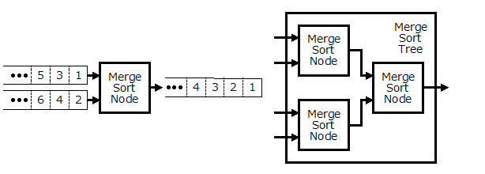

# VHDL で書くマージソーター(マージソート ツリー)


## はじめに


別記事 [「はじめに」] を参照してください。

この記事は、前々回の[「シングルワード マージソート ノード」]および前回の[「マルチワード マージソート ノード」]の続きで、これらのマージソートノードをツリー上に構成したマージソートツリーに関して説明します。


## マージソートツリーとは


マージソートツリーは、原則 2-way であるマージソートノードをツリー上に構成することにより3-way以上のマージソートを行います。

マージソートノードは２ワードの入力を受け付けて(2-way)、[「ワード比較器」] の比較結果をもとにどちらかのワードを出力します。[「FPGAを使って基本的なアルゴリズムのソーティングを劇的に高速化(1)」] ではマージロジック回路として紹介されていますが、これと同じものです。




Fig.1 マージソートノードと 4-way マージソートツリー

<br />


## マージソートツリーの VHDL 記述


### 構成


マージソートツリーは具体的には次の図のような構成になっています。マージソートツリーを再帰的に配置することによってをツリーを構成しています。


")

Fig.2 マージソートツリーの構成例(8-way)

<br />


### Entity


[「ワードの定義」]で説明したパラメータを ジェネリック変数 WORD_PARAM に設定します。

同時に処理するワード数を ジェネリック変数WORDS に設定します。

Way 数をジェネリック変数 WAYS に設定します。

ジェネリック変数 SORT_ORDER は昇順か降順かを指定します。


```VHDL:src/main/vhdl/core/merge_sorter_tree.vhd
library ieee;
use     ieee.std_logic_1164.all;
library Merge_Sorter;
use     Merge_Sorter.Word;
entity  Merge_Sorter_Tree is
    generic (
        WORD_PARAM  :  Word.Param_Type := Word.Default_Param;
        WORDS       :  integer :=  1;
        WAYS        :  integer :=  8;
        INFO_BITS   :  integer :=  3;
        SORT_ORDER  :  integer :=  0;
        QUEUE_SIZE  :  integer :=  2
    );
    port (
        CLK         :  in  std_logic;
        RST         :  in  std_logic;
        CLR         :  in  std_logic;
        I_WORD      :  in  std_logic_vector(WAYS*WORDS*WORD_PARAM.BITS-1 downto 0);
        I_INFO      :  in  std_logic_vector(WAYS*            INFO_BITS-1 downto 0) := (others => '0');
        I_LAST      :  in  std_logic_vector(WAYS                      -1 downto 0);
        I_VALID     :  in  std_logic_vector(WAYS                      -1 downto 0);
        I_READY     :  out std_logic_vector(WAYS                      -1 downto 0);
        O_WORD      :  out std_logic_vector(     WORDS*WORD_PARAM.BITS-1 downto 0);
        O_INFO      :  out std_logic_vector(                 INFO_BITS-1 downto 0);
        O_LAST      :  out std_logic;
        O_VALID     :  out std_logic;
        O_READY     :  in  std_logic
    );
end Merge_Sorter_Tree;

```


### Architecture


マージソートノードでは以下のライブラリパッケージを使用します。


```VHDL:src/main/vhdl/core/merge_sorter_tree.vhd
library ieee;
use     ieee.std_logic_1164.all;
library Merge_Sorter;
use     Merge_Sorter.Word;
use     Merge_Sorter.Core_Components.Word_Queue;
use     Merge_Sorter.Core_Components.Merge_Sorter_Node;

```


内部信号と Merge_Sorter_Tree のコンポーネントを宣言します。


```VHDL:src/main/vhdl/core/merge_sorter_tree.vhd
architecture RTL of Merge_Sorter_Tree is
    component  Merge_Sorter_Tree 
        generic (
            WORD_PARAM  :  Word.Param_Type := Word.Default_Param;
            WORDS       :  integer :=  1;
            WAYS        :  integer :=  8;
            INFO_BITS   :  integer :=  3;
            SORT_ORDER  :  integer :=  0;
            QUEUE_SIZE  :  integer :=  2
        );
        port (
            CLK         :  in  std_logic;
            RST         :  in  std_logic;
            CLR         :  in  std_logic;
            I_WORD      :  in  std_logic_vector(WAYS*WORDS*WORD_PARAM.BITS-1 downto 0);
            I_INFO      :  in  std_logic_vector(WAYS*            INFO_BITS-1 downto 0) := (others => '0');
            I_LAST      :  in  std_logic_vector(WAYS                      -1 downto 0);
            I_VALID     :  in  std_logic_vector(WAYS                      -1 downto 0);
            I_READY     :  out std_logic_vector(WAYS                      -1 downto 0);
            O_WORD      :  out std_logic_vector(     WORDS*WORD_PARAM.BITS-1 downto 0);
            O_INFO      :  out std_logic_vector(                 INFO_BITS-1 downto 0);
            O_LAST      :  out std_logic;
            O_VALID     :  out std_logic;
            O_READY     :  in  std_logic
        );
    end component;
    signal    q_word        :  std_logic_vector(WORDS*WORD_PARAM.BITS-1 downto 0);
    signal    q_info        :  std_logic_vector(            INFO_BITS-1 downto 0);
    signal    q_last        :  std_logic;
    signal    q_valid       :  std_logic;
    signal    q_ready       :  std_logic;
begin

```


WAYS=1 の時は何もせずに後段の Word_Queue に接続します。


```VHDL:src/main/vhdl/core/merge_sorter_tree.vhd
    NONE: if (WAYS = 1) generate
        q_word     <= I_WORD;
        q_info     <= I_INFO;
        q_last     <= I_LAST (0);
        q_valid    <= I_VALID(0);
        I_READY(0) <= q_ready;
    end generate;

```


WAYS>1 の時は、WAYS を A と B に分割して Merge_Sorter_Tree を再帰的に配置します。


```VHDL:src/main/vhdl/core/merge_sorter_tree.vhd
    TREE: if (WAYS > 1) generate
        constant  A_WAYS    :  integer := WAYS / 2;
        constant  A_FLAG_LO :  integer := 0;
        constant  A_FLAG_HI :  integer := A_WAYS - 1;
        constant  A_WORD_LO :  integer := 0;
        constant  A_WORD_HI :  integer := A_WAYS*WORDS*WORD_PARAM.BITS - 1;
        constant  A_INFO_LO :  integer := 0;
        constant  A_INFO_HI :  integer := A_WAYS*INFO_BITS             - 1;
        signal    a_word    :  std_logic_vector(WORDS*WORD_PARAM.BITS-1 downto 0);
        signal    a_info    :  std_logic_vector(            INFO_BITS-1 downto 0);
        signal    a_last    :  std_logic;
        signal    a_valid   :  std_logic;
        signal    a_ready   :  std_logic;
        constant  B_WAYS    :  integer := WAYS - A_WAYS;
        constant  B_FLAG_LO :  integer := A_FLAG_HI + 1;
        constant  B_FLAG_HI :  integer := WAYS      - 1;
        constant  B_WORD_LO :  integer := A_WORD_HI + 1;
        constant  B_WORD_HI :  integer := WAYS*WORDS*WORD_PARAM.BITS - 1;
        constant  B_INFO_LO :  integer := A_INFO_HI + 1;
        constant  B_INFO_HI :  integer := WAYS*INFO_BITS             - 1;
        signal    b_word    :  std_logic_vector(WORDS*WORD_PARAM.BITS-1 downto 0);
        signal    b_info    :  std_logic_vector(            INFO_BITS-1 downto 0);
        signal    b_last    :  std_logic;
        signal    b_valid   :  std_logic;
        signal    b_ready   :  std_logic;
    begin

```


A 側の Merge_Soter_Tree を配置します。 Merge_Sorter_Tree のソート結果は a_word に出力されます。


```VHDL:src/main/vhdl/core/merge_sorter_tree.vhd
        A: Merge_Sorter_Tree                                        -- 
            generic map (                                           -- 
                WORD_PARAM  => WORD_PARAM                         , --
                WORDS       => WORDS                              , --
                WAYS        => A_WAYS                             , --
                INFO_BITS   => INFO_BITS                          , --
                SORT_ORDER  => SORT_ORDER                         , -- 
                QUEUE_SIZE  => QUEUE_SIZE                           --
            )                                                       -- 
            port map (                                              -- 
                CLK         => CLK                                , -- In  :
                RST         => RST                                , -- In  :
                CLR         => CLR                                , -- In  :
                I_WORD      => I_WORD (A_WORD_HI downto A_WORD_LO), -- In  :
                I_INFO      => I_INFO (A_INFO_HI downto A_INFO_LO), -- In  :
                I_LAST      => I_LAST (A_FLAG_HI downto A_FLAG_LO), -- In  :
                I_VALID     => I_VALID(A_FLAG_HI downto A_FLAG_LO), -- In  :
                I_READY     => I_READY(A_FLAG_HI downto A_FLAG_LO), -- Out :
                O_WORD      => a_word                             , -- Out :
                O_INFO      => a_info                             , -- Out :
                O_LAST      => a_last                             , -- Out :
                O_VALID     => a_valid                            , -- Out :
                O_READY     => a_ready                              -- In  :
            );                                                      -- 

```


B 側の Merge_Soter_Tree を配置します。 Merge_Sorter_Tree のソート結果は b_word に出力されます。


```VHDL:src/main/vhdl/core/merge_sorter_tree.vhd
        B: Merge_Sorter_Tree                                        -- 
            generic map (                                           -- 
                WORD_PARAM  => WORD_PARAM                         , --
                WORDS       => WORDS                              , --
                WAYS        => B_WAYS                             , --
                INFO_BITS   => INFO_BITS                          , --
                SORT_ORDER  => SORT_ORDER                         , -- 
                QUEUE_SIZE  => QUEUE_SIZE                           --
            )                                                       -- 
            port map (                                              -- 
                CLK         => CLK                                , -- In  :
                RST         => RST                                , -- In  :
                CLR         => CLR                                , -- In  :
                I_WORD      => I_WORD (B_WORD_HI downto B_WORD_LO), -- In  :
                I_INFO      => I_INFO (B_INFO_HI downto B_INFO_LO), -- In  :
                I_LAST      => I_LAST (B_FLAG_HI downto B_FLAG_LO), -- In  :
                I_VALID     => I_VALID(B_FLAG_HI downto B_FLAG_LO), -- In  :
                I_READY     => I_READY(B_FLAG_HI downto B_FLAG_LO), -- Out :
                O_WORD      => b_word                             , -- Out :
                O_INFO      => b_info                             , -- Out :
                O_LAST      => b_last                             , -- Out :
                O_VALID     => b_valid                            , -- Out :
                O_READY     => b_ready                              -- In  :
            );                                                      -- 
                                                      -- 

```


AおよびB の Merge_Soter_Tree のソート結果を Merge_Sorter_Node に入力してマージソートします。


```VHDL:src/main/vhdl/core/merge_sorter_tree.vhd
        NODE: Merge_Sorter_Node                                     -- 
           generic map(                                             -- 
                WORD_PARAM  => WORD_PARAM                         , --
                WORDS       => WORDS                              , --
                SORT_ORDER  => SORT_ORDER                         , -- 
                INFO_BITS   => INFO_BITS                            -- 
            )                                                       -- 
            port map (                                              -- 
                CLK         => CLK                                , -- In  :
                RST         => RST                                , -- In  :
                CLR         => CLR                                , -- In  :
                A_WORD      => a_word                             , -- In  :
                A_INFO      => a_info                             , -- In  :
                A_LAST      => a_last                             , -- In  :
                A_VALID     => a_valid                            , -- In  :
                A_READY     => a_ready                            , -- Out :
                B_WORD      => b_word                             , -- In  :
                B_INFO      => b_info                             , -- In  :
                B_LAST      => b_last                             , -- In  :
                B_VALID     => b_valid                            , -- In  :
                B_READY     => b_ready                            , -- Out :
                O_WORD      => q_word                             , -- Out :
                O_INFO      => q_info                             , -- Out :
                O_LAST      => q_last                             , -- Out :
                O_VALID     => q_valid                            , -- Out :
                O_READY     => q_ready                              -- In  :
            );                                                      -- 
    end generate;                                                   -- 

```


WAYS>1 の場合は Merge_Soter_Node によるマージソートの結果を、WAYS=1 の場合は、入力されたワードをそのまま、Word_Queue に入力します。Word_Queue の結果をマージソートツリーの出力とします。


```VHDL:src/main/vhdl/core/merge_sorter_tree.vhd
    OUTLET: block                                                   -- 
    begin                                                           -- 
        QUEUE: Word_Queue                                           -- 
            generic map (                                           -- 
                WORD_PARAM  => WORD_PARAM                         , -- 
                WORDS       => WORDS                              , --
                INFO_BITS   => INFO_BITS                          , -- 
                QUEUE_SIZE  => QUEUE_SIZE                           -- 
            )                                                       -- 
            port map (                                              -- 
                CLK         => CLK                                , -- In  :
                RST         => RST                                , -- In  :
                CLR         => CLR                                , -- In  :
                I_WORD      => q_word                             , -- In  :
                I_INFO      => q_info                             , -- In  :
                I_LAST      => q_last                             , -- In  :
                I_VALID     => q_valid                            , -- In  :
                I_READY     => q_ready                            , -- Out :
                O_WORD      => O_WORD                             , -- Out :
                O_INFO      => O_INFO                             , -- Out :
                O_LAST      => O_LAST                             , -- Out :
                O_VALID     => O_VALID                            , -- Out :
                O_READY     => O_READY                              -- In  :
           );                                                       --
    end block;                                                      -- 
end RTL;
                                                 -- 

```


## 参照

* 目次: [「はじめに」]
* 次回: [「端数ワード処理」]
* 前回: [「マルチワード マージソート ノード」]
* ソースコード:   
https://github.com/ikwzm/Merge_Sorter/blob/1.4.1/src/main/vhdl/core/merge_sorter_tree.vhd


[「はじめに」]: ./01_introduction.md "「VHDL で書くマージソーター(はじめに)」"
[「ワードの定義」]: ./02_word_package.md "「VHDL で書くマージソーター(ワードの定義)」"
[「ワード比較器」]: ./03_word_compare.md "「VHDL で書くマージソーター(ワード比較器)」"
[「ソーティングネットワーク」]: ./04_sorting_network.md "「VHDL で書くマージソーター(ソーティングネットワーク)」"
[「バイトニックマージソート」]: ./05_bitonic_sorter.md "「VHDL で書くマージソーター(バイトニックマージソート)」"
[「バッチャー奇偶マージソート」]: ./06_oddeven_sorter.md "「VHDL で書くマージソーター(バッチャー奇偶マージソート)」"
[「シングルワード マージソート ノード」]: ./07_merge_sort_node_single.md "「VHDL で書くマージソーター(シングルワード マージソート ノード)」"
[「マルチワード マージソート ノード」]: ./08_merge_sort_node_multi.md "「VHDL で書くマージソーター(マルチワード マージソート ノード)」"
[「マージソート ツリー」]: ./09_merge_sort_tree.md "「VHDL で書くマージソーター(マージソート ツリー)」"
[「端数ワード処理」]: ./10_merge_sort_core_1.md "「VHDL で書くマージソーター(端数ワード処理)」"
[「ストリーム入力」]: ./11_merge_sort_core_2.md "「VHDL で書くマージソーター(ストリーム入力)」"
[「ストリームフィードバック」]: ./12_merge_sort_core_3.md "「VHDL で書くマージソーター(ストリームフィードバック)」"
[「ArgSort IP」]: ./13_argsort.md "「VHDL で書くマージソーター(ArgSort IP)」"
[「ArgSort-Ultra96」]: https://github.com/ikwzm/ArgSort-Ultra96/blob/1.2.1/doc/ja/argsort-ultra96.md "「VHDL で書くマージソーター(ArgSort-Ultra96)」"
[「ArgSort-Kv260」]: https://github.com/ikwzm/ArgSort-Kv260/blob/1.2.1/doc/ja/argsort-Kv260.md "「VHDL で書くマージソーター(ArgSort-Kv260)」"
[ACRi]: https://www.acri.c.titech.ac.jp/wp "アダプティブコンピューティング研究推進体(ACRi)"
[アダプティブコンピューティング研究推進体(ACRi)]: https://www.acri.c.titech.ac.jp/wp "アダプティブコンピューティング研究推進体(ACRi)"
[「FPGAを使って基本的なアルゴリズムのソーティングを劇的に高速化(1)」]: https://www.acri.c.titech.ac.jp/wordpress/archives/132 "「FPGAを使って基本的なアルゴリズムのソーティングを劇的に高速化(1)」"
[「FPGAを使って基本的なアルゴリズムのソーティングを劇的に高速化(2)」]: https://www.acri.c.titech.ac.jp/wordpress/archives/501 "「FPGAを使って基本的なアルゴリズムのソーティングを劇的に高速化(2)」"
[「FPGAを使って基本的なアルゴリズムのソーティングを劇的に高速化(3)」]: https://www.acri.c.titech.ac.jp/wordpress/archives/2393 "「FPGAを使って基本的なアルゴリズムのソーティングを劇的に高速化(3)」"
[「FPGAを使って基本的なアルゴリズムのソーティングを劇的に高速化(4)」]: https://www.acri.c.titech.ac.jp/wordpress/archives/3888 "「FPGAを使って基本的なアルゴリズムのソーティングを劇的に高速化(4)」"
[「FPGAを使って基本的なアルゴリズムのソーティングを劇的に高速化(5)」]: https://www.acri.c.titech.ac.jp/wordpress/archives/4713 "「FPGAを使って基本的なアルゴリズムのソーティングを劇的に高速化(5)」"
