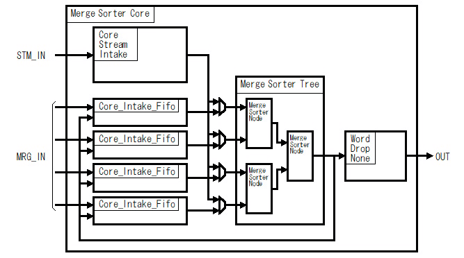
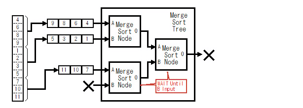
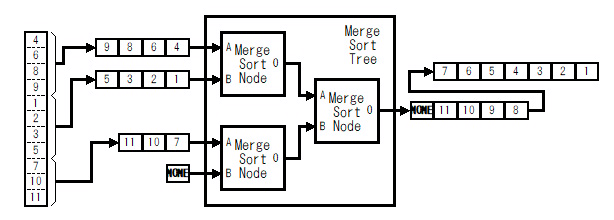
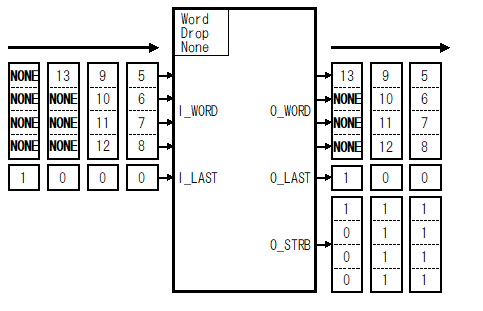

# VHDL で書くマージソーター(端数ワード処理)

## はじめに

別記事 [「はじめに」] を参照してください。

前回の記事で紹介した[「マージソート ツリー」]だけでも基本的なソートは行えますが、そのままでは使い勝手がよくありません。そこで[「マージソート ツリー」]の周りに幾つかの回路を追加してもう少し使い勝手を良くしたマージソートコアを作りました。マージソートコアは具体的には次の機能を[「マージソート ツリー」]に追加します。
  * 「端数ワード処理」(この記事)
  * [「ストリーム入力」]
  * [「ストリームフィードバック」]

この記事では端数ワード処理に関して説明します。

## マージソートコアの構成

マージソートコアは次の図のように[「マージソート ツリー」]の入力側に ストリーム入力回路(Core_Stream_Intake) と入力FIFO(Core_Intake_Fifo)、出力側にWord_Drop_None 回路を追加した構成になっています。

Fig.1 マージソートコアの構成

 

## 端数ワード処理とは

### Way 単位の端数ワード処理

[「マージソート ツリー」]内部の「マージソート ノード」は、その構造上、必ずワードが入力される必要があります。入力されるワードが無いと「マージソート ノード」は入力待ち状態のまま終了しません。

しかし、ソートするワード群のワード数が、必ず Way 単位であるとは限りません。ソートするワード数の都合上、[「マージソート ツリー」]のすべての入力にワードが供給できなくなる場合があり得ます。

Fig.2 マージソートツリーのワード未入力によるフリーズ

 

そこでマージソートツリーコアでは、[「ワードの定義」]で説明した NONE 属性と POSTPEND 属性を付加したダミーのワードを[「マージソート ツリー」]に入力することにより、[「マージソート ツリー」]のソート処理を正常に終了させます。

Fig.3 マージソートツリーのダミーワード入力による端数処理

 

なお、NONE属性を持つワードは後段 Word_Drop_None 回路にて出力時に削除されます。また、NONE 属性と共に POSTPEND 属性を持っているので、[「マージソート ツリー」]によるソート結果出力時には最も遅く出力されます。

### マルチワード マージソート ノードの端数ワード処理

[「マルチワード マージソート」]は、同時に処理するワードを複数ワードにすることで、単位時間あたりに出力するワード数を増やします。その結果、マージソートをワード数倍に高速化することが出来ます。

しかし、ソートするワード群のワード数が[「マルチワード マージソート」]が同時に処理するワード数で割り切れるとは限りません。そこでマージソートツリーコアでは、[「ワードの定義」]で説明した NONE 属性と POSTPEND 属性を付加したダミーのワードを[「マージソート ツリー」]に入力します。

なお、NONE属性を持つワードは後段 Word_Drop_None 回路にて出力時に削除されます。また、NONE 属性と共に POSTPEND 属性を持っているので、[「マージソート ツリー」]によるソート結果出力時には最も遅く出力されます。

")

Fig.4 マルチワードマージソートの端数ワード処理の動作例(1)

 

")

Fig.5 マルチワードマージソートの端数ワード処理の動作例(2)

 

")

Fig.6 マルチワードマージソートの端数ワード処理の動作例(3)

 

### Word_Drop_None

Word_Drop_None 回路は、[「マージソート ツリー」]が出力したソート結果から NONE 属性の付いたワードを削除するフィルターの役割をします。

Word_Drop_None 回路によって、マージソートコアが便宜上追加したダミーワード(NONE属性+POSTPEND属性付きのワード)がマージソートコアから出力されずに捨てられます。

Fig.7 Word_Drop_None の役割

 

## 参照

* 目次: [「はじめに」]
* 次回: [「ストリーム入力」] 
* 前回: [「マージソート ツリー」]
* ソースコード:   
https://github.com/ikwzm/Merge_Sorter/blob/0.9.1/src/main/vhdl/core/merge_sorter_core.vhd   
https://github.com/ikwzm/Merge_Sorter/blob/0.9.1/src/main/vhdl/core/word_drop_none.vhd

 

[「はじめに」]: ./01_introduction.md "「VHDL で書くマージソーター(はじめに)」"
[「ワードの定義」]: ./02_word_package.md "「VHDL で書くマージソーター(ワードの定義)」"
[「ワード比較器」]: ./03_word_compare.md "「VHDL で書くマージソーター(ワード比較器)」"
[「ソーティングネットワーク」]: ./04_sorting_network.md "「VHDL で書くマージソーター(ソーティングネットワーク)」"
[「バイトニックマージソート」]: ./05_bitonic_sorter.md "「VHDL で書くマージソーター(バイトニックマージソート)」"
[「バッチャー奇偶マージソート」]: ./06_oddeven_sorter.md "「VHDL で書くマージソーター(バッチャー奇偶マージソート)」"
[「シングルワード マージソート ノード」]: ./07_merge_sort_node_single.md "「VHDL で書くマージソーター(シングルワード マージソート ノード)」"
[「マルチワード マージソート ノード」]: ./08_merge_sort_node_multi.md "「VHDL で書くマージソーター(マルチワード マージソート ノード)」"
[「マージソート ツリー」]: ./09_merge_sort_tree.md "「VHDL で書くマージソーター(マージソート ツリー)」"
[「端数ワード処理」]: ./10_merge_sort_core_1.md "「VHDL で書くマージソーター(端数ワード処理)」"
[「ストリーム入力」]: ./11_merge_sort_core_2.md "「VHDL で書くマージソーター(ストリーム入力)」"
[「ストリームフィードバック」]: ./12_merge_sort_core_3.md "「VHDL で書くマージソーター(ストリームフィードバック)」"
[「ArgSort IP」]: ./13_argsort.md "「VHDL で書くマージソーター(ArgSort IP)」"
[「ArgSort-Ultra96」]: https://github.com/ikwzm/ArgSort-Ultra96/blob/1.2.1/doc/ja/argsort-ultra96.md "「VHDL で書くマージソーター(ArgSort-Ultra96)」"
[「ArgSort-Kv260」]: https://github.com/ikwzm/ArgSort-Kv260/blob/1.2.1/doc/ja/argsort-Kv260.md "「VHDL で書くマージソーター(ArgSort-Kv260)」"
[ACRi]: https://www.acri.c.titech.ac.jp/wp "アダプティブコンピューティング研究推進体(ACRi)"
[アダプティブコンピューティング研究推進体(ACRi)]: https://www.acri.c.titech.ac.jp/wp "アダプティブコンピューティング研究推進体(ACRi)"
[「FPGAを使って基本的なアルゴリズムのソーティングを劇的に高速化(1)」]: https://www.acri.c.titech.ac.jp/wordpress/archives/132 "「FPGAを使って基本的なアルゴリズムのソーティングを劇的に高速化(1)」"
[「FPGAを使って基本的なアルゴリズムのソーティングを劇的に高速化(2)」]: https://www.acri.c.titech.ac.jp/wordpress/archives/501 "「FPGAを使って基本的なアルゴリズムのソーティングを劇的に高速化(2)」"
[「FPGAを使って基本的なアルゴリズムのソーティングを劇的に高速化(3)」]: https://www.acri.c.titech.ac.jp/wordpress/archives/2393 "「FPGAを使って基本的なアルゴリズムのソーティングを劇的に高速化(3)」"
[「FPGAを使って基本的なアルゴリズムのソーティングを劇的に高速化(4)」]: https://www.acri.c.titech.ac.jp/wordpress/archives/3888 "「FPGAを使って基本的なアルゴリズムのソーティングを劇的に高速化(4)」"
[「FPGAを使って基本的なアルゴリズムのソーティングを劇的に高速化(5)」]: https://www.acri.c.titech.ac.jp/wordpress/archives/4713 "「FPGAを使って基本的なアルゴリズムのソーティングを劇的に高速化(5)」"
