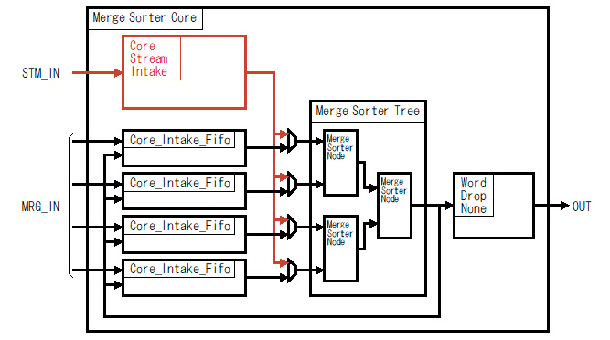
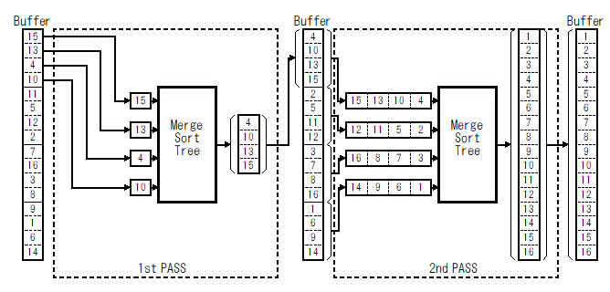

# VHDL で書くマージソーター(ストリーム入力)

## はじめに

別記事 [「はじめに」] を参照してください。

前々回の記事で紹介した[「マージソート ツリー」]だけでも基本的なソートは行えますが、そのままでは使い勝手がよくありません。そこで[「マージソート ツリー」]の周りに幾つかの回路を追加してもう少し使い勝手を良くしたマージソートコアを作りました。マージソートコアは具体的には次の機能を[「マージソート ツリー」]に追加します。
  * [「端数ワード処理」]	
  * 「ストリーム入力」(この記事)
  * [「ストリームフィードバック」]

この記事ではストリーム入力に関して説明します。

## マージソートコアの構成

マージソートコアは次の図のように[「マージソート ツリー」]の入力側に ストリーム入力回路(Core_Stream_Intake) と入力FIFO(Core_Intake_Fifo)、出力側にWord_Drop_None 回路を追加した構成になっています。この記事で説明するストリーム入力を行うのはストリーム入力回路(Core_Stream_Intake)です。

Fig.1 マージソートコアの構成

 

## ストリーム入力の目的

ストリーム入力の目的は次の二つです。
  * 最初のパスの転送効率アップ
  * マルチワード マージソートの際のソーティングネットワークの削減

### 最初のパスの転送効率アップ

#### マージソートのパスとは

下図に 4-way の[「マージソート ツリー」]で16ワードのデータをソートする例を示します。 4-way の[「マージソート ツリー」]で 16ワードのデータをソートする場合は、2つのパスで行います。

Fig.2 4-way マージソートツリーによる16ワードデータのソート例

 

最初のパスではバッファから4ワードずつ取り出して[「マージソート ツリー」]の各入力に１ワードずつ入力して４ワードのソート結果をバッファに出力する処理を４回繰り返します。2番目（最後の）パスではバッファから[「マージソート ツリー」]の各入力に4ワードずつ入力して16ワードのソート結果をバッファに出力します。

#### ストリーム入力が無い場合

[「マージソート ツリー」]の各入力に個別に DMA を付けてバッファから読み出す場合、問題は最初のパスです。どうしても最初のパスはとびとびのアドレスにあるワードを DMA が １ワードずつ読み出す必要があります。

")

Fig.3 最初のパスのDMA転送(ストリーム入力無し)

 

#### ストリーム入力によるバースト転送

一般的に DMA 等がバッファからのデータを読み出す際には、バースト転送でまとめて数ワード分を読み出した方が効率的です。そこで下図のように[「マージソート ツリー」]の入力側に ストリーム入力専用の回路(Core_Stream_Intake) をつけています。このストリーム入力専用の回路は、DMAがバッファの最初から読んだデータをストリームとして受け取り、[「マージソート ツリー」]の各入力に分散して入力します。このストリーム入力専用の回路により、DMAはバースト転送が可能になり転送効率があがります。

")

Fig.4 最初のパスのDMA転送(ストリーム入力あり)

 

Fig.5 マージソートコアのストリーム入力

 

### マルチワード マージソートの際のソーティングネットワークの削減

[「マルチワード マージソート ノード」] を使った[「マージソート ツリー」]は、同時に処理するワードを複数ワードにすることで単位時間あたりに出力するワード数を増やします。その結果、マージソートをワード数倍に高速化することが出来ます。

しかし、その複数ワード内ではすでにソート済みでなければなりません。つまり最初のパスでは、複数ワード内をソートする機構が必要になります。（最初のパス以外はすでにソート済みなので必要ありません。）

#### ストリーム入力がない場合

ストリーム入力が無い場合は、下図のように各入力にソーティングネットワーク等を使って複数ワード内をソートする必要があります。

しかし、バッファからデータを読み出す速度が十分に無い場合、各入力にソーティングネットワークを追加するのはリソースの無駄になります。例えば下図のような場合、もしバッファから読み出す速度が１クロックにつき4ワード以下ならば、各々のソーティングネットワークは同時に動くことはありません。

")

Fig.6 マルチワードマージソートの最初のパス(ストリーム入力無しの場合)

 

#### ストリーム入力による複数ワード内ソート

バッファからデータを読み出す速度が十分に無い場合、各入力にソーティングネットワークを付けるのではなく、一か所に集めた方がリソースが無駄になりません。そこで下図のようにストリーム入力専用の回路(Core_Stream_Intake)の中に一つだけソーティングネットワークをつけて複数ワード内ソートを行います。

")

Fig.7 マルチワードマージソートの最初のパス(ストリーム入力ありの場合)

 

## 参照

* 目次: [「はじめに」]
* 次回: [「ストリームフィードバック」]
* 前回: [「端数ワード処理」]
* ソースコード:   
https://github.com/ikwzm/Merge_Sorter/blob/1.4.1/src/main/vhdl/core/merge_sorter_core.vhd   
https://github.com/ikwzm/Merge_Sorter/blob/1.4.1/src/main/vhdl/core/core_stream_intake.vhd

 

[「はじめに」]: ./01_introduction.md "「VHDL で書くマージソーター(はじめに)」"
[「ワードの定義」]: ./02_word_package.md "「VHDL で書くマージソーター(ワードの定義)」"
[「ワード比較器」]: ./03_word_compare.md "「VHDL で書くマージソーター(ワード比較器)」"
[「ソーティングネットワーク(コアパッケージ)」]: ./04_sorting_network.md "「VHDL で書くソーティングネットワーク(コアパッケージ)」"
[「ソーティングネットワーク(バイトニックマージソート)」]: ./05_bitonic_sorter.md "「VHDL で書くソーティングネットワーク(バイトニックマージソート)」"
[「ソーティングネットワーク(バッチャー奇偶マージソート)」]: ./06_oddeven_sorter.md "「VHDL で書くソーティングネットワーク(バッチャー奇偶マージソート)」"
[「シングルワード マージソート ノード」]: ./07_merge_sort_node_single.md "「VHDL で書くマージソーター(シングルワード マージソート ノード)」"
[「マルチワード マージソート ノード」]: ./08_merge_sort_node_multi.md "「VHDL で書くマージソーター(マルチワード マージソート ノード)」"
[「マージソート ツリー」]: ./09_merge_sort_tree.md "「VHDL で書くマージソーター(マージソート ツリー)」"
[「端数ワード処理」]: ./10_merge_sort_core_1.md "「VHDL で書くマージソーター(端数ワード処理)」"
[「ストリーム入力」]: ./11_merge_sort_core_2.md "「VHDL で書くマージソーター(ストリーム入力)」"
[「ストリームフィードバック」]: ./12_merge_sort_core_3.md "「VHDL で書くマージソーター(ストリームフィードバック)」"
[「ArgSort IP」]: ./13_argsort.md "「VHDL で書くマージソーター(ArgSort IP)」"
[「ArgSort-Ultra96」]: https://github.com/ikwzm/ArgSort-Ultra96/blob/1.2.1/doc/ja/argsort-ultra96.md "「VHDL で書くマージソーター(ArgSort-Ultra96)」"
[「ArgSort-Kv260」]: https://github.com/ikwzm/ArgSort-Kv260/blob/1.2.1/doc/ja/argsort-Kv260.md "「VHDL で書くマージソーター(ArgSort-Kv260)」"
[ACRi]: https://www.acri.c.titech.ac.jp/wp "アダプティブコンピューティング研究推進体(ACRi)"
[アダプティブコンピューティング研究推進体(ACRi)]: https://www.acri.c.titech.ac.jp/wp "アダプティブコンピューティング研究推進体(ACRi)"
[「FPGAを使って基本的なアルゴリズムのソーティングを劇的に高速化(1)」]: https://www.acri.c.titech.ac.jp/wordpress/archives/132 "「FPGAを使って基本的なアルゴリズムのソーティングを劇的に高速化(1)」"
[「FPGAを使って基本的なアルゴリズムのソーティングを劇的に高速化(2)」]: https://www.acri.c.titech.ac.jp/wordpress/archives/501 "「FPGAを使って基本的なアルゴリズムのソーティングを劇的に高速化(2)」"
[「FPGAを使って基本的なアルゴリズムのソーティングを劇的に高速化(3)」]: https://www.acri.c.titech.ac.jp/wordpress/archives/2393 "「FPGAを使って基本的なアルゴリズムのソーティングを劇的に高速化(3)」"
[「FPGAを使って基本的なアルゴリズムのソーティングを劇的に高速化(4)」]: https://www.acri.c.titech.ac.jp/wordpress/archives/3888 "「FPGAを使って基本的なアルゴリズムのソーティングを劇的に高速化(4)」"
[「FPGAを使って基本的なアルゴリズムのソーティングを劇的に高速化(5)」]: https://www.acri.c.titech.ac.jp/wordpress/archives/4713 "「FPGAを使って基本的なアルゴリズムのソーティングを劇的に高速化(5)」"
