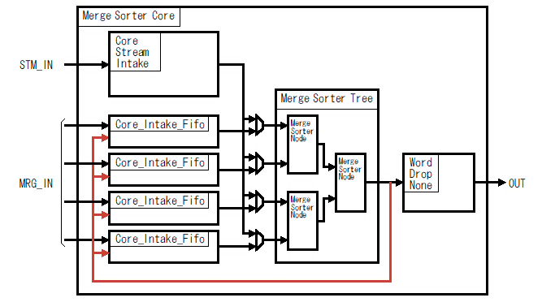
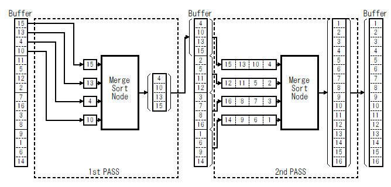

# VHDL で書くマージソーター(ストリームフィードバック)

## はじめに

別記事 [「はじめに」] を参照してください。

前々々回の記事で紹介した[「マージソート ツリー」]だけでも基本的なソートは行えますが、そのままでは使い勝手がよくありません。そこで[「マージソート ツリー」]の周りに幾つかの回路を追加してもう少し使い勝手を良くしたマージソートコアを作りました。マージソートコアは具体的には次の機能を[「マージソート ツリー」]に追加します。

  * [「端数ワード処理」]	
  * [「ストリーム入力」]
  * 「ストリームフィードバック」(この記事)

この記事ではストリームフィードバックに関して説明します。

## マージソートコアの構成

マージソートコアは次の図のように[「マージソート ツリー」]の入力側に ストリーム入力回路(Core_Stream_Intake) と入力FIFO(Core_Intake_Fifo)、出力側にWord_Drop_None 回路を追加した構成になっています。この記事で説明するストリームフィードバックは下図の赤い矢印で示すパスです。

Fig.1 マージソートコアの構成

 

## ストリームフィードバックとは

### マージソートのパス

下図に 4-way の[「マージソート ツリー」]で16ワードのデータをソートする例を示します。 4-way の[「マージソート ツリー」]で 16ワードのデータをソートする場合は、2つのパスで行います。

Fig.2 4-way マージソートツリーによる16ワードデータのソート例

 

最初のパスではバッファから4ワードずつ取り出して[「マージソート ツリー」]の各入力に１ワードずつ入力して４ワードのソート結果をバッファに出力する処理を４回繰り返します。2番目（最後の）パスではバッファから[「マージソート ツリー」]の各入力に4ワードずつ入力して16ワードのソート結果をバッファに出力します。

### ストリームフィードバックの目的

前節で説明したマージソートの各パスの入出力はバッファを介して行われます。通常、バッファは外部メモリに確保され、DMA 等を使って読み書きされます。外部メモリにバッファを確保した場合、マージソートツリーが性能を発揮するためには充分な転送帯域が必要です。しかし、充分な転送帯域が確保できるとは限りません。例えば、外部メモリが他の用途(CPU/GPU等)と共有している場合などが考えられます。

以上のことから、なるべくバッファを外部メモリにおかない工夫が必要です。

ストリームフィードバックは、マージソートのパスの最初の方(１パス〜３パス程度)のバッファをマージソートコア内部のFIFO をつかうことで、外部メモリへのアクセスを行わないようにします。

### ストリームフィードバックの動作例

以下にストリームフィードバックの動作例を示します。

#### 最初のパス(1st PASS)

最初のパス(1st PASS)では、ストリーム入力回路(Core_Stream_Intake)を介してバッファからデータを読み込んで[「マージソート ツリー」]に入力します。ソートした結果はバッファに書かずに入力FIFO(Core_Intake_Fifo)にフィードバックします。

")

Fig.3 ストリームフィードバックの動作例(1st PASS-1)

 

")

Fig.4 ストリームフィードバックの動作例(1st PASS-2)

 

")

Fig.5 ストリームフィードバックの動作例(1st PASS-3)

 

")

Fig.6 ストリームフィードバックの動作例(1st PASS-4)

 

#### 2番目のパス(2nd PASS)

2番目のパス(2nd PASS) では、１番目のパスでFIFO(Core_Intake_Fifo)に格納されたワードデータを[「マージソート ツリー」]に入力します。ソートされた結果はバッファに書き込まれます。

")

Fig.7 ストリームフィードバックの動作例(2nd PASS)

 

## ストリームフィードバックの効果

### 性能への寄与

ストリームフィードバックの性能への寄与は、バッファへのアクセスが減ること  __だけ__  です。何故なら、[「マージソート ツリー」]を通る回数自体はストリームフィードバックの有無に関係なく同じだからです。したがって、バッファへのアクセスが[「マージソート ツリー」]の性能に比べて十分早い場合は、性能的にはほとんど向上しません。しかし、バッファへのアクセス性能が[「マージソート ツリー」]の性能に比べて充分でない場合は、多少の効果が見込まれます。

### 効果があるのは最初の数パスだけ

ストリームフィードバックは、マージソートの際のパスの最初の数回分のバッファアクセスを省略することが出来ます。ただし、あくまでも最初の数回分だけです。ソートするデータが多くて何回もパスを回すような場合は、相対的に効果が小さくなります。

### ストリームフィードバックの回数制限

前節で「効果があるのは最初の数パスだけ」と説明しましたが、ストリームフィードバックの回数を増やせばその分効果が増えます。しかし次の計算式で示すようにストリームフィードバック回数(STM_FEEDBACK)を増やせば増やすほどストリームフィードバックに必要な FIFO の容量が大きくなります。

FIFO_SIZE = WAYS × WORDS × 2 × (WAYS\*\*STM_FEEDBACK)

上の式で示すように、性能を上げようとして WAYS を増やすほどそれに対応して必要な FIFO の容量も大きくなります。前々節の「性能への寄与」で説明したように、バッファへのアクセスが[「マージソート ツリー」]の性能に比べて十分早い場合は性能的にはほとんど向上しません。それを考えるとストリームフィードバックの回数を無制限に増やすことは好ましくありません。

逆に、もしFPGA/ASIC の内部リソースに余裕があるならば、１〜２回のストリームフィードバックを付けとしても、性能的には速くなることはあっても遅くなることはありません。

## 参照

* 目次: [「はじめに」]
* 次回: [「ArgSort IP」]
* 前回: [「ストリーム入力」]
* ソースコード:   
https://github.com/ikwzm/Merge_Sorter/blob/1.4.1/src/main/vhdl/core/merge_sorter_core.vhd   
https://github.com/ikwzm/Merge_Sorter/blob/1.4.1/src/main/vhdl/core/core_intake_fifo.vhd   
https://github.com/ikwzm/Merge_Sorter/blob/1.4.1/src/main/vhdl/core/core_stream_intake.vhd

[ACRi]: https://www.acri.c.titech.ac.jp/wp "アダプティブコンピューティング研究推進体(ACRi)"
[アダプティブコンピューティング研究推進体(ACRi)]: https://www.acri.c.titech.ac.jp/wp "アダプティブコンピューティング研究推進体(ACRi)"
[「FPGAを使って基本的なアルゴリズムのソーティングを劇的に高速化(1)」]: https://www.acri.c.titech.ac.jp/wordpress/archives/132 "「FPGAを使って基本的なアルゴリズムのソーティングを劇的に高速化(1)」"
[「FPGAを使って基本的なアルゴリズムのソーティングを劇的に高速化(2)」]: https://www.acri.c.titech.ac.jp/wordpress/archives/501 "「FPGAを使って基本的なアルゴリズムのソーティングを劇的に高速化(2)」"
[「FPGAを使って基本的なアルゴリズムのソーティングを劇的に高速化(3)」]: https://www.acri.c.titech.ac.jp/wordpress/archives/2393 "「FPGAを使って基本的なアルゴリズムのソーティングを劇的に高速化(3)」"
[「FPGAを使って基本的なアルゴリズムのソーティングを劇的に高速化(4)」]: https://www.acri.c.titech.ac.jp/wordpress/archives/3888 "「FPGAを使って基本的なアルゴリズムのソーティングを劇的に高速化(4)」"
[「FPGAを使って基本的なアルゴリズムのソーティングを劇的に高速化(5)」]: https://www.acri.c.titech.ac.jp/wordpress/archives/4713 "「FPGAを使って基本的なアルゴリズムのソーティングを劇的に高速化(5)」"
[「はじめに」]: ./01_introduction.md "「VHDL で書くマージソーター(はじめに)」"
[「ワードの定義」]: ./02_word_package.md "「VHDL で書くマージソーター(ワードの定義)」"
[「ワード比較器」]: ./03_word_compare.md "「VHDL で書くマージソーター(ワード比較器)」"
[「ソーティングネットワーク(コアパッケージ)」]: ./04_sorting_network.md "「VHDL で書くソーティングネットワーク(コアパッケージ)」"
[「ソーティングネットワーク(バイトニックマージソート)」]: ./05_bitonic_sorter.md "「VHDL で書くソーティングネットワーク(バイトニックマージソート)」"
[「ソーティングネットワーク(バッチャー奇偶マージソート)」]: ./06_oddeven_sorter.md "「VHDL で書くソーティングネットワーク(バッチャー奇偶マージソート)」"
[「シングルワード マージソート ノード」]: ./07_merge_sort_node_single.md "「VHDL で書くマージソーター(シングルワード マージソート ノード)」"
[「マルチワード マージソート ノード」]: ./08_merge_sort_node_multi.md "「VHDL で書くマージソーター(マルチワード マージソート ノード)」"
[「マージソート ツリー」]: ./09_merge_sort_tree.md "「VHDL で書くマージソーター(マージソート ツリー)」"
[「端数ワード処理」]: ./10_merge_sort_core_1.md "「VHDL で書くマージソーター(端数ワード処理)」"
[「ストリーム入力」]: ./11_merge_sort_core_2.md "「VHDL で書くマージソーター(ストリーム入力)」"
[「ストリームフィードバック」]: ./12_merge_sort_core_3.md "「VHDL で書くマージソーター(ストリームフィードバック)」"
[「ArgSort IP」]: ./13_argsort.md "「VHDL で書くマージソーター(ArgSort IP)」"
[「ArgSort-Ultra96」]: https://github.com/ikwzm/ArgSort-Ultra96/blob/1.2.1/doc/ja/argsort-ultra96.md "「VHDL で書くマージソーター(ArgSort-Ultra96)」"
[「ArgSort-Kv260」]: https://github.com/ikwzm/ArgSort-Kv260/blob/1.2.1/doc/ja/argsort-Kv260.md "「VHDL で書くマージソーター(ArgSort-Kv260)」"
