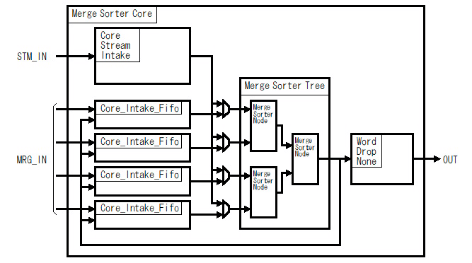
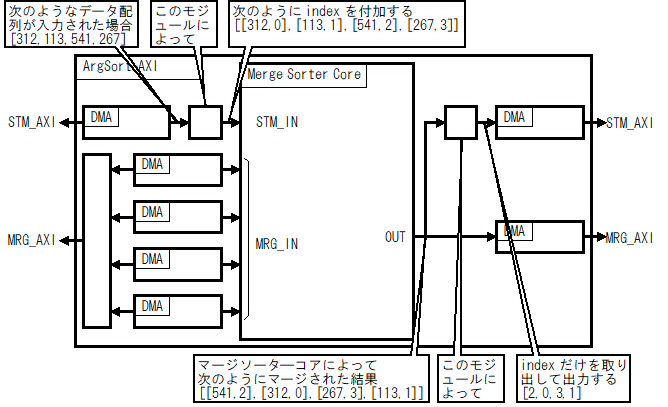
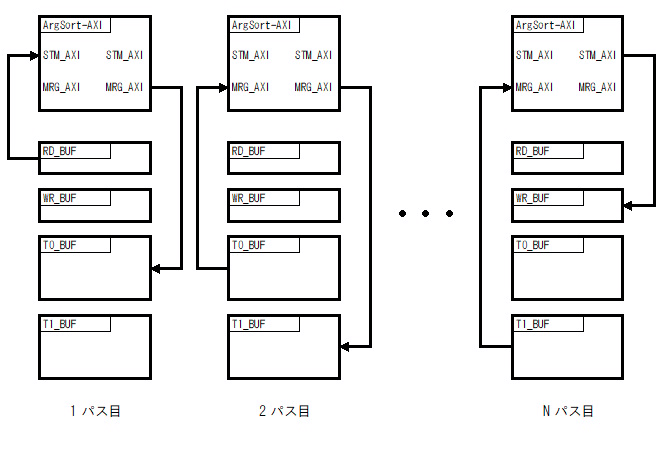
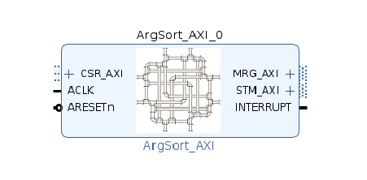
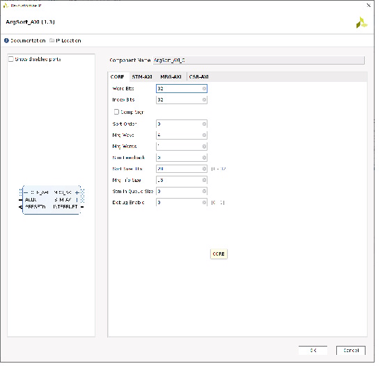
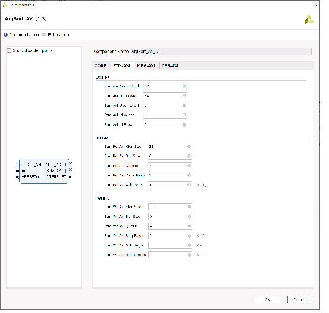
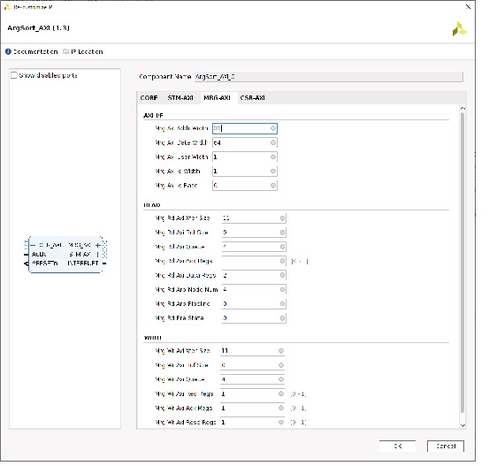
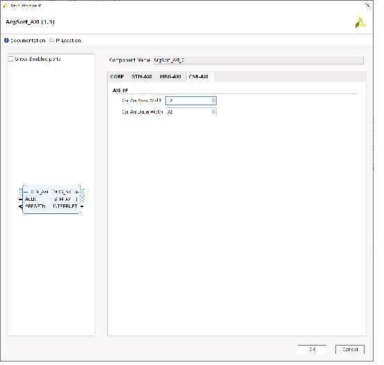

# VHDL で書くマージソーター(ArgSort IP)


## はじめに


別記事 [「はじめに」] を参照してください。

この記事ではマージソーターの利用例として ArgSort の IP を実装した例を説明します。


この記事で説明する ArgSort IP はGitHub にて公開しています。
* https://github.com/ikwzm/Merge_Sorter/tree/1.3.0/ip/argsort_axi_1.3


## ArgSort とは


データを大きい順や小さい順に並び変えるのがソートですが、その結果として、「順位nの値は何だったのか？」よりも、「何番目の要素が順位nだったのか？」を知りたいケースがあります。例えば、［312,113,541,267］のようなデータ配列がある場合、このデータ配列中の最大値は 541 であることよりも、このデータ配列の最大値541はデータ配列の 3番目(配列のインデックスとしては2(0から始まるので))にあることを知りたいようなケースです。


python という言語の numpy という拡張モジュールには、 argsort という名前の関数があって、それを使うと次のようになります。


```console
shell$ python3
Python 3.6.9 (default, Nov  7 2019, 10:44:02) 
[GCC 8.3.0] on linux
Type "help", "copyright", "credits" or "license" for more information.
>>> import numpy as np
>>> data = [312,113,541,267]
>>> sorted_index_list = list(np.argsort(data))[::-1]
>>> print(sorted_index_list)
[2, 0, 3, 1]
```


## ArgSort IP の構成


前回の [ストリームフィードバック] で紹介したマージソートコアは次のような構成になっていました。




Fig.1 マージソートコアの構成

<br />


このマージソートコアを使って ArgSort IP を構成した例を次図に示します。




Fig.2 ArgSort IPの構成

<br />

マージソートコアはソートの中間結果を保持するためのバッファ(T0_BUF と T1_BUF)を管理しています。このバッファは IP コアからは AXI4 Interface(MRG_AXI) でアクセスされます。このバッファにはRD_BUF から読んだデータに index が付加されたデータ配列が格納されます。

例えば RD_BUF に格納されたデータ配列をすべてソートするのにNパス必要だった場合、 ArgSort IP は次のように動作します。

 1.  STM_AXI から RD_BUF のデータ配列を読み、index を付加してマージソートコアに入力して、部分的にソートした結果を MRG_AXI から T0_BUF に書き込みます。
2. MRG_AXI から T0_BUF に格納された部分的にソートされた結果をマージソートコアに入力して、さらにマージソートした結果を MRG_AXI から T1_BUF に書き込みます。
3. 最後のNパス目では、MRG_AXI から T0_BUF または T1_BUF に格納された部分的にソートされた結果をマージソートコアに入力して、すべてソートされた結果のうち、index だけを取り出して STM_AXI から WR_BUF に書き込みます。




Fig.3 ArgSort IPの動作

<br />


## インターフェース


Table.1 ArgSort IP のインターフェース

| Name | Type | I/O | Description |
|------|------|-----|-------------|
| ACLK | STD_LOGIC | in | クロック信号 |
| ARESETn | STD_LOGIC | in | リセット信号 |
| CSR_AXI | AXI4-Lite | Slave | レジスタ制御用インターフェース |
| STM_AXI | AXI4 | Master | ストリーム入出力用インターフェース |
| MRG_AXI | AXI4 | Master | マージソートコアのワーク用インターフェース |
| INTERRUPT | STD_LOGIC | out | 割り込み出力信号 |




Fig.4 ArgSort IP のプレビュー

<br />


## パラメーター


### CORE


Table.2 ArgSort IP のCORE のパラメータ

<table border="2">
  <tr>
    <td>Name</td>
    <td>Type</td>
    <td>Default</td>
    <td>Description</td>
  </tr>
  <tr>
    <td>WORD_BITS</td>
    <td>integer</td>
    <td>32</td>
    <td>ソートするデータのビット幅</td>
  </tr>
  <tr>
    <td>INDEX_BITS</td>
    <td>integer </td>
    <td>32</td>
    <td>index のビット幅</td>
  </tr>
  <tr>
    <td>COMP_SIGN</td>
    <td>boolean</td>
    <td>FALSE</td>
    <td>データの符号の有無<br />(TRUE: 符号あり,FALSE: 符号なし)</td>
  </tr>
  <tr>
    <td>SORT_ORDER</td>
    <td>integer</td>
    <td>0</td>
    <td>ソート順(0: 昇順, 1: 降順)</td>
  </tr>
  <tr>
    <td>MRG_WAYS</td>
    <td>integer</td>
    <td>4</td>
    <td>マージソーターコアの WAY の数</td>
  </tr>
  <tr>
    <td>MRG_WORDS</td>
    <td>integer</td>
    <td>1</td>
    <td>同時に処理するワード数</td>
  </tr>
  <tr>
    <td>STM_FEEDBACK</td>
    <td>integer</td>
    <td>0</td>
    <td>ストリームフィードバックの回数</td>
  </tr>
  <tr>
    <td>SORT_SIZE_BITS</td>
    <td>integer</td>
    <td>28</td>
    <td>ソートサイズカウンタのビット数</td>
  </tr>
  <tr>
    <td>MRG_FIFO_SIZE</td>
    <td>integer</td>
    <td>16</td>
    <td>マージソーターコアの FIFO のサイズを<br />ワード単位で示す</td>
  </tr>
</table>




Fig.5 ArgSort IP CORE Parameters

<br />


### STM-AXI


Table.3 ArgSort IP のSTM-AXI のパラメータ

<table border="2">
  <tr>
    <td>Name</td>
    <td>Type</td>
    <td>Default</td>
    <td>Description</td>
  </tr>
  <tr>
    <td>STM_AXI_ADDR_WIDTH</td>
    <td>integer</td>
    <td>32</td>
    <td>STM-AXI アドレスのビット幅</td>
  </tr>
  <tr>
    <td>STM_AXI_DATA_WIDTH</td>
    <td>integer</td>
    <td>32</td>
    <td>STM-AXI データのビット幅</td>
  </tr>
  <tr>
    <td>STM_AXI_USER_WIDTH</td>
    <td>integer</td>
    <td>1</td>
    <td>STM-AXI ARUSER/AWUSER のビット幅 </td>
  </tr>
  <tr>
    <td>STM_AXI_ID_WIDTH</td>
    <td>integer</td>
    <td>1</td>
    <td>STM-AXI ARID/AWID のビット幅</td>
  </tr>
  <tr>
    <td>STM_AXI_ID_BASE</td>
    <td>integer</td>
    <td>0</td>
    <td>STM-AXI のARID/AWID のベースの値</td>
  </tr>
  <tr>
    <td>STM_RD_AXI_XFER_SIZE</td>
    <td>integer</td>
    <td>11</td>
    <td>STM-AXI のリードチャネルの最大転送サイズを<br />２のべき乗値で指定する(11: 2**11=2048bytes)</td>
  </tr>
  <tr>
    <td>STM_RD_AXI_BUF_SIZE</td>
    <td>integer</td>
    <td>0</td>
    <td>STM-AXI のリードバッファサイズ<br />0を指定した場合は内部で自動的に決定される</td>
  </tr>
  <tr>
    <td>STM_RD_AXI_QUEUE</td>
    <td>integer</td>
    <td>4</td>
    <td>STM-AXI のリード時のパイプライン処理数</td>
  </tr>
  <tr>
    <td>STM_WR_AXI_XFER_SIZE</td>
    <td>integer</td>
    <td>11</td>
    <td>STM-AXI のライトチャネルの最大転送サイズを<br />２のべき乗値で指定する(11: 2**11=2048bytes)</td>
  </tr>
  <tr>
    <td>STM_WR_AXI_BUF_SIZE</td>
    <td>integer</td>
    <td>0</td>
    <td>STM-AXI のライトバッファサイズ<br />0を指定した場合は内部で自動的に決定される</td>
  </tr>
  <tr>
    <td>STM_WR_AXI_QUEUE</td>
    <td>integer</td>
    <td>4</td>
    <td>STM-AXI のライト時のパイプライン処理数</td>
  </tr>
</table>




Fig.6 ArgSort IP STM-AXI Parameters

<br />


### MRG-AXI


Table.4 ArgSort IP のMRG-AXI のパラメータ

<table border="2">
  <tr>
    <td>Name</td>
    <td>Type</td>
    <td>Default</td>
    <td>Description</td>
  </tr>
  <tr>
    <td>MRG_AXI_ADDR_WIDTH</td>
    <td>integer</td>
    <td>32</td>
    <td>MRG-AXI アドレスのビット幅</td>
  </tr>
  <tr>
    <td>MRG_AXI_DATA_WIDTH</td>
    <td>integer</td>
    <td>32</td>
    <td>MRG-AXI データのビット幅</td>
  </tr>
  <tr>
    <td>MRG_AXI_USER_WIDTH</td>
    <td>integer</td>
    <td>1</td>
    <td>MRG-AXI ARUSER/AWUSER のビット幅 </td>
  </tr>
  <tr>
    <td>MRG_AXI_ID_WIDTH</td>
    <td>integer</td>
    <td>1</td>
    <td>MRG-AXI ARID/AWID のビット幅</td>
  </tr>
  <tr>
    <td>MRG_AXI_ID_BASE</td>
    <td>integer</td>
    <td>0</td>
    <td>MRG-AXI のARID/AWID のベースの値</td>
  </tr>
  <tr>
    <td>MRG_RD_AXI_XFER_SIZE</td>
    <td>integer</td>
    <td>11</td>
    <td>MRG-AXI のリードチャネルの最大転送サイズを<br />２のべき乗値で指定する(11: 2**11=2048bytes)</td>
  </tr>
  <tr>
    <td>MRG_RD_AXI_BUF_SIZE</td>
    <td>integer</td>
    <td>0</td>
    <td>MRG-AXI のリードバッファサイズ<br />0を指定した場合は内部で自動的に決定される</td>
  </tr>
  <tr>
    <td>MRG_RD_AXI_QUEUE</td>
    <td>integer</td>
    <td>4</td>
    <td>MRG-AXI のリード時のパイプライン処理数</td>
  </tr>
  <tr>
    <td>MRG_WR_AXI_XFER_SIZE</td>
    <td>integer</td>
    <td>11</td>
    <td>MRG-AXI のライトチャネルの最大転送サイズを<br />２のべき乗値で指定する(11: 2**11=2048bytes)</td>
  </tr>
  <tr>
    <td>MRG_WR_AXI_BUF_SIZE</td>
    <td>integer</td>
    <td>0</td>
    <td>MRG-AXI のライトバッファサイズ<br />0を指定した場合は内部で自動的に決定される</td>
  </tr>
  <tr>
    <td>MRG_WR_AXI_QUEUE</td>
    <td>integer</td>
    <td>4</td>
    <td>MRG-AXI のライト時のパイプライン処理数</td>
  </tr>
</table>




Fig.7 ArgSort IP MRG-AXI Parameters

<br />


### CSR-AXI


Table.5 ArgSort IP のCSR-AXI のパラメータ

| Name | Type | Default | Description |
|------|------|---------|-------------|
| CSR_AXI_ADDR_WIDTH | integer | 12 | CSR-AXI アドレスのビット幅 |
| CSR_AXI_DATA_WIDTH | integer | 32 | CSR-AXI データのビット幅 |




Fig.8 ArgSort IP CSR-AXI Parameters

<br />


## レジスタマップ


Table.6 ArgSort IP のレジスタマップ

| Name | Address | Width | Type | Description |
|------|---------|-------|------|-------------|
| VERSION_REGS | 0x000 | 64bit | RO | 各種パラメータ情報 |
| RD_ADDR_REGS | 0x008 | 64bit | R/W | 入力データが格納されているバッファの先頭アドレス |
| WR_ADDR_REGS | 0x010 | 64bit | R/W | ソート結果を格納するバッファの先頭アドレス |
| T0_ADDR_REGS | 0x018 | 64bit | R/W | ソートの途中結果を格納するバッファ(その０)の先頭アドレス |
| T1_ADDR_REGS | 0x020 | 64bit | R/W | ソートの途中結果を格納するバッファ(その1）の先頭アドレス |
| RD_MODE_REGS | 0x028 | 32bit | R/W | 入力データが格納されているバッファをアクセスする際の各種モード |
| WR_MODE_REGS | 0x02C | 32bit | R/W | ソート結果を格納するバッファをアクセスする際の各種モード |
| T0_MODE_REGS | 0x030 | 32bit | R/W | ソートの途中結果を格納するバッファ(その0)をアクセスする際の各種モード |
| T1_MODE_REGS | 0x034 | 32bit | R/W | ソートの途中結果を格納するバッファ(その1)をアクセスする際の各種モード |
| SIZE_REGS | 0x038 | 32bit | R/W | ソートするデータのワード数 |
| MODE_REGS | 0x03C | 16bit | R/W | 割り込み許可およびデバッグモード |
| STAT_REGS | 0x03E | 8bit | R/W | ステータス情報 |
| CTRL_REGS | 0x03F | 8bit | R/W | START/STOP 等の各種コントロールを行う |
| DEBUG_REGS_0 | 0x040 | 64bit | R | デバッグ情報(その0) |
| DEBUG_REGS_1 | 0x048 | 64bit | R | デバッグ情報(その1) |
| DEBUG_REGS_2 | 0x050 | 64bit | R | デバッグ情報(その2) |
| DEBUG_REGS_3 | 0x058 | 64bit | R | デバッグ情報(その3) |
| DEBUG_REGS_4 | 0x060 | 64bit | R | デバッグ情報(その4) |
| DEBUG_REGS_5 | 0x068 | 64bit | R | デバッグ情報(その5) |
| DEBUG_REGS_6 | 0x070 | 64bit | R | デバッグ情報(その6) |
| DEBUG_REGS_7 | 0x078 | 64bit | R | デバッグ情報(その7) |


## レジスタの詳細


### VERSION_REGS


VERSION_REGS にはビルド時に設定したパラメータが格納されています。


Table.7 VERSION_REGS のビットフィールド

| Name | Bits | Type | Reset | Description |
|------|------|------|-------|-------------|
| VERSION_MAJOR | 63:60 | RO | 0x1 | IP のバージョンのメジャー番号 |
| VERSION_MINOR | 59:56 | RO | 0x3 | IP のバージョンのマイナー番号 |
| MRG_WAYS | 55:46 | RO | MRG_WAYS | ビルド時の MRG_WAYS パラメータの値 |
| MRG_WORDS | 45:36 | RO | MRG_WORDS | ビルド時のMRG_WORDS パラメータの値 |
| STM_FEEDBACK | 35:32 | RO | STM_FEEDBACK | ビルド時のSTM_FEEDBACK パラメータの値 |
| WORD_BITS | 31:20 | RO | WORD_BITS | ビルド時の WORD_BITS パラメータの値 |
| INDEX_BITS | 19:08 | RO | INDEX_BITS | ビルド時の INDEX_BITS パラメータの値 |
| SORT_ORDER | 07:07 | RO | SORT_ORDER | ビルド時の SORT_ORDER パラメータの値 |
| COMP_SIGN | 06:06 | RO | COMP_SIGN | ビルド時の COMP_SIGN パラメータの値 |
| DEBUG_ENABLE | 05:05 | RO | DEBUG_ENABLE | ビルド時の DEBUG_ENABLE パラメータの値 |
| RESERVED | 04:00 | RO | 0 | 予約 |


### RD_ADDR_REGS


RD_ADDR_REGSには入力データが格納されているバッファの先頭アドレスを設定します。このレジスタ自体は64ビット幅ですが、そのうち有効なアドレスのビットは STM_AXI_ADDR_WIDTH-1 : 0 の範囲です。

Table.8 RD_ADDR_REGS のビットフィールド

| Name | Bits | Type | Reset | Description |
|------|------|------|-------|-------------|
| ADDR | 63:00 | RW | 0 | 入力データが格納されているバッファの先頭アドレス |


### WR_ADDR_REGS


WR_ADDR_REGS にはソートした結果を格納するバッファの先頭アドレスを設定します。このレジスタ自体は64ビット幅ですが、そのうち有効なアドレスのビットは STM_AXI_ADDR_WIDTH-1 : 0 の範囲です。

Table.9 WR_ADDR_REGS のビットフィールド

| Name | Bits | Type | Reset | Description |
|------|------|------|-------|-------------|
| ADDR | 63:00 | RW | 0 | ソートした結果を格納するバッファの先頭アドレス |


### T0_ADDR_REGS


T0_ADDR_REGS にはソートの途中結果を格納するバッファ(その０)の先頭アドレスを設定します。このレジスタ自体は64ビット幅ですが、そのうち有効なアドレスのビットは MRG_AXI_ADDR_WIDTH-1 : 0 の範囲です。

Table.10 T0_ADDR_REGS のビットフィールド

| Name | Bits | Type | Reset | Description |
|------|------|------|-------|-------------|
| ADDR | 63:00 | RW | 0 | ソートの途中結果を格納するバッファ(その０)の先頭アドレス |


### T1_ADDR_REGS


T1_ADDR_REGS にはソートの途中結果を格納するバッファ(その1)の先頭アドレスを設定します。このレジスタ自体は64ビット幅ですが、そのうち有効なアドレスのビットは MRG_AXI_ADDR_WIDTH-1 : 0 の範囲です。

Table.11 T1_ADDR_REGS のビットフィールド

| Name | Bits | Type | Reset | Description |
|------|------|------|-------|-------------|
| ADDR | 63:00 | RW | 0 | ソートの途中結果を格納するバッファ(その1)の先頭アドレス |


### RD_MODE_REGS


RD_MODE_REGS には入力データが格納されているバッファをアクセスする際の各種モードを設定します。

Table.12 RD_MODE_REGS のビットフィールド

| Name | Bits | Type | Reset | Description |
|------|------|------|-------|-------------|
| SAFETY | 15:15 | RW | 0 | 1: 安全モードでアクセス, 0: 通常モードでアクセス |
| SPECULATIVE | 14:14 | RW | 0 | 1: 投機モードでアクセス, 0: 通常モードでアクセス |
| AID | 13:13 | RW | 0 | STM_AXI の ARID 番号を指定します |
| AUSER | 12:12 | RW | 0 | STM_AXI の ARUSER の値を指定します |
| APROT | 11:08 | RW | 0 | STM_AXI の ARPROT の値を指定します |
| ACACHE | 07:04 | RW | 0 | STM_AXI の ARCACHE の値を指定します |
| RESERVE | 03:00 | RO | 0 | 予約 |


### WR_MODE_REGS


WR_MODE_REGS にはソート結果を格納するバッファをアクセスする際の各種モードを設定します。

Table.13 WR_MODE_REGS のビットフィールド

| Name | Bits | Type | Reset | Description |
|------|------|------|-------|-------------|
| SAFETY | 15:15 | RW | 0 | 1: 安全モードでアクセス, 0: 通常モードでアクセス |
| SPECULATIVE | 14:14 | RW | 0 | 1: 投機モードでアクセス, 0: 通常モードでアクセス |
| AID | 13:13 | RW | 0 | STM_AXI の AWID 番号を指定します |
| AUSER | 12:12 | RW | 0 | STM_AXI の AWUSER の値を指定します |
| APROT | 11:08 | RW | 0 | STM_AXI の AWPROT の値を指定します |
| ACACHE | 07:04 | RW | 0 | STM_AXI の AWCACHE の値を指定します |
| RESERVE | 03:00 | RO | 0 | 予約 |


### T0_MODE_REGS


T0_MODE_REGS にはソートの途中結果を格納するバッファ(その0)をアクセスする際の各種モードを設定します。

Table.14 T0_MODE_REGS のビットフィールド

| Name | Bits | Type | Reset | Description |
|------|------|------|-------|-------------|
| SAFETY | 15:15 | RW | 0 | 1: 安全モードでアクセス, 0: 通常モードでアクセス |
| SPECULATIVE | 14:14 | RW | 0 | 1: 投機モードでアクセス, 0: 通常モードでアクセス |
| AID | 13:13 | RW | 0 | MRG_AXI の ARID/AWID 番号を指定します |
| AUSER | 12:12 | RW | 0 | MRG_AXI の ARUSER/AWUSER の値を指定します |
| APROT | 11:08 | RW | 0 | MRG_AXI の APROT/AWPROT の値を指定します |
| ACACHE | 07:04 | RW | 0 | MRG_AXI の ARCACHE/AWCACHE の値を指定します |
| RESERVE | 03:00 | RO | 0 | 予約 |


### T1_MODE_REGS


T1_MODE_REGS にはソートの途中結果を格納するバッファ(その1)をアクセスする際の各種モードを設定します。

Table.15 T1_MODE_REGS のビットフィールド

| Name | Bits | Type | Reset | Description |
|------|------|------|-------|-------------|
| SAFETY | 15:15 | RW | 0 | 1: 安全モードでアクセス, 0: 通常モードでアクセス |
| SPECULATIVE | 14:14 | RW | 0 | 1: 投機モードでアクセス, 0: 通常モードでアクセス |
| AID | 13:13 | RW | 0 | MRG_AXI の ARID/AWID 番号を指定する |
| AUSER | 12:12 | RW | 0 | MRG_AXI の ARUSER/AWUSER の値を指定します |
| APROT | 11:08 | RW | 0 | MRG_AXI の APROT/AWPROT の値を指定します |
| ACACHE | 07:04 | RW | 0 | MRG_AXI の ARCACHE/AWCACHE の値を指定します |
| RESERVE | 03:00 | RO | 0 | 予約 |


### SIZE_REGS


SIZE_REGS にはソートするデータのワード数を指定します。このレジスタ自体は32ビット幅ですが、そのうち有効なビットは SORT_SIZE_BITS-1 : 0 の範囲です。

Table.16 SIZE_REGS のビットフィールド

| Name | Bits | Type | Reset | Description |
|------|------|------|-------|-------------|
| SIZE | 31:00 | RW | 0 | ソートするデータのワード数 |


### MODE_REGS


MODE_REGS には割り込み許可およびデバッグモードを指定します。

Table.17 MODE_REGS のビットフィールド

<table border="2">
  <tr>
    <td>Name</td>
    <td>Bits</td>
    <td>Type</td>
    <td>Reset</td>
    <td>Description</td>
  </tr>
  <tr>
    <td>DEBUG_MODE</td>
    <td>15:12</td>
    <td>RW</td>
    <td>0</td>
    <td>デバッグモード<br />2: デバッグレジスタに各パスごとに要したサイクル数が格納されます</td>
  </tr>
  <tr>
    <td>RESERVE</td>
    <td>11:01</td>
    <td>RW</td>
    <td>0</td>
    <td>予約</td>
  </tr>
  <tr>
    <td>IRQ_ENABLE</td>
    <td>00:00</td>
    <td>RW</td>
    <td>0</td>
    <td>STAT_REGS.DONE に1がセットされた時に割り込みを発生するか否かを指定ます<br />1: 割り込みを発生します<br />0: 割り込みを発生しません</td>
  </tr>
</table>


### STAT_REGS


STAT_REGS には各種ステータス情報が格納されます。

Table.18 STAT_REGS のビットフィールド

<table border="2">
  <tr>
    <td>Name</td>
    <td>Bits</td>
    <td>Type</td>
    <td>Reset</td>
    <td>Description</td>
  </tr>
  <tr>
    <td>RESERVE</td>
    <td>07:01</td>
    <td>RW</td>
    <td>0</td>
    <td>予約</td>
  </tr>
  <tr>
    <td>DONE</td>
    <td>00:00</td>
    <td>RW</td>
    <td>0</td>
    <td>CTRL_REGS.DONE に 1 が設定されている場合、ソート終了時に 1 がセットされます<br />このフィールドに0を書き込むことで0にクリアされます</td>
  </tr>
</table>


### CTRL_REGS


CTRL_REGS に値を書き込むことで IP のリセットやソートの開始を指示します。

Table.19 CTRL_REGS のビットフィールド

<table border="2">
  <tr>
    <td>Name</td>
    <td>Bits</td>
    <td>Type</td>
    <td>Reset</td>
    <td>Description</td>
  </tr>
  <tr>
    <td>RESET</td>
    <td>07:07</td>
    <td>RW</td>
    <td>0</td>
    <td>1を書き込むことで IP をリセットします<br />0を書き込むことで IP のリセットを解除します</td>
  </tr>
  <tr>
    <td>RESERVE</td>
    <td>06:05</td>
    <td>RW</td>
    <td>0</td>
    <td>予約</td>
  </tr>
  <tr>
    <td>START</td>
    <td>04:04</td>
    <td>RW</td>
    <td>0</td>
    <td>１を書き込むことでソートを開始します<br />０を書き込んでも何もしません<br />ソート実行中は1が読めます<br />ソート停止中は0が読めます</td>
  </tr>
  <tr>
    <td>RESERVE</td>
    <td>03:03</td>
    <td>RW</td>
    <td>0</td>
    <td>予約</td>
  </tr>
  <tr>
    <td>DONE</td>
    <td>02:02</td>
    <td>RW</td>
    <td>0</td>
    <td>1: ソート終了時に STAT_REGS.DONE に１をセットします<br />0: ソート終了時に STAT_REGS.DONE に１をセットしません</td>
  </tr>
  <tr>
    <td>RESERVE</td>
    <td>01:00</td>
    <td>RW</td>
    <td>0</td>
    <td>予約</td>
  </tr>
</table>


### DEBUG_REGS_X


DEBUG 用のレジスタ。DEBUG_ENABLE パラメーターに 1 が設定されている場合にのみ有効です。

MODE_REGS.DEBUG が２の場合、DEBUG_REGS_0 には、ソート全部に要したサイクル数が格納されます。DEBUG_REGS_1 には１パス目に要したサイクル数、DEBUG_REGS_2 には2パス目に要したサイクル数という具合に順番にパスごとに要したサイクル数が格納されていきます。実行されなかったパスには０が格納されます。


## 参照

* 目次: [「はじめに」]
* 次回: [「ArgSort-Ultra96」]
* 前回: [「ストリームフィードバック」]
* Vivado IP: https://github.com/ikwzm/Merge_Sorter/tree/1.3.0/ip/argsort_axi_1.3
* ソースコード:   
https://github.com/ikwzm/Merge_Sorter/tree/1.3.0/src/main/vhdl/examples/argsort_axi


[「はじめに」]: ./01_introduction.md "「VHDL で書くマージソーター(はじめに)」"
[「ワードの定義」]: ./02_word_package.md "「VHDL で書くマージソーター(ワードの定義)」"
[「ワード比較器」]: ./03_word_compare.md "「VHDL で書くマージソーター(ワード比較器)」"
[「ソーティングネットワーク(コアパッケージ)」]: ./04_sorting_network.md "「VHDL で書くソーティングネットワーク(コアパッケージ)」"
[「ソーティングネットワーク(バイトニックマージソート)」]: ./05_bitonic_sorter.md "「VHDL で書くソーティングネットワーク(バイトニックマージソート)」"
[「ソーティングネットワーク(バッチャー奇偶マージソート)」]: ./06_oddeven_sorter.md "「VHDL で書くソーティングネットワーク(バッチャー奇偶マージソート)」"
[「シングルワード マージソート ノード」]: ./07_merge_sort_node_single.md "「VHDL で書くマージソーター(シングルワード マージソート ノード)」"
[「マルチワード マージソート ノード」]: ./08_merge_sort_node_multi.md "「VHDL で書くマージソーター(マルチワード マージソート ノード)」"
[「マージソート ツリー」]: ./09_merge_sort_tree.md "「VHDL で書くマージソーター(マージソート ツリー)」"
[「端数ワード処理」]: ./10_merge_sort_core_1.md "「VHDL で書くマージソーター(端数ワード処理)」"
[「ストリーム入力」]: ./11_merge_sort_core_2.md "「VHDL で書くマージソーター(ストリーム入力)」"
[「ストリームフィードバック」]: ./12_merge_sort_core_3.md "「VHDL で書くマージソーター(ストリームフィードバック)」"
[「ArgSort IP」]: ./13_argsort.md "「VHDL で書くマージソーター(ArgSort IP)」"
[「ArgSort-Ultra96」]: https://github.com/ikwzm/ArgSort-Ultra96/blob/1.2.1/doc/ja/argsort-ultra96.md "「VHDL で書くマージソーター(ArgSort-Ultra96)」"
[「ArgSort-Kv260」]: https://github.com/ikwzm/ArgSort-Kv260/blob/1.2.1/doc/ja/argsort-Kv260.md "「VHDL で書くマージソーター(ArgSort-Kv260)」"
