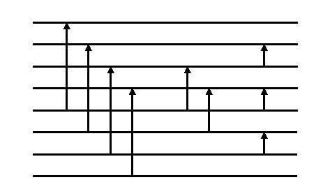
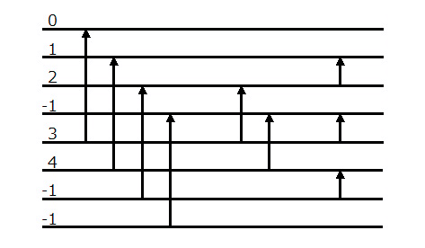
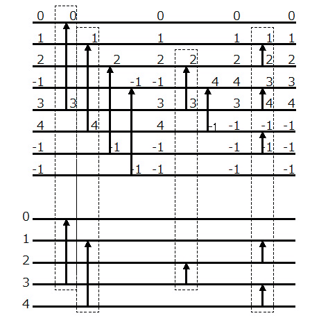
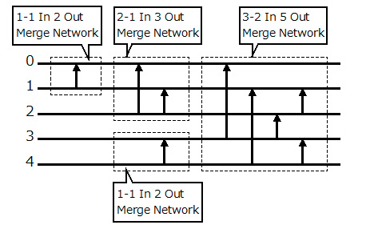

# VHDL で書くソーティングネットワーク(非対称マージソート)


## はじめに


筆者はかつて「VHDL で書くマージソーター」という題で幾つか記事を書きました。マージソーターを実装する際に、ソーティングネットワークを VHDL で書く必要がありました。これらの詳細は以下の記事を参照してください。


* [「VHDL で書くマージソーター(はじめに)」]
* [「VHDL で書くソーティングネットワーク(コアパッケージ)」]
* [「VHDL で書くソーティングネットワーク(バイトニックマージソート)」]
* [「VHDL で書くソーティングネットワーク(バッチャー奇偶マージソート)」]
* [「VHDL で書くソーティングネットワーク(バブルソート)」]


この記事は、上の記事の続編で、[「VHDL で書くソーティングネットワーク(コアパッケージ)」]を使って非対称マージソート回路を構成する方法を紹介します。


## 非対称マージソートとは


非対称マージソート(Asymmetric mergesort)という言葉は筆者が勝手に命名した名前です。もし他に同様な仕組みのソート方法があれば教えてください。


[「VHDL で書くソーティングネットワーク(バイトニックマージソート)」]や[「VHDL で書くソーティングネットワーク(バッチャー奇偶マージソート)」]で紹介したソーティングネットワークは、ソートする要素を半分ずつ区切って各々にソートを再帰的に実行して、その結果をマージします。その性質からソートする要素の数は２のべき乗値に限定されます。

ソートする要素の数が２のべき乗値に限定されているのは少し使い勝手が悪いので、ここではソートする要素の数が２のべき乗値でなくてもよく、また、[「VHDL で書くソーティングネットワーク(バブルソート)」]で紹介したバブルソートのネットワークよりも効率の良いソーティングネットワークを考えます。


### 非対称マージネットワーク


ここで紹介するのは非対称マージソートで、その名のとおりマージソートの一種です。ただし、二つのソート結果をマージする際に、その二つのソート結果の要素の数が同じ数で無くても良く、また各々のソート結果の要素の数が２のべき乗値でなくても構いません。そのようなマージをするネットワークを考えます。


と言っても考え方は単純で、まず大きめの[「VHDL で書くソーティングネットワーク(バッチャー奇偶マージソート)」]で紹介したマージネットワークを作り、そして不要なネットワークを消していくだけです。


例えば、次の図のように、要素数3のソート済み結果が入力されるネット(ネット番号0〜２)と要素数２のソート済み結果が入力されるネット(ネット番号3〜4)があって、それらをマージしてソートした結果を出力するネットワークを作ることを考えます。


")

Fig.1 非対称マージネットワーク(ブラックボックス)

<br />


まずはそれぞれの入力ネットの要素数が２のべき乗値になるように切り上げます。この例では 3 を ４に、2は２のままです。次にこれらの値の大きいほう(この例では4)の２倍のネット数(この例では8)のバッチャー奇偶マージネットワークを作ります。このマージネットワークは、各々４要素のソート済みデータを受け取って８要素のソート結果を出力します。




Fig.2 元になるバッチャー奇偶マージネットワーク

<br />


次にバッチャー奇偶マージネットワークのネットの数の整数配列を用意し、各々に元のネットワークのネット番号を設定します。その際、不要なネットには−1を設定します。




Fig.3 バッチャー奇偶マージネットワークにネット番号を割り当てる

<br />


あとはステージ毎に不要となるコンパレーターを削除しながらマージネットワークを作っていきます。具体的には、コンパレーターの入力側のネット番号が２つとも0以上の場合は残し、それ以外は削除します。整数配列のネット番号は0以上の場合は小さい方を前に、−1の場合は後ろに詰めて行きます。




Fig.4 バッチャー奇偶マージネットワークから不要なネットを削除する

<br />


### 非対称マージソートネットワーク


ソート済みの要素の数が非対称なネット入力でもマージできる「非対称マージネットワーク」が手に入ったので、今度はこの非対称マージネットワークを使って、ソーティングネットワークを作ります。

具体的には、要素数が「だいたい」同じくらいになるように入力ネットワークを二つに分割して、その各々のネットワークに対してソーティングネットワークを再帰的に作って、これを「非対称マージネットワーク」でマージします。


例えば、要素数が５の場合は、まず要素数３のネットワークと要素数２のネットワークに分割します。さらに要素数３のネットワークは、要素数２のネットワークと要素数１のネットワークに分割して、各々の出力をマージします。




Fig.5 非対称マージソートネットワークの例

<br />


### バブルソートネットワークとの比較


非対称マージソートネットワークと[「VHDL で書くソーティングネットワーク(バブルソート)」]で紹介したバブルソートネットワークとで、必要なコンパレーターの数とステージの段数を比較したのが次の表です。

Table.1 非対称マージソートネットワークとバブルソートネットワークの比較

<table border="2">
  <tr>
    <td align="center" rowspan="2">要素の数</td>
    <td align="center" colspan="2">コンパレーターの数</td>
    <td align="center" colspan="2">ステージの段数</td>
  </tr>
  <tr>
    <td align="center">バブルソート</td>
    <td align="center">非対称マージソート</td>
    <td align="center">バブルソート</td>
    <td align="center">非対称マージソート</td>
  </tr>
  <tr>
    <td align="right">4</td>
    <td align="right">6</td>
    <td align="right">5</td>
    <td align="right">5</td>
    <td align="right">3</td>
  </tr>
  <tr>
    <td align="right">5</td>
    <td align="right">10</td>
    <td align="right">9</td>
    <td align="right">7</td>
    <td align="right">6</td>
  </tr>
  <tr>
    <td align="right">6</td>
    <td align="right">15</td>
    <td align="right">12</td>
    <td align="right">9</td>
    <td align="right">6</td>
  </tr>
  <tr>
    <td align="right">7</td>
    <td align="right">21</td>
    <td align="right">16</td>
    <td align="right">11</td>
    <td align="right">6</td>
  </tr>
  <tr>
    <td align="right">8</td>
    <td align="right">28</td>
    <td align="right">19</td>
    <td align="right">13</td>
    <td align="right">6</td>
  </tr>
  <tr>
    <td align="right">9</td>
    <td align="right">36</td>
    <td align="right">26</td>
    <td align="right">15</td>
    <td align="right">10</td>
  </tr>
  <tr>
    <td align="right">10</td>
    <td align="right">45</td>
    <td align="right">31</td>
    <td align="right">17</td>
    <td align="right">10</td>
  </tr>
  <tr>
    <td align="right">15</td>
    <td align="right">105</td>
    <td align="right">59</td>
    <td align="right">27</td>
    <td align="right">10</td>
  </tr>
  <tr>
    <td align="right">20</td>
    <td align="right">190</td>
    <td align="right">97</td>
    <td align="right">37</td>
    <td align="right">15</td>
  </tr>
  <tr>
    <td align="right">25</td>
    <td align="right">300</td>
    <td align="right">138</td>
    <td align="right">47</td>
    <td align="right">15</td>
  </tr>
  <tr>
    <td align="right">30</td>
    <td align="right">435</td>
    <td align="right">178</td>
    <td align="right">57</td>
    <td align="right">15</td>
  </tr>
  <tr>
    <td align="right">35</td>
    <td align="right">595</td>
    <td align="right">232</td>
    <td align="right">67</td>
    <td align="right">21</td>
  </tr>
  <tr>
    <td align="right">40</td>
    <td align="right">780</td>
    <td align="right">283</td>
    <td align="right">77</td>
    <td align="right">21</td>
  </tr>
  <tr>
    <td align="right">45</td>
    <td align="right">990</td>
    <td align="right">342</td>
    <td align="right">87</td>
    <td align="right">21</td>
  </tr>
  <tr>
    <td align="right">50</td>
    <td align="right">1225</td>
    <td align="right">395</td>
    <td align="right">97</td>
    <td align="right">21</td>
  </tr>
</table>


バブルソートネットワークのコンパレーターの数は要素数n に対して (n×(n-1)÷2) なので O(n\*\*2) で増加します。また、バブルソートネットワークのステージ数は (n-1)+(n-2)=2n-3 になります。

それに対して非対称マージソートネットワークは、必要なコンパレーターの数とステージの数が少なくなっています。


## 非対称マージソートの VHDL 記述


### ソーティングネットワークの VHDL 記述


#### New_Network 関数


New_Network 関数は、非対称マージソートのソーティングネットワークに対応した Sorting_Network.Param_Type([「VHDL で書くソーティングネットワーク(コアパッケージ)」]参照)を生成します。 New_Network 関数は Asymmetric_MergeSort_Network パッケージにて定義しています。


```VHDL:src/main/vhdl/core/asymmetric_mergesort_network.vhd
library ieee;
use     ieee.std_logic_1164.all;
use     ieee.numeric_std.all;
library Merge_Sorter;
use     Merge_Sorter.Sorting_Network;
package Asymmetric_MergeSort_Network is
    function   New_Network(
                  LO          :  integer;
                  HI          :  integer;
                  ORDER       :  integer;
                  GROUP_NETS  :  integer := 1
    )             return         Sorting_Network.Param_Type;
    function   New_Network(
                  LO          :  integer;
                  HI          :  integer;
                  ORDER       :  integer;
                  GROUP_NETS  :  integer := 1;
                  QUEUE       :  Sorting_Network.Queue_Param_Type
    )             return         Sorting_Network.Param_Type;
    -- (後略) --
end Asymmetric_MergeSort_Network;
```


```VHDL:src/main/vhdl/core/asymmetric_mergesort_network.vhd
package body Asymmetric_MergeSort_Network is
    -- (前略) --
    function   New_Network(
                  LO          :  integer;
                  HI          :  integer;
                  ORDER       :  integer;
                  GROUP_NETS  :  integer := 1
    )             return         Sorting_Network.Param_Type
    is
        variable  network     :  Sorting_Network.Param_Type;
    begin
        network := Sorting_Network.New_Network(LO, HI, ORDER);
        asymmetric_sort(network, network.Stage_Lo, LO, HI, GROUP_NETS);
        return network;
    end function;
    function   New_Network(
                  LO          :  integer;
                  HI          :  integer;
                  ORDER       :  integer;
                  GROUP_NETS  :  integer := 1;
                  QUEUE       :  Sorting_Network.Queue_Param_Type
    )             return         Sorting_Network.Param_Type
    is
        variable  network     :  Sorting_Network.Param_Type;
    begin
        network := New_Network(LO, HI, ORDER, GROUP_NETS);
        Sorting_Network.Set_Queue_Param(network, QUEUE);
        return network;
    end function;
    -- (後略) --
end Asymmetric_MergeSort_Network;
```


#### New_Merge_Network 関数


New_Merge_Network 関数は、非対称マージソートネットワークのうちのマージの部分だけを取り出した Sorting_Network.Param_Type([「VHDL で書くソーティングネットワーク(コアパッケージ)」]参照)を生成します。 New_Merge_Network 関数は Asymmetric_MergeSort_Network パッケージにて定義しています。


```VHDL:src/main/vhdl/core/asymmetric_mergesort_network.vhd
library ieee;
use     ieee.std_logic_1164.all;
use     ieee.numeric_std.all;
library Merge_Sorter;
use     Merge_Sorter.Sorting_Network;
package Asymmetric_MergeSort_Network is
-- (前略) --
    function   New_Merge_Network(
                  L_LO        :  integer;
                  L_HI        :  integer;
                  H_LO        :  integer;
                  H_HI        :  integer;
                  ORDER       :  integer
    )             return         Sorting_Network.Param_Type;
    function   New_Merge_Network(
                  L_LO        :  integer;
                  L_HI        :  integer;
                  H_LO        :  integer;
                  H_HI        :  integer;
                  ORDER       :  integer;
                  QUEUE       :  Sorting_Network.Queue_Param_Type
    )             return         Sorting_Network.Param_Type;
end Asymmetric_MergeSort_Network;
```


```VHDL:src/main/vhdl/core/asymmetric_mergesort_network.vhd
package body Asymmetric_MergeSort_Network is
    -- (前略) --
    function   New_Merge_Network(
                  L_LO        :  integer;
                  L_HI        :  integer;
                  H_LO        :  integer;
                  H_HI        :  integer;
                  ORDER       :  integer
    )             return         Sorting_Network.Param_Type
    is
        variable  network     :  Sorting_Network.Param_Type;
        variable  net_lo      :  integer;
        variable  net_hi      :  integer;
    begin
        net_lo  := min(L_LO, H_LO);
        net_hi  := max(L_HI, H_HI);
        network := Sorting_Network.New_Network(net_lo, net_hi, ORDER);
        asymmetric_merge(network, network.Stage_Lo, L_LO, L_HI, H_LO, H_HI);
        return network;
    end function;
    function   New_Merge_Network(
                  L_LO        :  integer;
                  L_HI        :  integer;
                  H_LO        :  integer;
                  H_HI        :  integer;
                  ORDER       :  integer;
                  QUEUE       :  Sorting_Network.Queue_Param_Type
    )             return         Sorting_Network.Param_Type
    is
        variable  network     :  Sorting_Network.Param_Type;
    begin
        network := New_Merge_Network(L_LO, L_HI, H_LO, H_HI, ORDER);
        Sorting_Network.Set_Queue_Param(network, QUEUE);
        return network;
    end function;
end Asymmetric_MergeSort_Network;
```


#### asymmetric_sort 関数


asymmetric_sort 関数は、ソート用のソーティングネットワークを生成します。

この関数は、指定されたネットワークをだいたい同じ大きさの二つのネットワークに分割して各々のネットワークに対してasymmetric_sort 関数を再帰的に呼び出してソーティングネットワークを生成します。さらに各々のソーティングネットワークをマージするネットワークを asymmetric_merge 関数を使ってネットワークに追加します。


```VHDL:src/main/vhdl/core/asymmetric_mergesort_network.vhd
package body Asymmetric_MergeSort_Network is
    -- (前略) --
    procedure asymmetric_sort(
        variable  NETWORK     :  inout Sorting_Network.Param_Type;
                  START_STAGE :  in    integer;
                  LO          :  in    integer;
                  HI          :  in    integer;
                  GROUP_NETS  :  in    integer
    ) is
        variable  net_size    :        integer;
        variable  group_count :        integer;
        variable  l_network   :        Sorting_Network.Param_Type;
        variable  l_lo        :        integer;
        variable  l_hi        :        integer;
        variable  h_network   :        Sorting_Network.Param_Type;
        variable  h_lo        :        integer;
        variable  h_hi        :        integer;
        variable  next_stage  :        integer;
   
    begin
        net_size := HI - LO + 1;
        assert (net_size mod GROUP_NETS = 0)
            report "asymmetric_sort error" severity ERROR;
        group_count := net_size / GROUP_NETS;
        if (group_count > 1) then
            l_lo := LO;
            l_hi := LO + GROUP_NETS*(group_count/2) - 1;
            h_lo := l_hi + 1;
            h_hi := HI;
            l_network := Sorting_Network.New_Network(l_lo, l_hi, START_STAGE, NETWORK.Sort_Order);
            h_network := Sorting_Network.New_Network(h_lo, h_hi, START_STAGE, NETWORK.Sort_Order);
            asymmetric_sort(l_network, START_STAGE, l_lo, l_hi, GROUP_NETS);
            asymmetric_sort(h_network, START_STAGE, h_lo, h_hi, GROUP_NETS);
            Sorting_Network.Merge_Network(NETWORK, l_network);
            Sorting_Network.Merge_Network(NETWORK, h_network);
            next_stage := NETWORK.Stage_Hi + 1;
            asymmetric_merge(NETWORK, next_stage, l_lo, l_hi, h_lo, h_hi);
        end if;
    end procedure;
    -- (後略) --
end Asymmetric_MergeSort_Network;
```


#### asymmetric_merge 関数


 asymmetric_merge 関数は 非対称マージネットワークを生成します。

まずはそれぞれの入力ネットの要素数が２のべき乗値になるように切り上げます。次にこれらの値の大きいほうの値を、バッチャー奇偶マージネットワークを作る際の参考にします。


```VHDL:src/main/vhdl/core/asymmetric_mergesort_network.vhd
package body Asymmetric_MergeSort_Network is
    -- (前略) --
    procedure asymmetric_merge(
        variable  NETWORK     :  inout Sorting_Network.Param_Type;
                  START_STAGE :  in    integer;
                  L_LO        :  in    integer;
                  L_HI        :  in    integer;
                  H_LO        :  in    integer;
                  H_HI        :  in    integer
    ) is
        variable  half_size   :        integer;
    begin
        half_size := max(align_by_power_of_2(L_HI-L_LO+1), 
                         align_by_power_of_2(H_HI-H_LO+1));
        asymmetric_merge(NETWORK, START_STAGE, L_LO, L_HI, H_LO, H_HI, half_size);
    end procedure;
    -- (後略) --
end Asymmetric_MergeSort_Network;   
```


次に指定された大きさのバッチャー奇偶マージネットワークを生成して、あとは前節で説明したようにマージネットワークを生成していきます。


```VHDL:src/main/vhdl/core/asymmetric_mergesort_network.vhd
package body Asymmetric_MergeSort_Network is
    -- (前略) --
    procedure asymmetric_merge(
        variable  NETWORK     :  inout Sorting_Network.Param_Type;
                  START_STAGE :  in    integer;
                  L_LO        :  in    integer;
                  L_HI        :  in    integer;
                  H_LO        :  in    integer;
                  H_HI        :  in    integer;
        constant  HALF_SIZE   :  in    integer
    ) is
        type      NET_VALID_VECTOR   is array(0 to 2*HALF_SIZE-1) of integer;
        variable  curr_net_list      :  NET_VALID_VECTOR;
        variable  next_net_list      :  NET_VALID_VECTOR;
        variable  merge_network      :  Sorting_Network.Param_Type;
        variable  operator           :  Sorting_Network.Operator_Type;
        variable  l_size             :  integer;
        variable  h_size             :  integer;
        variable  op_lo_net          :  integer;
        variable  op_hi_net          :  integer;
        variable  comp_lo_net        :  integer;
        variable  comp_hi_net        :  integer;
        variable  step               :  integer;
        variable  curr_stage         :  integer;
        variable  last_stage         :  integer;
    begin
        merge_network := OddEven_MergeSort_Network.New_Merge_Network(0, 2*HALF_SIZE-1, 0);
 
        l_size := L_HI - L_LO + 1;
        h_size := H_HI - H_LO + 1;
        for i in 0 to HALF_SIZE-1 loop
            if (i < l_size) then
                curr_net_list(i) := i + L_LO;
            else
                curr_net_list(i) := -1;
            end if;
        end loop;
        for i in 0 to HALF_SIZE-1 loop
            if (i < h_size) then
                curr_net_list(i+HALF_SIZE) := i + H_LO;
            else
                curr_net_list(i+HALF_SIZE) := -1;
            end if;
        end loop;

        curr_stage := START_STAGE;
        last_stage := NETWORK.Stage_Hi;
        for stage in merge_network.Stage_Lo to merge_network.Stage_Hi loop
            for net in merge_network.Lo to merge_network.Hi loop
                operator  := merge_network.Stage_List(stage).Operator_List(net);
                step      := operator.STEP;
                op_lo_net := curr_net_list(net     );
                op_hi_net := curr_net_list(net+step);
                if (Sorting_Network.Operator_Is_Comp(operator)) then
                    if (step > 0) then
                        if    (op_lo_net >= 0 and op_hi_net >= 0) then
                            if (op_lo_net < op_hi_net) then
                                comp_lo_net := op_lo_net;
                                comp_hi_net := op_hi_net;
                            else
                                comp_lo_net := op_hi_net;
                                comp_hi_net := op_lo_net;
                            end if;
                            Sorting_Network.Add_Comparator(
                                NETWORK => NETWORK    ,
                                STAGE   => curr_stage ,
                                LO      => comp_lo_net,
                                HI      => comp_hi_net,
                                UP      => TRUE
                            );
                            next_net_list(net     ) := comp_lo_net;
                            next_net_list(net+step) := comp_hi_net;
                        elsif (op_lo_net >= 0 and op_hi_net <  0) then
                            next_net_list(net     ) := op_lo_net;
                            next_net_list(net+step) := -1;
                        elsif (op_hi_net >= 0 and op_lo_net <  0) then
                            next_net_list(net     ) := op_hi_net;
                            next_net_list(net+step) := -1;
                        else
                            next_net_list(net     ) := -1;
                            next_net_list(net+step) := -1;
                        end if;
                    elsif (step = 0) then
                        if (op_lo_net >= 0) then
                            next_net_list(net     ) := op_lo_net;
                        else
                            next_net_list(net     ) := -1;
                        end if;
                    end if;

                elsif (Sorting_Network.Operator_Is_Pass(operator)) then
                        if (op_lo_net >= 0 and op_hi_net >= 0) then
                            Sorting_Network.Add_Pass_Operator(
                                NETWORK => NETWORK   ,
                                STAGE   => curr_stage,
                                DST     => op_lo_net ,
                                SRC     => op_hi_net
                            );
                            next_net_list(net) := op_lo_net;
                        elsif (op_lo_net >= 0 and op_hi_net <  0) then
                            next_net_list(net) := op_lo_net;
                        else
                            next_net_list(net) := -1;
                        end if;
                else
                        if (op_lo_net >= 0) then
                            next_net_list(net) := op_lo_net;
                        else
                            next_net_list(net) := -1;
                        end if;
                end if;
            end loop;
            curr_net_list := next_net_list;
            last_stage    := curr_stage;
            curr_stage    := curr_stage + 1;
        end loop;
        if (last_stage > NETWORK.Stage_Hi) then
            NETWORK.Stage_Hi := last_stage;
        end if;
        NETWORK.Stage_Size := NETWORK.Stage_Hi - NETWORK.Stage_Lo + 1;
    end procedure;
    -- (後略) --
end Asymmetric_MergeSort_Network;  
```


### 非対称マージソートの VHDL 記述例


[「VHDL で書くソーティングネットワーク(コアパッケージ)」]で説明した Sorting_Network_Core に、前述で説明した New_Network関数で生成したソーティングネットワーク構成を示す定数を渡して非対称マージソート回路を構成した例を示します。


#### Entity 


```VHDL:src/main/vhdl/examples/asymmetric_sorter/asymmetric_sorter.vhd
library ieee;
use     ieee.std_logic_1164.all;
entity  Asymmetric_Sorter is
    generic (
        WORDS           :  integer :=  4;
        GROUP_WORDS     :  integer :=  1;
        DATA_BITS       :  integer := 32;
        COMP_HIGH       :  integer := 32;
        COMP_LOW        :  integer :=  0;
        COMP_SIGN       :  boolean := FALSE;
        SORT_ORDER      :  integer :=  0;
        ATRB_BITS       :  integer :=  4;
        INFO_BITS       :  integer :=  1;
        QUEUE_SIZE      :  integer :=  0
    );
    port (
        CLK             :  in  std_logic;
        RST             :  in  std_logic;
        CLR             :  in  std_logic;
        I_DATA          :  in  std_logic_vector(WORDS*DATA_BITS-1 downto 0);
        I_ATRB          :  in  std_logic_vector(WORDS*ATRB_BITS-1 downto 0) := (others => '0');
        I_INFO          :  in  std_logic_vector(      INFO_BITS-1 downto 0) := (others => '0');
        I_VALID         :  in  std_logic;
        I_READY         :  out std_logic;
        O_DATA          :  out std_logic_vector(WORDS*DATA_BITS-1 downto 0);
        O_ATRB          :  out std_logic_vector(WORDS*ATRB_BITS-1 downto 0);
        O_INFO          :  out std_logic_vector(      INFO_BITS-1 downto 0);
        O_VALID         :  out std_logic;
        O_READY         :  in  std_logic;
        BUSY            :  out std_logic
    );
end Asymmetric_Sorter;

```


#### Architecture


前節で説明した Asymmetric_MergeSort_Network.New_Network 関数を使ってソーティングネットワークを構築します。


```VHDL:src/main/vhdl/examples/asymmetric_sorter/asymmetric_sorter.vhd
library ieee;
use     ieee.std_logic_1164.all;
library Merge_Sorter;
use     Merge_Sorter.Word;
use     Merge_Sorter.Sorting_Network;
use     Merge_Sorter.Asymmetric_MergeSort_Network;
use     Merge_Sorter.Core_Components.Sorting_Network_Core;
architecture RTL of Asymmetric_Sorter is
    function  GEN_NETWORK_PARAM return Sorting_Network.Param_Type
    is
        variable  network       :  Sorting_Network.Param_Type;
        variable  sub_network   :  Sorting_Network.Param_Type;
        variable  top_network   :  Sorting_Network.Param_Type;
    begin
        if (GROUP_WORDS > 1) then
            assert (WORDS mod GROUP_WORDS = 0)
                report "GEN_NETWORK_PARAM error" severity ERROR;
            network     := Sorting_Network.New_Network(0, WORDS-1, SORT_ORDER);
            sub_network := Asymmetric_MergeSort_Network.New_Network(0, GROUP_WORDS-1, SORT_ORDER);
            top_network := Asymmetric_MergeSort_Network.New_Network(0, WORDS-1, SORT_ORDER, GROUP_WORDS);
            for i in 0 to WORDS/GROUP_WORDS-1 loop
                Sorting_Network.Merge_Network(network, sub_network, i*GROUP_WORDS, network.Stage_Lo);
            end loop;
            Sorting_Network.Merge_Network(network, top_network, 0, network.Stage_Hi+1);
        else
            network := Asymmetric_MergeSort_Network.New_Network(0, WORDS-1, SORT_ORDER);
        end if;
        Sorting_Network.Set_Queue_Param(network, Sorting_Network.Constant_Queue_Size(QUEUE_SIZE));
        assert (FALSE)
            report Sorting_Network.To_String(network)
            severity NOTE;
        return network;
    end function;
    constant  NETWORK_PARAM :  Sorting_Network.Param_Type := GEN_NETWORK_PARAM;
```


[「VHDL で書くマージソーター(ワードの定義)」]で説明したパラメータを WORD_PARAM 定数に設定します。


```VHDL:src/main/vhdl/examples/asymmetric_sorter/asymmetric_sorter.vhd
    constant  WORD_PARAM    :  Word.Param_Type := Word.New_Param(DATA_BITS, COMP_LOW, COMP_HIGH, COMP_SIGN);
    signal    i_word        :  std_logic_vector(WORDS*WORD_PARAM.BITS-1 downto 0);
    signal    o_word        :  std_logic_vector(WORDS*WORD_PARAM.BITS-1 downto 0);
begin
```


入力された I_DATA と I_ATRB を前述の WARD_PARAM 定数で指定されたワード形式に変換します。


```VHDL:src/main/vhdl/examples/asymmetric_sorter/asymmetric_sorter.vhd
    process (I_DATA, I_ATRB)
        variable   data     :  std_logic_vector(DATA_BITS-1 downto 0);
        variable   atrb     :  std_logic_vector(ATRB_BITS-1 downto 0);
        variable   word     :  std_logic_vector(WORD_PARAM.BITS-1 downto 0);
    begin
        for i in 0 to WORDS-1 loop
            data := I_DATA((i+1)*DATA_BITS-1 downto i*DATA_BITS);
            atrb := I_ATRB((i+1)*ATRB_BITS-1 downto i*ATRB_BITS);
            word(WORD_PARAM.DATA_HI downto WORD_PARAM.DATA_LO) := data;
            word(WORD_PARAM.ATRB_NONE_POS    ) := atrb(0);
            word(WORD_PARAM.ATRB_PRIORITY_POS) := atrb(1);
            word(WORD_PARAM.ATRB_POSTPEND_POS) := atrb(2);
            i_word((i+1)*WORD_PARAM.BITS-1 downto i*WORD_PARAM.BITS) <= word;
        end loop;
    end process;

```


前節で説明した Asymmetric_MergeSort_Network.New_Network 関数を使ってバブルソートのソーティングネットワークを構築して Sorting_Network_Core に渡します。これで非対称マージソートを行うソーティングネットワークが出来ます。


```VHDL:src/main/vhdl/examples/asymmetric_sorter/asymmetric_sorter.vhd
    CORE: Sorting_Network_Core
        generic map (
            NETWORK_PARAM   => NETWORK_PARAM   , --
            WORD_PARAM      => WORD_PARAM      , -- 
            INFO_BITS       => INFO_BITS         -- 
        )                                        -- 
        port map (                               -- 
            CLK             => CLK             , -- In  :
            RST             => RST             , -- In  :
            CLR             => CLR             , -- In  :
            I_WORD          => i_word          , -- In  :
            I_INFO          => I_INFO          , -- In  :
            I_VALID         => I_VALID         , -- In  :
            I_READY         => I_READY         , -- Out :
            O_WORD          => o_word          , -- Out :
            O_INFO          => O_INFO          , -- Out :
            O_VALID         => O_VALID         , -- Out :
            O_READY         => O_READY         , -- In  :
            BUSY            => BUSY              -- Out :
        );

```


最後にソート結果を O_WORD と O_ATRB に変換して出力します。


```VHDL:src/main/vhdl/examples/asymmetric_sorter/asymmetric_sorter.vhd
    process (o_word)
        variable   data     :  std_logic_vector(DATA_BITS-1 downto 0);
        variable   atrb     :  std_logic_vector(ATRB_BITS-1 downto 0);
        variable   word     :  std_logic_vector(WORD_PARAM.BITS-1 downto 0);
    begin
        for i in 0 to WORDS-1 loop
            word := o_word((i+1)*WORD_PARAM.BITS-1 downto i*WORD_PARAM.BITS);
            data := word(WORD_PARAM.DATA_HI downto WORD_PARAM.DATA_LO);
            atrb    := (others => '0');
            atrb(0) := word(WORD_PARAM.ATRB_NONE_POS    );
            atrb(1) := word(WORD_PARAM.ATRB_PRIORITY_POS);
            atrb(2) := word(WORD_PARAM.ATRB_POSTPEND_POS);
            O_DATA((i+1)*DATA_BITS-1 downto i*DATA_BITS) <= data;
            O_ATRB((i+1)*ATRB_BITS-1 downto i*ATRB_BITS) <= atrb;
        end loop;
    end process;
end RTL;

```


## まとめ


この記事では、非対称マージソートに基づいたソーティングネットワークを VHDL で記述する方法を紹介しました。ここで紹介した非対称マージソートは、バイトニックマージソートやバッチャー奇遇マージソートに比べて、ソートする要素数が２のべき乗値に限定されない利点があります。またバブルソートに比べてコンパレーターの数とステージ数が少なくなっています。そのため、例えばメディアンフィルタを FPGA で実装する場合に活用できると思います。

なお、非対称マージソート(Asymmetric mergesort)という言葉は筆者が勝手に命名した名前です。もし他に同様な仕組みのソート方法があれば教えてください。


## 参照


### 参考記事


* [「VHDL で書くマージソーター(はじめに)」]
* [「VHDL で書くマージソーター(ワードの定義)」]
* [「VHDL で書くソーティングネットワーク(コアパッケージ)」]
* [「VHDL で書くソーティングネットワーク(バイトニックマージソート)」]
* [「VHDL で書くソーティングネットワーク(バッチャー奇偶マージソート)」]
* [「VHDL で書くソーティングネットワーク(バブルソート)」]


### ソースコード


* https://github.com/ikwzm/Merge_Sorter/blob/1.4.1/src/main/vhdl/core/sorting_network.vhd
* https://github.com/ikwzm/Merge_Sorter/blob/1.4.1/src/main/vhdl/core/asymmetric_mergesort_network.vhd
* https://github.com/ikwzm/Merge_Sorter/blob/1.4.1/src/main/vhdl/examples/asymmetric_sorter/asymmetric_sorter.vhd


[「VHDL で書くマージソーター(はじめに)」]: ./01_introduction.md "「VHDL で書くマージソーター(はじめに)」"
[「VHDL で書くマージソーター(ワードの定義)」]: ./02_word_package.md "「VHDL で書くマージソーター(ワードの定義)」"
[「VHDL で書くマージソーター(ワード比較器)」]: ./03_word_compare.md "「VHDL で書くマージソーター(ワード比較器)」"
[「VHDL で書くソーティングネットワーク(コアパッケージ)」]: ./04_sorting_network.md "「VHDL で書くソーティングネットワーク(コアパッケージ)」"
[「VHDL で書くソーティングネットワーク(バイトニックマージソート)」]: ./05_bitonic_sorter.md "「VHDL で書くソーティングネットワーク(バイトニックマージソート)」"
[「VHDL で書くソーティングネットワーク(バッチャー奇偶マージソート)」]: ./06_oddeven_sorter.md "「VHDL で書くソーティングネットワーク(バッチャー奇偶マージソート)」"
[「VHDL で書くソーティングネットワーク(バブルソート)」]: ./16_bubble_sorter.md "「VHDL で書くソーティングネットワーク(バブルソート)」"
[「VHDL で書くソーティングネットワーク(非対称マージソート)」]: ./17_asymmetric_mergesorter.md "「VHDL で書くソーティングネットワーク(非対称マージソート)」"
